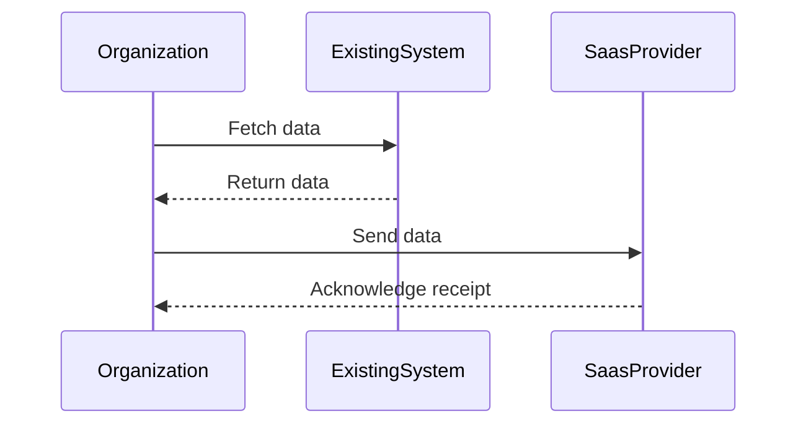

## Introduction

Repurchasing is a cloud migration strategy where an organization transitions from traditional software applications to their cloud-based counterparts, often available as Software as a Service (SaaS). This approach allows organizations to adopt modern software solutions, minimize the need for in-house infrastructure, and benefit from the scalability and maintenance typically handled by the software provider.

## Detailed Explanation

### Concept

Repurchasing involves replacing an existing application that may have been custom-built or hosted on-premises with a commercial off-the-shelf (COTS) SaaS application. This strategy is often selected when the current system does not meet company needs or when maintaining the existing infrastructure becomes prohibitively costly.

### Key Benefits

- **Cost Efficiency**: Lower initial investment and predictable operational expenses are achieved by eliminating infrastructure costs.
- **Scalability**: Easily scale resources up or down depending on demand without heavy lifting in terms of infrastructure management.
- **Accessibility**: SaaS solutions often offer superior accessibility, allowing users access from any location with an internet connection.
- **Vendor Managed Updates**: Software updates and maintenance are typically handled by the SaaS provider, ensuring that software is always current and secure.

### Implementation Steps

1. **Evaluate Needs**: Analyze existing applications for their relevancy and compatibility with available SaaS options.
2. **Select a SaaS Provider**: Choose a vendor whose offering meets current and foreseeable business goals, ensuring alignment with security and compliance standards.
3. **Data Migration Planning**: Develop a comprehensive plan for data transfer, ensuring integrity, security, and continuity.
4. **Integration Planning**: Identify necessary integrations with existing systems and tools to ensure seamless operations.
5. **User Training and Change Management**: Implement training programs to help staff transition to the new system, addressing change management concerns.
6. **Testing and Rollout**: Conduct testing to ensure that all functionalities work as expected before full-scale rollout.

### Example Code

Here's a hypothetical example of integration with a SaaS solution using a cloud computing service:

```java
import com.saasprovider.Client;
import com.organization.DataTransferService;

public class SaasIntegration {
    private Client saasClient = new Client("your-api-key");

    public void migrateData(DataTransferService dataTransferService) {
        // Fetch data from existing on-premise system
        var data = dataTransferService.fetchData();
        
        // Transfer data to SaaS provider
        saasClient.send(data);
        
        System.out.println("Data migration completed successfully.");
    }
}
```

### Diagram

Below is a simple sequence diagram illustrating the interaction between an organization, its existing system, and a SaaS provider.



## Related Patterns

- **Refactoring**: Involves optimizing existing software to better interact with cloud services without altering its external behavior.
- **Rehosting**: Often referred to as "lift and shift", this involves moving applications to cloud infrastructure with minimal changes.

## Additional Resources

- **AWS SaaS Factory**: Learn more about transitioning from on-premise software to SaaS solutions with AWS guidance.
- **Google Cloud's SaaS Toolkit**: Resources provided by Google to assist organizations in developing SaaS offerings on their platform.
- **Azure SaaS Development Kit**: Azure's toolkit and best practices for transitioning to, and developing, SaaS solutions.

## Summary

Repurchasing as a cloud migration strategy offers significant benefits by allowing organizations to modernize their software landscapes efficiently. By leveraging existing SaaS offerings, businesses can reduce infrastructure burdens, improve scalability, and focus resources on strategic initiatives. However, careful planning around data migration, integration, and change management is essential to maximize the benefits of transitioning to a SaaS model.
