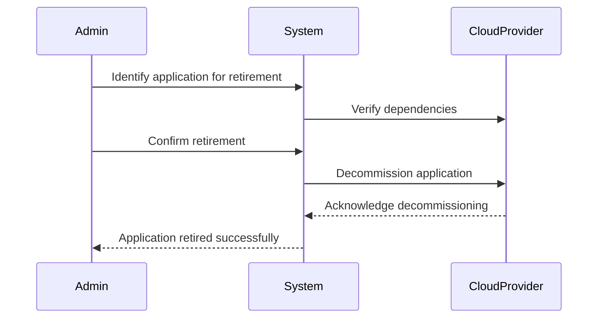

The **Retiring** pattern is a crucial aspect of cloud migration strategies. It involves the deliberate decommissioning or phasing out of obsolete applications, systems, or services that are no longer required in the new cloud environment. This process not only ensures that valuable resources are not wasted on maintaining outdated systems but also helps in reducing costs, improving efficiency, and enhancing scalability.

## Key Concepts

- **Obsolete Applications**: Applications that are outdated, duplicated, or no longer aligned with business goals.
- **Decommissioning**: The systematic process of shutting down services or applications that are redundant or not contributing to business value.
- **Efficiency and Cost Reduction**: By retiring unnecessary services, organizations can significantly reduce IT overhead.

## Architectural Approaches

### Analysis and Identification
Evaluate the current application portfolio to identify candidates for retirement. This involves assessing business value, technical viability, and future requirements.

### Planning and Execution
A clear plan must be set for retiring applications, including timelines, impact analysis, and communication strategies. Ensure data retention policies and any regulatory compliance issues are addressed.

### Resource Reallocation
Identify how existing resources can be redirected or optimized for more critical tasks or functions that align with strategic business enhancements.

## Best Practices

- **Conduct Thorough Assessments**: Regularly review applications to ensure alignment with current business needs.
- **Engage Stakeholders**: Involve all relevant parties in decision-making processes to ensure that vital data and functionalities are not inadvertently lost.
- **Maintain Documentation**: Document the retirement process carefully, including reasons for decommissioning and any dependencies that might be affected.
- **Automate Where Possible**: Use automation tools to streamline the decommissioning process and minimize human error.
- **Monitor Impact**: Post-retirement, ensure continuous monitoring to validate expected outcomes.

## Example Code

Below is a simplified example using a script to decommission a virtual machine in a cloud environment, assuming the necessary API and credentials are set up:

```bash
#!/bin/bash


VM_ID="1234-your-vm-id"
CLOUD_PROVIDER="gcloud" # Example using Google Cloud

echo "Decommissioning VM $VM_ID..."
${CLOUD_PROVIDER} compute instances delete $VM_ID --quiet

if [ $? -eq 0 ]; then
  echo "VM $VM_ID successfully decommissioned."
else
  echo "Failed to decommission VM $VM_ID."
fi
```

## Diagrams

Below is sequence diagram illustrating the process of retiring an application:



## Related Patterns

- **Rehosting**: Moving applications to the cloud with minimal changes.
- **Refactoring**: Reimagining solutions to take full advantage of cloud capabilities.
- **Replatforming**: Making a few cloud optimizations to achieve tangible benefits without changing core architecture.

## Additional Resources

- [AWS Migration Strategies](https://aws.amazon.com/blogs)
- [Google Cloud Migration Guide](https://cloud.google.com/migrate)
- [Azure Transition Guidance](https://docs.microsoft.com/en-us/azure/architecture/cloud-adoption)

## Summary

The **Retiring** pattern is essential for maintaining an efficient, cost-effective, and scalable cloud environment. By systematically identifying and decommissioning obsolete applications, organizations can focus their resources on what truly matters—innovation and growth. Armed with proper assessment, planning, and execution, you can ensure a smooth transition to the cloud with minimized risks and optimized benefits.
