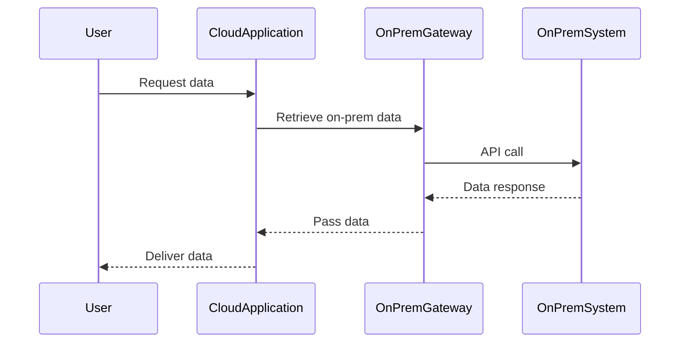

## Overview

The **Retaining** pattern is a cloud migration strategy where organizations decide to keep certain applications or workloads on-premises rather than migrating them to a cloud environment. This decision is crucial when applications have constraints such as legacy dependencies, compliance requirements, latency-sensitive operations, or when they represent a strategic choice for the enterprise.

## Detailed Explanation

During the cloud migration process, not all applications are suitable for migration due to various constraints:

- **Legacy Dependencies**: Some applications are deeply integrated with other on-premises systems, using outdated technology that lacks cloud support.
  
- **Regulatory Compliance**: Compliance requirements may not allow data or applications to reside off-premises due to data sovereignty laws or specific industry regulations.

- **Latency and Performance**: Applications requiring ultra-low latency might perform better when operated locally rather than over a network to a cloud provider.

- **Cost Considerations**: For some, the cost of re-architecting applications for the cloud may outweigh the benefits.

- **Strategic Choices**: Organizations may view certain function-specific applications as strategic, choosing to retain them on-premises for better control and security.

## Architectural Approaches

1. **Hybrid Architectures**: Integrating cloud services with on-premises applications using gateways or VPNs to create a seamless cloud/on-prem hybrid architecture.
   
2. **Service Mesh and Integration**: Utilizing service meshes for communication across on-premises and cloud applications, helping to maintain service discovery, load balancing, and failover within hybrid settings.

3. **API Gateways**: Exposing on-premises applications through secure APIs that cloud services or external users can consume.

## Best Practices

- Conduct a comprehensive assessment to decide which applications should be retained based on business needs, technology stack, and legal constraints.
  
- Implement robust data protection and backup mechanisms for retained systems to mitigate the risk of on-premises failures.

- Regularly review the technology landscape and emerging regulations to adapt the retaining strategy as necessary.

- Establish clear communication and synchronization protocols between on-premises and cloud environments for coherent operation.

## Example Code

```java
// Example of exposing on-premises application functionality via an API

@SpringBootApplication
@RestController
public class OnPremApplication {

    public static void main(String[] args) {
        SpringApplication.run(OnPremApplication.class, args);
    }

    @GetMapping("/api/data")
    public ResponseEntity<String> getOnPremData() {
        // Simulating retrieval of data from on-premises system
        return new ResponseEntity<>("Data from on-premises system", HttpStatus.OK);
    }
}
```

## Diagrams

### UML Sequence Diagram



## Related Patterns

- **Rehost (Lift and Shift)**: Migrates applications as is to the cloud, often a contrasting approach to retaining.
- **Refactor (Re-architect)**: Involves significant change to enable applications for cloud scalability and flexibility, which may not be suitable for retained applications.
- **Hybrid Database**: Operating databases across on-premises and cloud environments to cater to specific data handling needs.

## Additional Resources

- [Hybrid Cloud Strategies](https://www.example.com)
- [Compliance in Cloud Computing](https://www.example.com)
- [On-Premises to Cloud Migration Guide](https://www.example.com)

## Summary

The **Retaining** pattern plays a pivotal role in comprehensive cloud strategies by acknowledging that not all applications can or should be migrated to the cloud. By maintaining certain applications on-premises, organizations can balance new technological advantages with existing constraints, ultimately striving for an agile, cost-effective, and compliant IT landscape.
