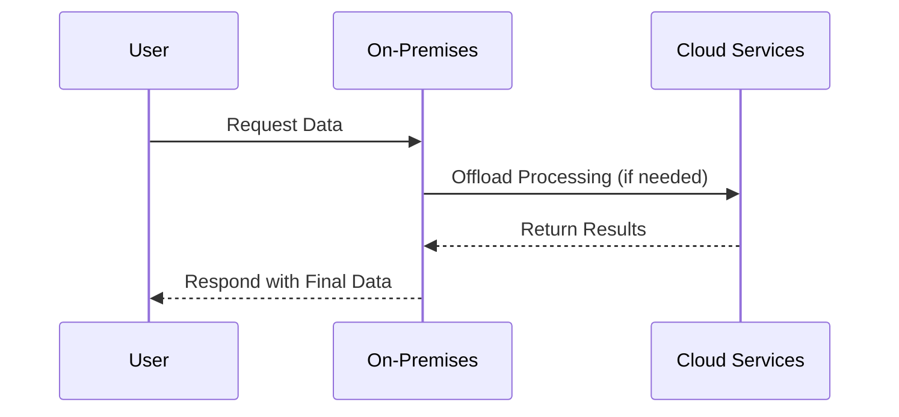

## Introduction

Hybrid Cloud Deployment is a strategic architectural approach that combines on-premises infrastructure or private clouds with public cloud services. This pattern is designed to harness both the scalability and innovation of cloud environments with the control and security of on-premises systems. By deploying a hybrid cloud model, organizations can optimize their existing resources and make a gradual transition to cloud services, mitigating risks often associated with large-scale migrations.

## Detailed Explanation

### Key Components

1. **On-Premises Infrastructure**: Traditional computing resources kept in the physical data center, providing compliance, security, and control.
2. **Public Cloud Services**: Cloud-based resources offered by service providers like AWS, Azure, and GCP, known for scalability and accessibility.
3. **Integration and Orchestration Layer**: Technologies and tools such as an API gateway or cloud management platform that facilitate seamless interaction between cloud and on-prem resources.
4. **Security and Compliance Frameworks**: Ensuring data protection and adhering to regulatory standards, a critical component in hybrid setups.

### Architectural Approaches

- **Cloud Bursting**: Automatically offloading workloads to the cloud during peak demand.
- **Load Balancing**: Distributing workloads between on-premises and cloud-based servers to optimize performance and resilience.
- **Data Replication and Backup**: Leveraging the cloud for backup and disaster recovery ensures redundancy and safeguarding against data loss.

### Best Practices

- **Unified Management Solutions**: Utilize platforms that offer centralized management for both environments, reducing complexity.
- **Robust Networking**: Implement secure, high-bandwidth connectivity between cloud and on-prem environments to facilitate seamless data transfer.
- **Security Measures**: Enforce strong identity and access management (IAM) policies across all resources.

## Example Code

Here's a sample architecture using Terraform to define hybrid cloud resources across AWS and on-premise setup:

```hcl
provider "aws" {
  region = "us-west-2"
}

resource "aws_instance" "web" {
  ami           = "ami-0c55b159cbfafe1f0"
  instance_type = "t2.micro"

  tags = {
    Name = "Hybrid-Cloud-Web-Instance"
  }
}

resource "null_resource" "on_prem_integration" {
  # Implement scripts or command to bridge communication here
}
```

## Diagrams

Here's a basic sequence diagram illustrating data flow in a hybrid environment, capturing key processes such as user requests, on-prem processing, and cloud resource triggering:



## Related Patterns

- **Multi-Cloud Strategy**: Involves deploying workloads across several cloud providers.
- **Edge Computing**: Pushing processing closer to data sources can complement a hybrid approach.
- **Service Mesh**: Manages service-to-service communication within and across cloud boundaries.

## Additional Resources

- [AWS Hybrid Cloud Architectures](https://aws.amazon.com/architecture/hybrid-cloud/)
- [Microsoft Azure Hybrid Solutions](https://azure.microsoft.com/en-us/solutions/hybrid-cloud/)
- [Google Cloud Platform Hybrid Models](https://cloud.google.com/hybrid)

## Summary

Hybrid Cloud Deployment is a flexible approach that provides the benefits of cloud computing while maintaining the security, governance, and performance of on-premises systems. It offers a balanced solution catering to enterprises requiring scalability alongside robust security. Leveraging this pattern effectively requires strategic planning, appropriate tool selection, and adherence to best practices to ensure seamless integration and operation across environments.
