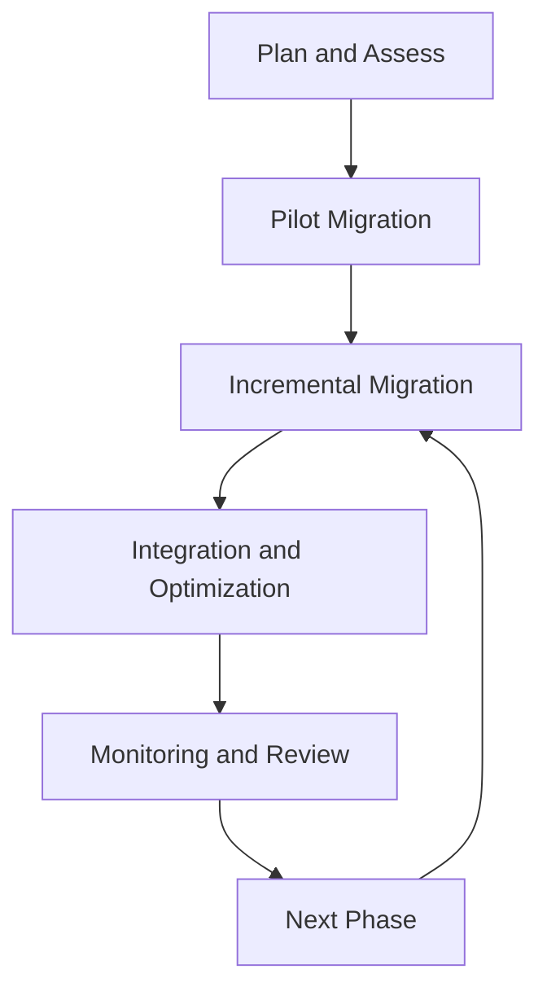

## Introduction

Migrating to the cloud offers many benefits, including scalability, flexibility, cost savings, and improved resource utilization. However, the migration process also comes with challenges such as application downtime, data loss, and integration complexities. The Phased Migration Approach provides a strategic framework that allows organizations to address these challenges by migrating applications incrementally, thereby reducing risks associated with large-scale transitions.

## Detailed Explanation

### What is the Phased Migration Approach?

The Phased Migration Approach is a strategic method of relocating an organization's applications, data, and workloads to the cloud environment in a controlled, step-by-step manner. By breaking down the migration process into smaller, manageable phases, companies can ensure continuity, test functionality at each stage, and resolve issues without affecting the overall operation.

### Key Considerations

- **Selection of Candidates for Migration:** Carefully evaluate and prioritize applications for phased migration based on factors such as business criticality, complexity, dependencies, and anticipated benefits.
  
- **Risk Assessment:** Conduct a thorough risk evaluation before every migration phase to identify potential issues and develop contingency plans.

- **Resource Allocation:** Assign dedicated teams for each migration phase, ensuring specialized expertise for planning, execution, and troubleshooting.

- **Stakeholder Involvement:** Engage all relevant stakeholders throughout the phased migration to incorporate feedback and address concerns.

### Phased Migration Steps

1. **Planning and Assessment:** Identify your migration goals, evaluate the current infrastructure, and set a detailed migration plan outlining phases, timelines, and resource requirements.

2. **Architectural Redesign:** For applications requiring architectural changes to optimize cloud-native features, design new architecture that leverages cloud benefits.

3. **Pilot Migration:** Begin with non-critical applications as pilot projects to test the migration processes and general readiness for cloud adoption.

4. **Incremental Migration:** Gradually move applications and workloads, conducting thorough testing and validation at the end of each phase to ensure successful operation.

5. **Integration and Optimization:** After migration, ensure that applications are integrated with existing systems and optimize performance to fully utilize the cloud capabilities.

6. **Monitoring and Review:** Continuously monitor the performance of migrated applications, and gather feedback from users to improve and adapt future phases.

## Best Practices

- **Incremental Updates:** Rather than large, disruptive updates, implement smaller, iterative changes during migration for easier management and rollback if necessary.
  
- **Automation Tools:** Leverage automation tools for testing, deployment, and monitoring to streamline processes and reduce manual effort.

- **Training and Support:** Provide training for IT staff and users to transition smoothly to the cloud environment, enhancing adoption and productivity.

## Example Code

Below is an illustrative example using Java and AWS SDK to migrate a sample database to Amazon RDS.

```java
import com.amazonaws.services.rds.AmazonRDS;
import com.amazonaws.services.rds.AmazonRDSClientBuilder;
import com.amazonaws.services.rds.model.CreateDBInstanceRequest;

public class DatabaseMigration {
    public static void main(String[] args) {
        AmazonRDS rdsClient = AmazonRDSClientBuilder.standard().build();
        CreateDBInstanceRequest request = new CreateDBInstanceRequest()
                .withDBInstanceIdentifier("migrated-db-instance")
                .withAllocatedStorage(20)
                .withDBInstanceClass("db.t3.micro")
                .withEngine("mysql")
                .withMasterUsername("admin")
                .withMasterUserPassword("password");

        rdsClient.createDBInstance(request);
        System.out.println("Database Migration to RDS initiated successfully.");
    }
}
```

## Diagrams

Below is a simple diagram illustrating the Phased Migration Approach:



## Related Patterns

- **Rehost (Lift and Shift) Strategy:** Quick migration tactic focused on moving applications without modifications.
  
- **Refactor Strategy:** Requires code changes to optimize applications for cloud environments, often used in tandem with phased approaches for complex systems.

- **Hybrid Cloud Deployment:** Combining on-premise and cloud resources, often integrated into phased migrations for robust, flexible architectures.

## Additional Resources

- [AWS Migration Hub](https://aws.amazon.com/migration-hub/)
- [Microsoft Azure Migration Center](https://azure.microsoft.com/en-us/solutions/migration/)
- [Google Cloud Migration Tools](https://cloud.google.com/products/migrate)

## Summary

The Phased Migration Approach offers a structured yet flexible pathway to migrate applications to the cloud with minimal disruptions. By executing the migration in stages, organizations can optimize their resources, test new environments incrementally, and systematically address challenges, leading to a smoother, more reliable transition to the cloud. By embracing best practices and utilizing cloud-native tools and frameworks, businesses can fully realize the benefits of cloud computing while minimizing risks.
