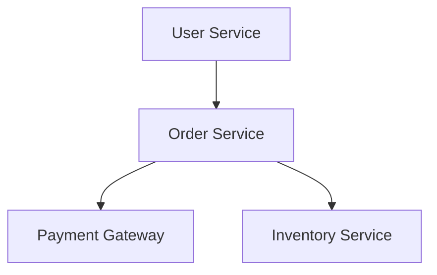

## Introduction

When migrating applications to the cloud, it is essential to understand the interdependencies between various applications and components. Application Dependency Mapping (ADM) is a crucial process that helps architects and engineers identify and visualize these dependencies, ensuring a smooth and efficient migration to the cloud. This pattern helps mitigate risks, avoid unforeseen issues during the migration process, and supports better decision-making when re-architecting applications for cloud environments.

## Core Concepts

### Definition

Application Dependency Mapping involves identifying all the interactions between applications and their components, such as databases, services, middleware, and APIs. This mapping includes direct and indirect dependencies, which might impact performance, security, and maintainability in a cloud-based environment.

### Purpose

- **Risk Identification:** Understanding dependencies can highlight potential points of failure.
- **Reduction of Downtime:** Ensures all dependencies are accounted for, reducing unexpected downtime during migration.
- **Performance Optimization:** Identifies bottlenecks and opportunities for optimization.
- **Cost Efficiency:** Helps avoid unnecessary costs by recognizing obsolete resources.
- **Enhanced Security:** Reveals security risks in data flow and access controls.

## Best Practices for Application Dependency Mapping

1. **Automated Discovery Tools:** Use automated tools to scan and discover application dependencies. Tools like AWS Application Discovery Service or Flexera Optima can simplify and expedite this process.
2. **Collaborative Workshops:** Engage stakeholders and teams in workshops to gather insights into known and undocumented dependencies.
3. **Visualization Techniques:** Create visual diagrams using tools like Lucidchart or draw.io to represent dependencies effectively.
4. **Continuous Updates:** Dependencies change over time due to updates, new features, or retiring of components. Maintain an updated map to reflect these changes.
5. **Integration with CI/CD Pipelines:** Incorporate dependency checks and updates into continuous integration and delivery pipelines to ensure ongoing accuracy.

## Example Code and Diagrams

### Example Code Snippet

Below is a hypothetical example of how you might begin assessing dependencies using a simple Python script. This example uses Python libraries to perform network analysis on microservices:

```python
import networkx as nx

G = nx.DiGraph()

G.add_node("User Service")
G.add_node("Order Service")
G.add_node("Payment Gateway")
G.add_node("Inventory Service")

G.add_edge("User Service", "Order Service")
G.add_edge("Order Service", "Payment Gateway")
G.add_edge("Order Service", "Inventory Service")

nx.draw(G, with_labels=True)
```

### Diagram

Here's diagram to represent a similar mapping of a hypothetical application:



## Related Patterns and Practices

- **Service Mesh:** For dynamic management of microservices communications.
- **Configuration Management:** Ensures that all system configurations are documented and manageable.
- **Cloud Reference Architectures:** Provides a standard framework and best practices for cloud deployments.

## Additional Resources

- **Tools:** AWS Migration Hub, Azure Migrate, ServiceNow Discovery
- **Books:** "Migrating to the Cloud: Patterns and Frameworks" by Marcel Wiget
- **Courses:** Coursera's "Cloud Computing Concepts, Part 1" by University of Illinois

## Summary

Application Dependency Mapping is a foundational activity in cloud migration, enabling organizations to gain deep insights into their applications' interactions. By effectively charting these relationships, businesses can mitigate migration risks, optimize performance, and enhance security, thus ensuring a smooth transition to the cloud. By leveraging automated tools, collaborative input, and continuous updates, organizations can maintain effective and efficient dependency maps that support ongoing architecture evolution.

Understanding dependencies before embarking on cloud migration ensures that the project's objectives align with business needs while maintaining reliable application performance and security post-migration.
