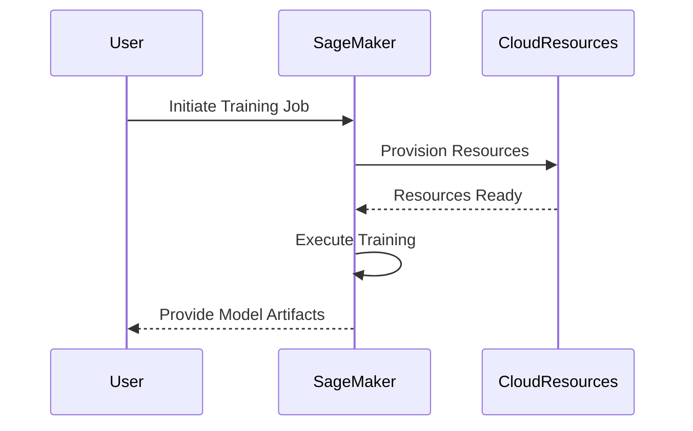

## Managed Machine Learning Platforms: Overview

Managed machine learning platforms such as AWS SageMaker and Google AI Platform provide a comprehensive suite of tools and services designed to simplify and accelerate the development of machine learning models. These platforms abstract many of the complexities associated with setting up and maintaining infrastructure, offering an integrated environment for data processing, model training, deployment, and subsequent monitoring.

## Design Pattern Explanation

### Architectural Approach

Managed machine learning platforms offer a cloud-based environment that fits into the "Platform as a Service" (PaaS) model. These platforms integrate several elements required for ML workflows, including:

1. **Data Preprocessing**: Tools for cleaning and preparing data before training.
2. **Model Building and Training**: Environments for developing algorithms, with access to scalable compute resources.
3. **Hyperparameter Optimization**: Automated tuning tools to improve model performance.
4. **Model Deployment**: Services to deploy models as scalable API endpoints.
5. **Monitoring and Management**: Features for logging, monitoring, and updating deployed models.

### Paradigms and Best Practices

- **Use Managed Services**: Leverage built-in features for infrastructure management (like auto-scaling) to focus more on model experimentation and less on operational complexities.
- **Experimentation and Versioning**: Utilize the platform's capabilities to maintain versions of your models and experiment with different algorithms.
- **Security and Compliance**: Ensure data policies comply with legal standards by using secure storage options provided by these platforms.
- **Integration with Other Cloud Services**: Seamlessly integrate with other cloud-native services for a more comprehensive solution (e.g., data pipelines, storage).

## Example Code

This code snippet demonstrates how to initiate a simple training job on AWS SageMaker using Python:

```python
import boto3
import sagemaker
from sagemaker import get_execution_role
from sagemaker.estimator import Estimator

role = get_execution_role()
sagemaker_session = sagemaker.Session()

container = 'your-container-image'

estimator = Estimator(image_uri=container,
                      role=role,
                      instance_count=1,
                      instance_type='ml.m5.large',
                      output_path='s3://your-bucket/your-output-path',
                      session=sagemaker_session)

estimator.fit('s3://your-bucket/your-dataset-path')
```

## Diagrams

### UML Sequence Diagram



## Related Patterns

- **Data Lake Pattern**: Integration with a centralized data repository to manage large-scale data sets.
- **Continuous Deployment for ML**: Automating the process of keeping ML models updated in production systems.
- **Serverless Architectures**: Utilizing serverless services for parts of the machine learning pipeline to reduce management overhead.

## Additional Resources

- [AWS SageMaker Developer Guide](https://docs.aws.amazon.com/sagemaker/latest/dg/whatis.html)
- [Google AI Platform Documentation](https://cloud.google.com/ai-platform/docs)
- [Machine Learning on GCP](https://cloud.google.com/training/machinelearning-ai)

## Summary

Managed machine learning platforms significantly lower the barriers to entry for building robust AI solutions by bundling essential tools and services within a unified platform. By leveraging these platforms, organizations can harness scalable infrastructure, streamline their ML workflows, and ultimately deploy models with greater efficiency and reliability.

Through careful integration with other cloud services, these platforms not only offer a full-stack approach for machine learning but also ensure that solutions remain agile and scalable in response to business needs.
