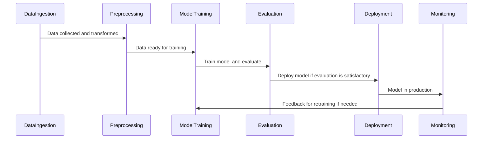

## Introduction

In the evolving world of machine learning (ML), the need for efficient and automated pipelines is paramount. **ML Pipelines Automation** refers to structuring and managing the sequence of ML processes, from data collection and preprocessing to training, evaluation, and ultimately, deployment. This pattern ensures that ML workflows are not only efficient and repeatable but also scalable and adaptable to changes in data or business requirements.

## Design Pattern: ML Pipelines Automation

ML Pipelines Automation encompasses orchestrating various stages of the ML lifecycle, utilizing cloud infrastructure to leverage scalability and flexibility. This pattern integrates with CI/CD environments, automates model versioning, and manages artifacts, ensuring timely deployment and integration of ML models into production systems.

### Key Components

1. **Data Ingestion and Preprocessing**
   - Automate data collection from diverse sources (e.g., databases, APIs).
   - Perform data cleaning, transformation, and feature engineering.

2. **Model Training and Evaluation**
   - Select appropriate ML algorithms.
   - Utilize hyperparameter tuning to optimize performance.
   - Implement cross-validation to assess model generalization.

3. **Model Deployment**
   - Package models for different environments (e.g., cloud, edge).
   - Automate deployment strategies, such as A/B testing and canary releases.

4. **Monitoring and Maintenance**
   - Monitor model performance and drift.
   - Schedule regular retraining with augmented data.

5. **Version Control and Governance**
   - Use version control systems for data, code, and models.
   - Ensure compliance with data privacy and security regulations.

### Advantages

- **Scalability**: Handle large data volumes and complex models.
- **Efficiency**: Reduce manual interventions, accelerating the ML lifecycle.
- **Consistency**: Reproduce experiments and deployments reliably.
- **Integration**: Seamlessly connect with existing cloud and enterprise systems.

## Architectural Approaches

1. **Service-Oriented Architecture (SOA)**
   Utilize microservices to separate different stages of the ML pipeline, promoting reusability and maintainability.

2. **Serverless Computing**
   Leverage serverless architectures for processing data and deploying models, reducing overhead and costs.

3. **Data Lake Architecture**
   Store large volumes of raw and processed data flexibly, integrating with ML models during training and inference.

## Best Practices

- **Automate Everything**: From data management to deployment, automate as much of the pipeline as possible.
- **Implement Feedback Loops**: Use real-time feedback to iteratively improve models.
- **Security First**: Prioritize data security and model integrity throughout the lifecycle.
- **Optimize Resource Use**: Use cloud resources efficiently, leveraging spot instances and autoscaling where applicable.

## Example Code

Below is an example using Python and MLflow to set up an automated ML pipeline:

```python
import mlflow
from sklearn.model_selection import train_test_split
from sklearn.ensemble import RandomForestClassifier
from sklearn.metrics import accuracy_score
import pandas as pd

data = pd.read_csv('data.csv')
X = data.drop('target', axis=1)
y = data['target']

X_train, X_test, y_train, y_test = train_test_split(X, y, test_size=0.2, random_state=42)

with mlflow.start_run():
    rf = RandomForestClassifier(n_estimators=100)
    rf.fit(X_train, y_train)

    # Model Evaluation
    predictions = rf.predict(X_test)
    accuracy = accuracy_score(y_test, predictions)
    mlflow.log_metric('accuracy', accuracy)

    # Logging the Model
    mlflow.sklearn.log_model(rf, 'random-forest-model')
```

## Diagrams

Below is UML Sequence diagram illustrating the ML pipeline process:



## Related Patterns

- **Continuous Integration/Continuous Deployment (CI/CD)**: Integrates seamlessly with ML pipelines for automated delivery and deployment.
- **Data Lake Patterns**: Facilitates scalable storage and processing of big data for ML purposes.
- **Event-Driven Architecture**: Supports reactive model updates with real-time data flows.

## Additional Resources

- "Building Machine Learning Powered Applications" by Emmanuel Ameisen
- Documentation on [MLflow](https://mlflow.org/)
- AWS SageMaker Pipelines [Documentation & Examples](https://aws.amazon.com/sagemaker/pipelines/)

## Summary

The ML Pipelines Automation pattern is a powerful approach to managing and orchestrating machine learning workflows in the cloud. By automating each step, from data ingestion to deployment, organizations can scale their ML capabilities effectively. Leveraging cloud-native tools and architectures not only enhances efficiency but also ensures compliance and adaptability in the rapidly changing AI landscape. Whether you're working in a startup or a large enterprise, adopting this pattern aligns your ML initiatives with modern industry practices and technological advancements.
