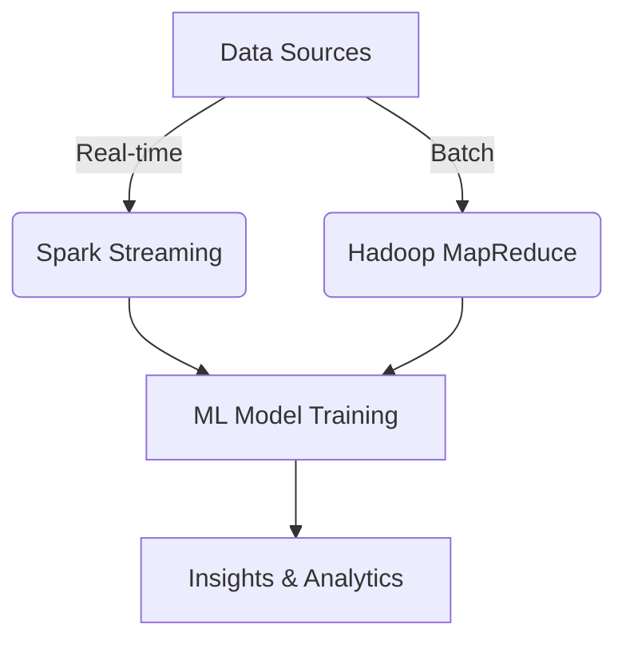

## Introduction
Big Data Integration is a pivotal design pattern that leverages machine learning algorithms in conjunction with big data frameworks like Hadoop and Spark. This integration enables the processing and analysis of large datasets efficiently, facilitating the extraction of meaningful insights which are crucial for informed decision-making.

## Design Pattern Overview

### Key Concepts
- **Scalability**: The ability to handle growing amounts of data seamlessly.
- **Parallel Processing**: Uses distributed computing to process data simultaneously across multiple nodes.
- **Real-time Analytics**: Provides near-instantaneous insights and analytics capabilities.
- **Data Consistency**: Ensures data integrity across multiple sources and formats.

### Architectural Approaches

1. **Batch Processing with Hadoop**
   - **MapReduce**: Utilizes parallel processing to split data into chunks, process them, and aggregate the results.
   - **HDFS (Hadoop Distributed File System)**: Stores large datasets across a distributed system, facilitating fault-tolerance and scalability.
  
2. **Real-time Processing with Spark**
   - **In-memory Processing**: Speeds up data computation by keeping data in memory, significantly enhancing processing times compared to disk-based systems.
   - **MLlib**: Spark's library supporting various machine learning algorithms, optimizing iterations necessary for training models on large datasets.
  
3. **Integration Architectures**
   - **Lambda Architecture**: Combines batch and real-time processing.
   - **Kappa Architecture**: Focuses on streaming data, eliminating the batch layer for simplicity.
  
### Paradigms and Best Practices

- **Data Lakes**: Centralized repositories allowing data storage of any scale in raw format, enabling on-demand data processing and analytics.
- **ETL vs. ELT**: Transform data either before (ETL - Extract, Transform, Load) or after (ELT - Extract, Load, Transform) loading into the storage system.
- **Scalable ML Models**: Use algorithms designed to handle big data, such as linear models or decision trees, optimized for scalability.

## Example Code
Here's a simple example using Apache Spark and MLlib in Scala, which integrates a basic machine learning model:

```scala
import org.apache.spark.ml.Pipeline
import org.apache.spark.ml.classification.LogisticRegression
import org.apache.spark.ml.feature.{HashingTF, Tokenizer}
import org.apache.spark.sql.SparkSession

val spark = SparkSession.builder
  .appName("Big Data Integration Example")
  .getOrCreate()

val training = spark.createDataFrame(Seq(
  (0L, "spark hadoop big data", 1.0),
  (1L, "logistic regression models", 0.0),
  (2L, "integrating machine learning", 1.0)
)).toDF("id", "text", "label")

val tokenizer = new Tokenizer().setInputCol("text").setOutputCol("words")
val hashingTF = new HashingTF().setInputCol("words").setOutputCol("features").setNumFeatures(1000)

val lr = new LogisticRegression()
val pipeline = new Pipeline().setStages(Array(tokenizer, hashingTF, lr))

val model = pipeline.fit(training)
```

## Diagrams

### Big Data Integration Architecture


## Related Patterns
- **Data Lake Pattern**: Facilitates data extraction and exploration by organizing raw data in a central repository.
- **Real-time Streaming Analytics**: Allows immediate processing and analysis of data streams.

## Additional Resources
- [Apache Spark Documentation](https://spark.apache.org/docs/latest/)
- [Hadoop Ecosystem Overview](https://hadoop.apache.org/)
- [Designing Data-Intensive Applications by Martin Kleppmann](https://www.oreilly.com/library/view/designing-data-intensive-applications/9781491903063/)

## Summary
Big Data Integration is essential for organizations aiming to harness the potential of massive datasets. By combining machine learning with robust big data tools, businesses can optimize their data processing workflows, resulting in efficient analytics and refined machine learning models that provide competitive advantages. This pattern continues to evolve, driving innovation in data-rich industries.
