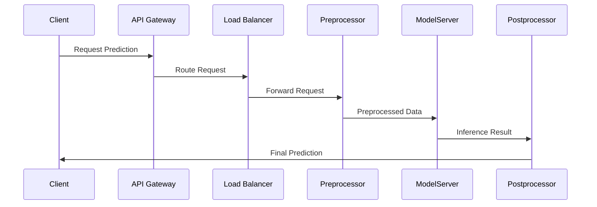

## Real-Time Predictions: Overview

In today’s fast-paced digital environment, real-time predictions play a crucial role in delivering seamless user experiences and enabling proactive decision-making. This pattern focuses on serving predictions with low latency by leveraging cutting-edge cloud technologies, efficient architectural designs, and effective best practices for deploying real-time systems.

### Key Concepts

- **Low Latency**: The primary goal is to minimize the time between receiving an input and delivering an output (prediction).
- **Scalability**: The system should be capable of handling increasing loads while maintaining performance levels.
- **Fault Tolerance**: Ensures system reliability by maintaining service continuity during failures.
- **Elasticity**: Dynamically adjust resources to meet demand changes.

## Architectural Approaches

### 1. **Model Serving Frameworks**

Leverage frameworks such as TensorFlow Serving, KServe, or MLflow, which are optimized for deploying machine learning models. These frameworks provide APIs to serve predictions with robust controls over scaling and version management.

### 2. **Microservices Architecture**

Use a microservices-based architecture to separate components responsible for different tasks such as data pre-processing, model inference, post-processing, and logging. This separation enhances flexibility, maintainability, and scalability.



### 3. **Serverless Computing**

Utilize serverless offerings like AWS Lambda, Google Cloud Functions, or Azure Functions to execute model inference on demand. This approach simplifies operations and reduces costs by managing infrastructure dynamically.

## Best Practices

- **Model Optimization**: Optimize models for faster inference using techniques like quantization, pruning, and efficient data structures.
- **Efficient Data Handling**: Implement caching mechanisms and use fast data transfer protocols to minimize data latency.
- **Monitoring and Logging**: Establish robust monitoring and alerting mechanisms to track performance and identify issues promptly.
- **A/B Testing**: Facilitate A/B testing to assess model performance in real-world scenarios.

## Example Code

Here is a simple example demonstrating a RESTful API endpoint that serves a trained machine learning model using Flask and TensorFlow:

```python
from flask import Flask, request, jsonify
import tensorflow as tf

app = Flask(__name__)

model = tf.keras.models.load_model('path_to_model')

@app.route("/predict", methods=["POST"])
def predict():
    data = request.get_json(force=True)
    predictions = model.predict([data['input']])
    return jsonify(predictions=predictions.tolist())

if __name__ == "__main__":
    app.run(debug=True)
```

## Related Patterns

- **Batch Processing Pattern**: Suitable for scenarios where real-time predictions are not necessary and batch operations can be used.
- **Event-Driven Architecture**: Complements real-time predictions by reacting to events rather than performing constant polling.

## Additional Resources

- [AWS Lambda for Real-Time ML Predictions](https://aws.amazon.com/lambda/)
- [TensorFlow Serving](https://www.tensorflow.org/tfx/guide/serving)
- [KServe Documentation](https://kserve.github.io/website/)

## Summary

Real-time predictions provide a competitive edge by enabling immediate responses to data inputs, producing actionable insights with minimal delay. By adopting the right architecture, employing best practices, and leveraging cloud-based tools, businesses can achieve reliable, scalable, and low-latency predictive systems. Adaptability, performance, and cost-effectiveness underscore the success of deploying real-time prediction services in the evolving landscape of AI and machine learning.
