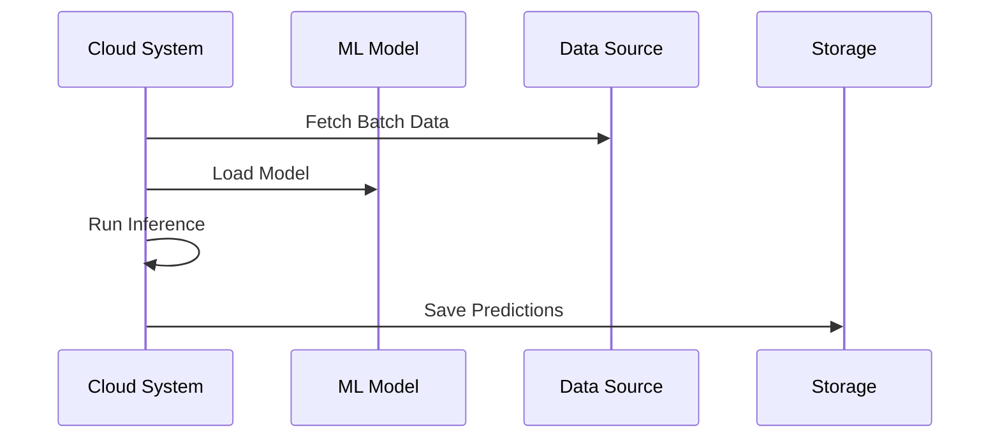

## Introduction to Batch Inference Processing

In the realm of cloud computing and artificial intelligence, **Batch Inference Processing** is a pivotal pattern employed to execute predictive analytics by applying machine learning models to large datasets periodically. This pattern is of paramount importance when immediate or real-time predictions are not necessary, and batch processing can be scheduled during off-peak hours to optimize resource usage and cost.

## Detailed Explanation

The core idea of batch inference processing is to decouple the model training and prediction phases in a machine learning workflow. Predictions are not required instantaneously; instead, they are computed in bulk, providing flexibility regarding when and how resources are allocated. This pattern is typically used in scenarios like:

- Predicting customer churn based on behavioral patterns collected over weeks or months.
- Generating updated recommendation lists for users in an e-commerce platform based on periodically aggregated interaction data.
- Running trend analyses or risk assessments in financial sectors with historical data.

### Key Components and Architectural Approaches

- **Data Aggregation**: Before performing batch inference, the necessary data is collected and prepared. This involves aggregating large sets of data that the model will process.
  
- **Model Deployment**: The machine learning model is deployed in an environment isolated from frequent real-time queries, often utilizing cloud-based platforms to scale as needed.
  
- **Batch Execution**: The computation of inferences is executed in the form of batch jobs, scheduled to run at specific intervals when computational resources are less contested.
  
- **Storage and Management**: After inference, results are stored in databases or distributed storage systems for further analysis or direct application.

### Example Code

Here's a simple conceptual example using Python and a cloud service for batch processing:

```python
import pandas as pd
from sklearn.externals import joblib
from cloud_provider import BatchProcessingService

model = joblib.load('model.pkl')

def run_batch_inference(batch_data_path, output_path):
    # Load batch data
    data = pd.read_csv(batch_data_path)
    
    # Process data and make predictions
    predictions = model.predict(data)
    
    # Save predictions to an output file
    pd.DataFrame(predictions, columns=['Prediction']).to_csv(output_path, index=False)

batch_service = BatchProcessingService()
batch_service.schedule(
    function=run_batch_inference,
    args=('s3://bucket/path/to/batch_data.csv', 's3://bucket/path/to/output_predictions.csv')
)
```

### Diagrams



## Related Patterns

- **Real-Time Inference Processing**: Contrast to batch inference where predictions are made on demand.
- **ETL (Extract, Transform, Load)**: Often runs before batch inference processes to prepare and transform the data.
- **Data Lake Pattern**: Typically holds historical data necessary for batch inference processing.

## Best Practices

- **Efficient Scheduling**: Align batch processing windows with low system load periods to minimize resource costs.
  
- **Focus on Storage Solutions**: Use scalable storage that can efficiently handle large volumes of data input and output.
  
- **Monitoring and Logging**: Implement comprehensive logging to monitor job processing and quickly troubleshoot failures or sub-optimal performance.

## Additional Resources

- AWS Batch: AWS's managed service for running batch computing workloads.
- Azure Batch: Azure's platform tailored for large-scale cloud batch and high-performance computing (HPC) applications.
- Google Cloud Dataflow: A fully managed service that delivers reliable, cost-effective data processing patterns, including batch.

## Summary

Batch Inference Processing is a strategic approach in cloud-based machine learning that leverages the power of cloud scalability and resource management. By running model predictions at scheduled intervals, organizations can optimize their predictive operations, reduce costs, and improve resource management. This pattern enables businesses to forecast effectively while balancing computational demands and economic efficiency.
