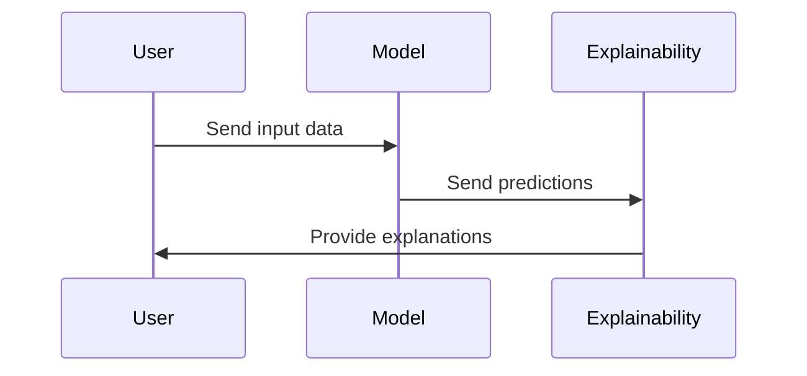

## Introduction

With the growth of artificial intelligence and machine learning applications in various domains, understanding how a model makes decisions is crucial for fostering trust and ensuring accountability. Model Explainability Tools are essential in providing insights into the inner workings of machine learning models. These tools enable data scientists, engineers, and decision-makers to decode complex algorithms and foster an environment of transparency and accountability.

## Design Pattern Overview

Model Explainability Tools aim to demystify the behavior of machine learning models by offering insights into their decision-making processes. As machine learning models become increasingly complex and black-boxed—like in deep learning architectures—the demand for explaining their decisions becomes paramount. This pattern is particularly noteworthy in sensitive applications like healthcare, finance, and legal sectors, where the implications of AI decisions can be profound.

### Key Components

1. **Local Explainability**: Understanding the prediction for a specific instance.
2. **Global Explainability**: Understanding the overall logic and behavior of the model.
3. **Model Agnostic Tools**: Tools that can work with any type of machine learning model.
4. **Model Specific Tools**: Tools tailored for specific model types or architectures.

### Common Tools and Techniques

- **LIME (Local Interpretable Model-agnostic Explanations)**: Provides explanations about individual predictions using locally approximated models.
- **SHAP (SHapley Additive exPlanations)**: A unified approach to explain the output of any machine learning model based on Shapley values from cooperative game theory.
- **Integrated Gradients**: Attributing the prediction of a deep network to its input features.
- **Partial Dependence Plots (PDP)**: Visualize the relationship between the target response and a set of input features.
- **Feature Importance**: Assigns a score to features based on their contribution to the prediction.

## Architectural Approaches

When integrating Model Explainability Tools in your system, consider the following architectural approaches:

- **Service Oriented Architecture (SOA)**: Deploy model explainability as a separate service that interfaces with machine learning models.
- **Microservices**: Integrate explainability tools into microservices architecture, enabling distributed deployment and scaling.
- **Middleware Integration**: Use middleware to facilitate the exchange of model decisions and their corresponding explanations.

## Best Practices

- Ensure **Data Privacy**: Protect sensitive input data used during the explanation process.
- Maintain **Performance Balance**: Explanation tools can be compute-intensive, so balance model accuracy with the performance overhead.
- **User-Friendly Interfaces**: Provide intuitive and accessible visualizations for stakeholders across technical expertise levels.
- Continuous **Model Evaluation**: Regularly evaluate models for biases and inaccuracies, using explainability tools to diagnose issues.

## Example Code

Here is a simple example using SHAP for a scikit-learn model:

```python
import shap
import xgboost
from sklearn.model_selection import train_test_split

X, y = shap.datasets.boston()
X_train, X_test, y_train, y_test = train_test_split(X, y, test_size=0.2, random_state=42)

model = xgboost.XGBRegressor().fit(X_train, y_train)

explainer = shap.Explainer(model)
shap_values = explainer(X_test)

shap.plots.waterfall(shap_values[0])
```

## Diagrams

### UML Sequence Diagram


## Related Patterns

- **Machine Learning Model Deployment**: For deploying models in various environments.
- **Data Preprocessing Pipelines**: Preparing and cleaning data before model training.

## Additional Resources

- [Interpretable Machine Learning Book by Christoph Molnar](https://christophm.github.io/interpretable-ml-book/)
- [SHAP Documentation](https://shap.readthedocs.io/en/latest/)

## Summary

Model Explainability Tools are pivotal in bridging the gap between machine learning model complexity and the need for transparency and trust in AI systems. By deploying these tools, organizations can ensure that the decisions informed by AI are interpretable, accountable, and fair, thus reinforcing confidence in automated systems and their outcomes.
