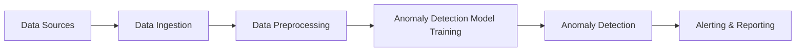

## Introduction

Anomaly detection systems are essential in modern cloud environments for identifying unexpected patterns that deviate from the norm, which could be indicative of critical issues such as fraud, network intrusions, or equipment failures. The integration of machine learning with cloud services provides scalable solutions capable of processing vast amounts of data to detect anomalies in real-time.

## Architectural Approaches

### Data Collection and Preprocessing

- **Data Ingestion**: Utilize cloud services such as AWS Kinesis, Azure Event Hubs, or Google Cloud Pub/Sub to collect and stream data from various sources.
- **Preprocessing**: Use cloud-based ETL services like AWS Glue, Azure Data Factory, or Google Cloud Dataflow to clean and preprocess data before feeding it into anomaly detection models.

### Anomaly Detection Models

- **Statistical Methods**: Implement basic statistical models to identify data points that fall outside predefined thresholds. 
- **Machine Learning Models**: Leverage supervised and unsupervised learning algorithms. Common approaches include:
  - **Isolation Forest**: Efficiently separates anomalies using decision trees.
  - **Autoencoders**: Neural network-based models that learn to reconstruct input data, identifying anomalies through reconstruction errors.

### Deployment and Monitoring

- **Model Deployment**: Deploy models using cloud-native services such as AWS SageMaker, Azure Machine Learning, or Google AI Platform.
- **Monitoring and Scaling**: Use cloud monitoring services (e.g., AWS CloudWatch, Azure Monitor) to ensure the system’s performance and scale resources dynamically based on load.

## Best Practices

- **Data Quality**: Ensure high data quality through rigorous preprocessing and cleansing processes.
- **Continuous Training**: Implement a feedback loop to continuously improve model accuracy by retraining with new data.
- **Scalability**: Design the system for horizontal scaling to handle increased data loads seamlessly.

## Example Code

Here’s a simple implementation of an Isolation Forest using Python and AWS:

```python
from sklearn.ensemble import IsolationForest
import boto3
import pandas as pd

s3 = boto3.client('s3')
response = s3.get_object(Bucket='my-bucket', Key='my-data.csv')
data = pd.read_csv(response['Body'])

model = IsolationForest(contamination=0.1)
model.fit(data)

anomalies = model.predict(data)
print("Detected anomalies:", data[anomalies == -1])
```

## Diagrams

### Anomaly Detection System Flow



## Related Patterns

- **Event Streaming**: For real-time data collection and processing.
- **Serverless Architectures**: Enhance scalability and reduce operating costs.
- **Chaos Engineering**: Identifying system vulnerabilities through controlled disruptions.

## Additional Resources

- [AWS Anomaly Detection Documentation](https://docs.aws.amazon.com/)
- [Azure Anomaly Detector](https://azure.microsoft.com/en-us/services/anomaly-detector/)
- [Google Cloud AI for Anomaly Detection](https://cloud.google.com/products/ai)

## Summary

Anomaly detection systems in the cloud enable organizations to proactively identify and respond to unusual events using advanced machine learning techniques. By leveraging cloud-native infrastructures, these systems are both powerful and scalable, making them integral components of modern IT environments. Implementing these systems requires careful consideration of data management, model selection, and deployment strategies to ensure effectiveness and efficiency.
