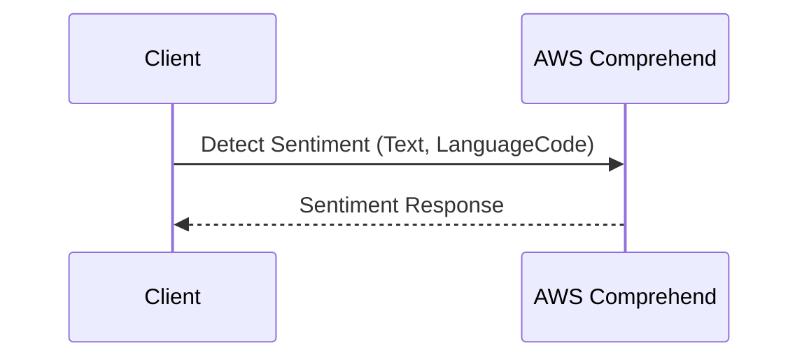

## Introduction

Natural Language Processing (NLP) is a subfield of artificial intelligence (AI) that focuses on the interaction between computers and humans through natural language. By utilizing cloud-based NLP services, businesses can perform complex text analysis more efficiently and at scale, without the need for extensive on-premises infrastructure.

## Architectural Approaches

Cloud-based NLP services provide a range of architectural approaches to implement text analysis capabilities. Key architectural elements include:

1. **Microservices Architecture**: Decompose NLP functionalities into microservices such as tokenization, sentiment analysis, entity recognition, etc., which can be independently deployed and scaled.

2. **Serverless Computing**: Utilize Functions-as-a-Service (FaaS) for on-demand processing of NLP tasks, reducing the operational overhead and improving resource utilization.

3. **Event-Driven Architecture**: Implement event-driven processing of text streams using cloud messaging services like AWS SQS, Azure Service Bus, or Google Pub/Sub to trigger NLP pipelines.

## Best Practices

When leveraging cloud-based NLP services, consider these best practices:

1. **Data Privacy and Compliance**: Ensure that the NLP services are compliant with relevant data protection regulations such as GDPR by using services that offer data encryption and access control.

2. **Model Customization**: Take advantage of customization features provided by cloud services to fine-tune pre-built models to suit specific domain needs, enhancing the accuracy of text analysis.

3. **Cost Management**: Implement intelligent cost management by monitoring cloud service usage patterns and opting for cost-effective pricing models.

## Example Code

Here's an example of utilizing a cloud-based NLP service with Python, using AWS Comprehend for sentiment analysis:

```python
import boto3

client = boto3.client('comprehend', region_name='us-west-2')

text = "Natural Language Processing enables interaction between humans and computers."

response = client.detect_sentiment(
    Text=text,
    LanguageCode='en'
)

sentiment = response['Sentiment']
print(f"Detected sentiment: {sentiment}")
```

## Diagrams

A basic sequence diagram showing the interaction with cloud-based NLP services:



## Related Patterns

- **Data Ingestion Pattern**: Techniques to allow scalable and efficient ingestion of data for NLP processing.
- **Data Lake Pattern**: Use data lakes to store large volumes of raw text data for historical NLP analysis.
- **Machine Learning Model Deployment Pattern**: Strategies to deploy custom models that integrate with cloud NLP services.

## Additional Resources

- [AWS Comprehend Documentation](https://docs.aws.amazon.com/comprehend/index.html)
- [Azure Cognitive Services for Language](https://azure.microsoft.com/en-us/services/cognitive-services/text-analytics/)
- [Google Cloud Natural Language API](https://cloud.google.com/natural-language)

## Summary

Cloud-based NLP services democratize access to sophisticated text analysis capabilities by offering scalable, cost-effective, and customizable solutions. By leveraging patterns such as microservices architecture and serverless computing, organizations can extract valuable insights from textual data efficiently. As these technologies evolve, they will further enable seamless integration of AI and machine learning capabilities into various business processes.
