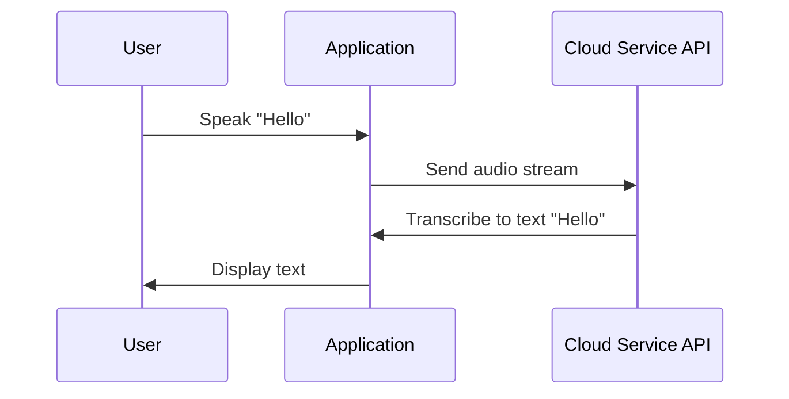

Speech recognition and synthesis, often embodied as part of cloud-based AI services, underpin the capability of applications to interact with users through voice, transforming spoken language into text (speech recognition) and text back into spoken word (text-to-speech synthesis).

## Detailed Explanations

Speech recognition and synthesis have become ubiquitous in modern applications, from personal assistants like Alexa and Google Assistant to automated customer support systems. The cloud enhances these capabilities by offering scalable, managed services that developers can easily integrate into their applications.

### Key Components
- **Speech Recognition Engine**: Translates spoken language into text. It uses techniques like Hidden Markov Models, Deep Neural Networks, and end-to-end learning architectures.
- **Text-to-Speech (TTS) Engine**: Converts digital text into synthesized voice, often using techniques such as WaveNet or Tacotron models to produce natural-sounding speech.

### Architectural Approaches

1. **API-Based Integration**: Cloud providers like AWS (Amazon Polly), Google Cloud (Speech-to-Text, Text-to-Speech), and Azure (Cognitive Services) offer APIs for direct integration. This is ideal for applications with moderate throughput and where latency is not critical.
   
2. **Containerized Microservices**: Deploy speech recognition and synthesis as microservices within a containerized infrastructure (e.g., Kubernetes). This supports higher scalability and customization for specific use cases, such as industry-specific terminology.

3. **Edge Computing**: Running inference on edge devices (using models like TensorFlow Lite) to process audio data locally, reducing latency and cost associated with cloud data transmission. This is critical for IoT and mobile applications requiring real-time processing.

### Best Practices

- **Latency Optimization**: Cache frequently used phrases in TTS to reduce processing time. Use incremental results streaming in speech recognition for more responsive interactions.
- **Model Customization**: Fine-tune models to understand domain-specific vocabulary and accents by training on specialized datasets.
- **Security and Privacy**: Implement robust encryption for audio data in transit and at rest. Provide users with transparency on how their audio data is used and stored.
- **Scalability**: Leverage cloud elasticity to handle varying loads. Use horizontal scaling for TTS services during peak demand.

### Example Code

Here is a simple example using Google Cloud's Text-to-Speech API in Python:

```python
from google.cloud import texttospeech

client = texttospeech.TextToSpeechClient()

synthesis_input = texttospeech.SynthesisInput(text="Hello, world!")

voice = texttospeech.VoiceSelectionParams(
    language_code="en-US", ssml_gender=texttospeech.SsmlVoiceGender.NEUTRAL)

audio_config = texttospeech.AudioConfig(
    audio_encoding=texttospeech.AudioEncoding.MP3)

response = client.synthesize_speech(
    input=synthesis_input, voice=voice, audio_config=audio_config)

with open("output.mp3", "wb") as out:
    out.write(response.audio_content)
    print('Audio content written to file "output.mp3"')
```

### Diagrams

#### UML Sequence Diagram



### Related Patterns

- **Speech Analytics**: Extending speech recognition to analyze voice messages for insights.
- **Voice Biometrics**: Using voice prints as a method of identification and authentication.

### Additional Resources

- [Google Cloud Text-to-Speech](https://cloud.google.com/text-to-speech)
- [AWS Text-to-Speech (Polly)](https://aws.amazon.com/polly/)
- [Azure Cognitive Services](
   https://azure.microsoft.com/en-us/services/cognitive-services/)

## Summary

Speech recognition and synthesis have reshaped how applications interact with users by supporting seamless, voice-enabled interfaces. Leveraging cloud services for speech processing provides flexibility, scalability, and accessibility, allowing developers to create more engaging and intuitive user experiences. The pattern involves several considerations around latency management, security, and the adaptability of solutions for specific needs. By understanding these elements, developers can effectively implement voice-driven features in their applications.
