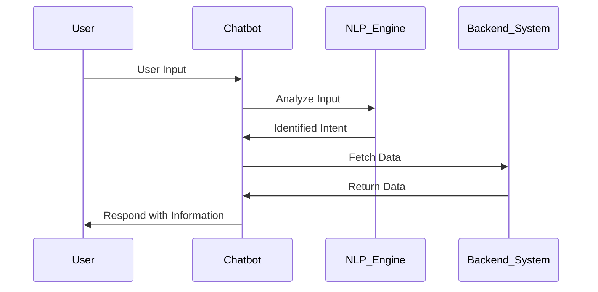

## Introduction

In recent years, chatbots and conversational AI have revolutionized how businesses interact with customers, providing enhanced user experiences and automation capabilities. These tools rely heavily on natural language processing (NLP) to understand and respond to human inputs effectively. This design pattern discusses the architecture, best practices, and implementation strategies for creating intelligent chat interfaces deployed on cloud platforms.

## Architecture

The core components of chatbots and conversational AI include:

1. **Natural Language Processing (NLP)**: This component interprets user inputs in natural language, identifying intent and extracting relevant data. NLP engines like Google's Dialogflow, AWS Lex, or Microsoft's LUIS are widely used for this purpose.

2. **Dialogue Management**: This manages the conversation flow, determining the sequence of interactions based on user inputs and system responses. It often includes state management to maintain context across messages.

3. **Integration Layer**: Connects the chatbot to existing systems such as CRM, databases, and third-party APIs to fetch or update data based on user queries.

4. **User Interface**: Can be implemented as chat windows on websites, mobile apps, or social media platforms, providing a seamless communication channel between the user and the bot.

5. **Cloud Infrastructure**: Hosting the chatbot on cloud platforms such as AWS, Azure, or GCP ensures scalability, high availability, and integration with other cloud-based services for extended functionalities.

## Best Practices

- **Understand User Intentions**: Use comprehensive training datasets to ensure that the NLP engine accurately captures user intents and entities, enhancing the conversation's natural flow.

- **Design Conversational Flows**: Plan dialogue paths considering different user inputs, ensuring clarity and consistency. Utilize dialogue trees or flowcharts to visualize and design this flow.

- **Standardize Responses**: Maintain a coherent voice and tone across the chatbot's responses, aligning with the brand's communication style.

- **Embed Feedback Loops**: Allow users to provide feedback on responses to continually improve system accuracy and relevance via machine learning.

- **Ensure Privacy**: Implement robust encryption and data handling mechanisms, complying with regulations such as GDPR for protecting user data.

## Example Code

Here's a simple example of a chatbot using AWS Lex in Python:

```python
import boto3

client = boto3.client('lex-runtime')

response = client.post_text(
    botName='YourBotName',
    botAlias='YourBotAlias',
    userId='User123',
    inputText='What is my order status?'
)

print('Bot Response:', response['message'])
```

This script sends a text message to an AWS Lex bot and prints the response message, demonstrating the interaction with the bot through Lex's runtime service.

## Diagrams

Below is a sequence diagram illustrating a typical interaction between a user and a cloud-based chatbot:



## Related Patterns

- **Service Mesh**: Enhances microservices communication, which is crucial for integrating different AI services within the chatbot ecosystem.

- **API Gateway**: Facilitates secure and efficient communication between the user interface and cloud services, acting as an entry point for the chatbot's interactions.

- **Event-driven Architecture**: Ideal for chatbots that need to respond to real-time events, triggering actions based on user interactions or external signals.

## Additional Resources

- [Google Cloud Dialogflow Documentation](https://cloud.google.com/dialogflow/docs)
- [AWS Lex Documentation](https://docs.aws.amazon.com/lex/)
- [Microsoft Azure Bot Services](https://docs.microsoft.com/en-us/azure/bot-service/?view=azure-bot-service-4.0)

## Summary

Chatbots and conversational AI represent a powerful design pattern in cloud computing, transforming user interaction through intelligent interfaces. By leveraging cloud-based services and following best practices, developers can create scalable, reliable, and adaptable chat solutions that meet diverse business needs. This pattern not only enhances customer engagement but also streamlines operations, showcasing the synergy between AI and cloud technology.
