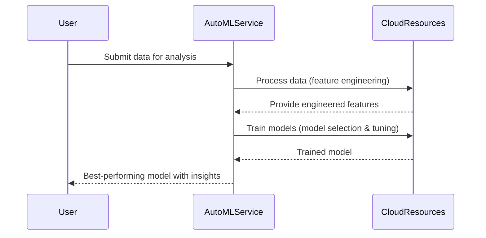

## Introduction

AutoML, or Automated Machine Learning, refers to the process of automating the end-to-end process of applying machine learning to real-world problems. The use of AutoML tools is steadily growing, as they enable organizations to build ML models with little to no expertise in the field. These tools are particularly beneficial for SMEs and larger enterprises that aim to harness AI capabilities but lack extensive in-house data science teams.

## Design Pattern Explanation

AutoML tools streamline the machine learning process by automating tasks such as data pre-processing, feature engineering, model selection, hyperparameter tuning, and even deployment. By doing so, they allow non-experts to generate models efficiently, without requiring in-depth knowledge of algorithms or specialized skills.

### Key Components
- **Data Pre-processing**: Cleans and prepares data for analysis, handling missing values, and data normalization automatically.
- **Feature Engineering**: Automates the creation and selection of variables or features that have the most predictive power.
- **Model Selection**: Identifies the best algorithm suited for the dataset by testing multiple models.
- **Hyperparameter Tuning**: Optimizes hyperparameters to improve the performance of the selected models.
- **Model Evaluation and Interpretation**: Offers insights into model performance and global as well as local explanations for predictions.
  
### Architectural Approaches
1. **Cloud-Based Platforms**: Various cloud service providers offer AutoML services, facilitating scalability and integration within existing cloud ecosystems.
2. **Open Source Libraries**: Open-source AutoML libraries can be adapted and tailored to specific needs within on-premise environments.
3. **Hybrid Solutions**: Combining cloud services with on-premise resources to leverage the benefits of both approaches.

## Best Practices
- **Understand Your Data**: Even though AutoML tools automate many steps, having a clear understanding of data and its intricacies can dramatically improve model outputs.
- **Iterative Approach**: Use AutoML iteratively, testing various datasets and configurations to fine-tune outcomes.
- **Stay Updated**: AutoML is an evolving field with continuous improvements. Keeping abreast of new tools and features can provide competitive advantages.

## Example Code

### Python Example using Google's AutoML Service

```python
from google.cloud import automl

def create_dataset(project_id, dataset_display_name, compute_region):
    client = automl.AutoMlClient()
    project_location = client.location_path(project_id, compute_region)

    dataset_metadata = {'text_classification_dataset_metadata': {}}
    my_dataset = {
        'display_name': dataset_display_name,
        'text_classification_dataset_metadata': dataset_metadata
    }

    response = client.create_dataset(project_location, my_dataset)
    created_dataset = response.result()

    print("Dataset name: {}".format(created_dataset.name))
    return created_dataset
```

## Diagrams

### Sequence Diagram for AutoML Workflow



## Related Patterns
- **Machine Learning on Cloud**: Similar services that provide a more manual approach to deploying ML models using cloud resources.
- **Data Pipeline Automation**: Automates the integration and flow of data from various sources to prepare data-ready environments.

## Additional Resources
- [Google Cloud AutoML](https://cloud.google.com/automl)
- [Azure Machine Learning](https://azure.microsoft.com/en-us/services/machine-learning/)
- [H2O.ai - Open Source AutoML](https://www.h2o.ai/products/h2o-driverless-ai/)

## Summary
AutoML Tools are revolutionizing the way businesses approach machine learning by lowering the barrier to entry and enabling faster model development cycles. They optimize resources, often saving time and money while broadening AI adoption across various sectors. As these tools continue to evolve, staying informed about the latest developments and integrating them with strategic workflow adjustments is crucial for maximizing their potential.
