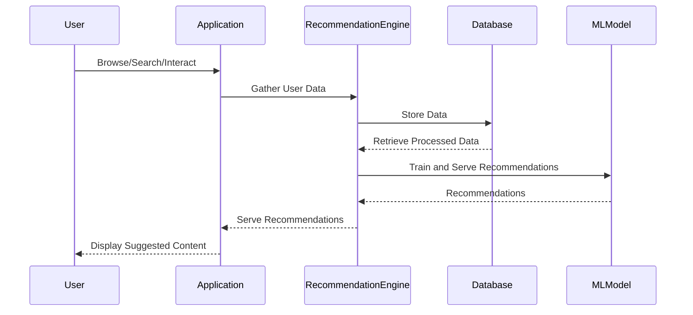

## Introduction

Recommendation Engines have transformed the way digital content is delivered and consumed by leveraging user behavior data to forecast preferences and suggest relevant content. These systems play a crucial role in streaming services, e-commerce platforms, and social media by providing a personalized user experience. They are underpinned by AI and machine learning technologies, which are increasingly deployed via cloud services for scalability and efficiency.

## Architectural Overview

### Core Components

1. **Data Collection and Storage**: User interactions, such as clicks, views, purchases, and ratings, are collected in real-time and stored in databases. Cloud-based NoSQL databases like Amazon DynamoDB or Google Cloud Firestore are often preferred due to their scalability and flexibility.

2. **Data Processing and Feature Engineering**: Raw data is preprocessed and transformed into meaningful features. This involves filtering, normalization, and sometimes, the use of more sophisticated techniques like graph embeddings or word embeddings.

3. **Model Training and Evaluation**: Different machine learning algorithms can be employed:
   - **Collaborative Filtering**: Utilizes the knowledge of user-item interactions.
   - **Content-Based Filtering**: Leverages the metadata of items, matching it to user profiles.
   - **Hybrid Models**: Combines multiple approaches for improved accuracy.

4. **Recommendation Serving**: The trained model is deployed and integrated into the application to serve real-time recommendations. Managed services like AWS SageMaker or Google AI Platform can automate this process.

5. **Feedback Loop**: User feedback is continuously collected to update the model, improving accuracy over time. This may involve online learning techniques.

### Example Code

Below is a simple example of a collaborative filtering recommendation system using a popular library in Python, `Surprise`:

```python
from surprise import SVD
from surprise import Dataset
from surprise import accuracy
from surprise.model_selection import train_test_split

data = Dataset.load_builtin('ml-100k')

trainset, testset = train_test_split(data, test_size=0.25)

algo = SVD()

algo.fit(trainset)

predictions = algo.test(testset)

accuracy.rmse(predictions)
```

## Diagram



## Related Patterns

- **Batch Processing**: Used when handling large volumes of data offline to update the recommendation model.
- **Event Streaming**: Real-time processing of streaming data with technologies like Kafka can be crucial for scalable systems.

## Best Practices

- **Performance Optimization**: Regular tuning of algorithms and reviewing results against cold-start problems.
- **Data Privacy**: Adhering to regulations like GDPR by anonymizing user data and ensuring transparency in recommendation generation.
- **Scalability**: Utilizing cloud-native services for automatic scaling and distribution.

## Additional Resources

- [Deep Learning for Recommender Systems](https://dl.acm.org/doi/10.1145/3240323)
- [Hybrid Approaches to Collaborative Filtering](https://www.sciencedirect.com/science/article/pii/S0957417420304008)

## Summary

Recommendation Engines are essential in driving user engagement and enhancing experiences by providing content tailored to user preferences. Implementing these systems in the cloud brings benefits like scalability, ease of deployment, and access to comprehensive AI tools. Practitioners should focus on understanding user needs, optimizing algorithms, and maintaining robust feedback loops to improve and refine the recommendation process continually.
