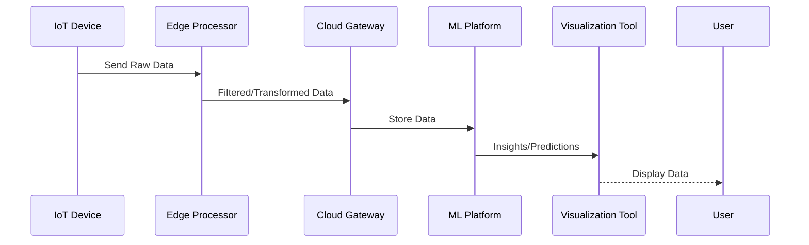

## Introduction

The integration of IoT devices with cloud computing infrastructures allows for seamless data collection, processing, and analysis using advanced machine learning (ML) techniques. This design pattern serves as a blueprint for architects and developers to streamline the incorporation of IoT data streams into cloud environments, leveraging the computational power and storage capabilities of the cloud for real-time and batch ML-driven insights.

## Detailed Explanation

### Design Pattern Structure

1. **IoT Device Layer**: Consists of various sensors and devices generating data continuously. Devices are connected either through direct internet access or via a gateway.

2. **Edge Processing Layer**: Provides preliminary processing capabilities such as data filtering, aggregation, and transformation closer to the data source, reducing bandwidth and improving latency.

3. **Data Ingestion Layer**: Utilizes cloud-based event streaming platforms like Apache Kafka on Confluent Cloud, AWS Kinesis, or Google Cloud Pub/Sub to transport data from edge networks to cloud storage and processing services.

4. **Data Storage Layer**: Employs managed cloud databases such as Amazon S3, Google BigQuery, or Azure Blob Storage for retaining large volumes of structured and unstructured data.

5. **Machine Learning Processing Layer**: Utilizes platforms like Azure Machine Learning, Google Cloud AI Platform, or Amazon SageMaker to train, validate, and deploy ML models on ingested data.

6. **Application and Visualization Layer**: Delivers actionable insights and predictions via dashboards, applications, or APIs using tools like Tableau, Power BI, or custom web apps.

### Architectural Approaches

- **Microservices Architecture**: Decompose complex IoT and ML workloads into independent services to enhance scalability, maintainability, and resilience.
  
- **Serverless Architecture**: Use serverless compute services such as AWS Lambda or Azure Functions for on-demand data processing and response to IoT-triggered events, optimizing costs and management overhead.

- **Event-Driven Architecture**: Facilitate real-time processing and responsiveness through event-based communication and processing patterns.

### Best Practices

- **Data Security**: Implement robust security measures, including end-to-end encryption, authentication, and access controls, to protect sensitive IoT data.

- **Scalability**: Design for scalability to handle the growth in the number of connected devices and the associated increase in data volume.

- **Latency Optimization**: Minimize latency using edge processing and efficient communication protocols (MQTT, HTTP/2).

### Example Code

```javascript
// Example AWS Lambda function for processing IoT data
const AWS = require('aws-sdk');
const iotdata = new AWS.IotData({ endpoint: 'YOUR_ENDPOINT_HERE' });

exports.handler = async (event) => {
    // Parse IoT data from the event
    let payload = JSON.parse(event.body);
    
    // Perform data transformation or analytics
    let transformedData = processData(payload);
    
    // Send data to an ML service or database
    await sendToMLService(transformedData);

    return {
        statusCode: 200,
        body: JSON.stringify({ message: 'Data processed successfully' }),
    };
};

function processData(data) {
    // Transform data logic
    return data;
}

function sendToMLService(data) {
    // Logic to send data to an ML service
    return Promise.resolve();
}
```

### Diagrams

#### UML Sequence Diagram



### Related Patterns

- **Data Lake Pattern**: Centralized repository for storing IoT-generated large data volumes for analysis.
- **Event Streaming Pattern**: Enable real-time data streaming and processing for IoT data flows.

### Additional Resources

- [AWS IoT Documentation](https://docs.aws.amazon.com/iot/)
- [Google Cloud IoT Documentation](https://cloud.google.com/solutions/iot)
- [Azure IoT Overview](https://docs.microsoft.com/en-us/azure/iot-fundamentals/)

## Summary

The integration of IoT devices with cloud computing and machine learning technologies offers a structured approach to harnessing vast IoT data streams for actionable insights. By following this design pattern, organizations can build scalable, secure, and efficient systems capable of real-time data processing and analysis, contributing to informed decision-making and operational improvement.
