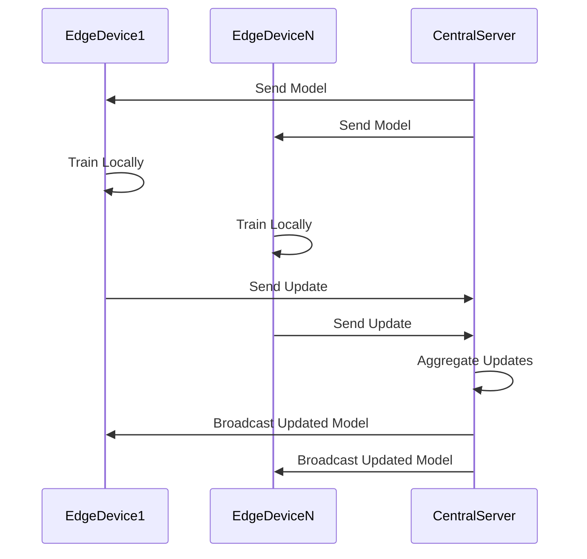

## Introduction

Federated Learning is an innovative machine learning paradigm that facilitates the training of a global model utilizing distributed data sources located on edge devices. It eliminates the necessity to centralize data, thus bolstering privacy, reducing latency, and improving computational efficiency. This pattern is particularly useful in environments where data sensitivity and privacy concerns are paramount, such as healthcare and finance.

## Detailed Explanation

### Architectural Approach

Federated Learning operates through a cooperative process:

1. **Local Training**: Each edge device downloads the current global model and trains it on local data.
2. **Model Update**: The locally trained updates, not the data, are sent back to a central server.
3. **Aggregation**: The server aggregates these updates to improve the global model.
4. **Distribution**: The improved global model is then broadcasted back to all devices.

This iterative process continues until the model reaches satisfactory performance levels.

### Key Components

- **Central Server**: Aggregates updates from multiple devices and orchestrates model training.
- **Edge Devices**: Perform local training and data storage, keeping raw data secured on the device.
- **Communication Network**: Ensures efficient and secure transmission of model parameters.

### Example Code

Here's a simplified example using Python pseudo-code to illustrate Federated Learning concepts:

```python
def train_local_model(data, model):
    # Training code...
    return updated_model

def central_server(devices, global_model):
    aggregated_updates = []

    for device in devices:
        # Each device trains the model locally
        local_update = device.train(data=device.local_data, model=global_model)
        aggregated_updates.append(local_update)

    # Aggregate updates (e.g., via averaging)
    global_model = aggregate(aggregated_updates)
    
    # Broadcast updated model
    for device in devices:
        device.update_global_model(global_model)

def aggregate(updates):
    # Assume a simple average of all updates for this example
    return sum(updates) / len(updates)

```

### Diagrams

Below is sequence diagram demonstrating the Federated Learning workflow:



## Best Practices

- **Communication Efficiency**: Minimize the amount of data transferred by focusing updates on model weights or parameters.
- **Privacy**: Use techniques like Differential Privacy or Homomorphic Encryption to further secure data.
- **Device Varieties**: Handle heterogeneous devices with varied computation capabilities and network conditions.

## Related Patterns

- **Edge Computing**: Bringing computation to data sources, reducing latency and bandwidth use.
- **Secure Multiparty Computation**: Allowing parties to jointly compute a function over inputs while keeping them private.
- **Model Parallelism**: Splitting models across multiple nodes or devices for training.

## Additional Resources

- **Google AI Blog** on Federated Learning research.
- **Papers with Code** repository showcasing Federated Learning implementations.
- **TensorFlow Federated (TFF)**: A framework for experimentation with Federated Learning.

## Summary

Federated Learning represents a transformative approach in the field of machine learning by shifting the focus from data centralization to privacy-preserving collaborative training. It leverages idle edge device resources, reducing the need for massive datasets and cloud computations. This pattern offers significant implications for privacy, real-time analytics, and harnessing distributed data potential in a confidential manner.

By adopting Federated Learning, organizations can effectively train robust machine learning models while adhering to stringent data privacy requirements and optimizing resource usage.
