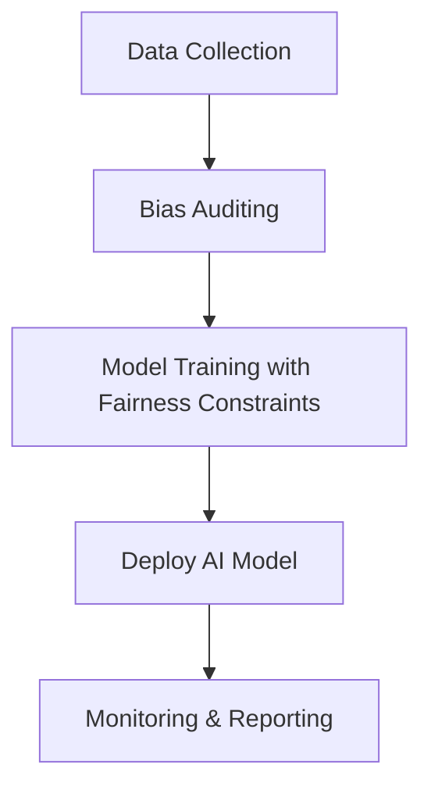
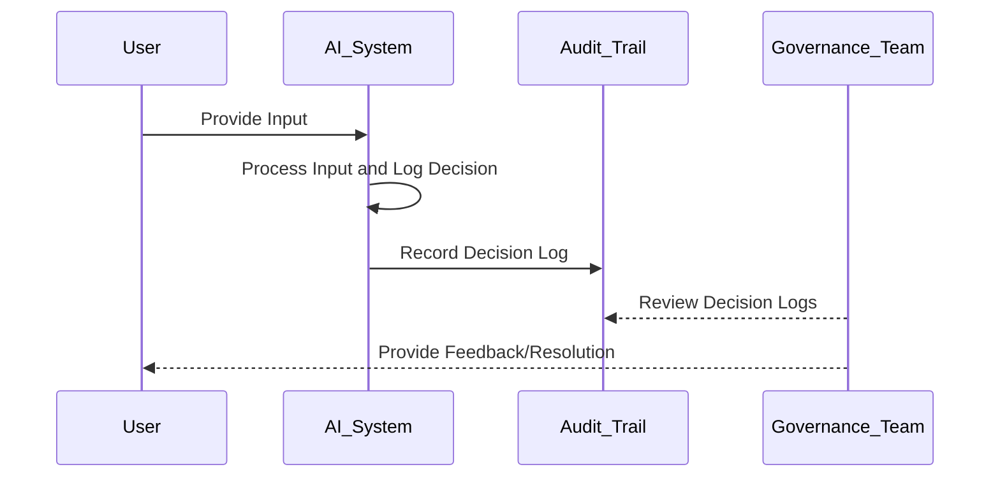

## Introduction

As artificial intelligence (AI) and machine learning (ML) become integral parts of cloud services, ensuring ethical use and deployment of these technologies is paramount. This involves developing AI systems that are fair, transparent, and accountable, thereby reducing potential biases and fostering trust with users. This article explores the patterns and practices that underlie ethical AI within cloud environments, providing practical guidance on implementing these principles.

## The Importance of Ethical AI

The deployment and integration of AI in cloud computing bring numerous advantages, including scalability and accessibility. However, these benefits can be undermined by ethical concerns if AI systems perpetuate biases or discriminate against certain groups. Ensuring fairness involves creating models that do not favor any user unfairly, refraining from harmful decision-making, and maintaining users' trust through transparency and accountability.

## Key Ethical Principles

1. **Fairness**: AI models should treat all users equitably, avoiding biases in data and algorithms that could lead to discrimination.
2. **Accountability**: Systems must be designed so that actions taken by AI can be traced and justified, ensuring responsibility can be assigned.
3. **Transparency**: The workings of AI models should be explainable to end-users, detailing how decisions are made.
4. **Privacy**: Safeguarding users’ data against unauthorized access and ensuring it is used responsibly.

## Best Practices for Ethical AI

### 1. Design for Fairness

- **Data Collection and Preparation**: Ensure diverse and representative data sets. Regularly audit data to identify and mitigate biases.
- **Algorithmic Fairness**: Employ techniques like bias correction algorithms or fairness constraints during model training.

### 2. Maintain Accountability

- **Auditing and Logging**: Implement comprehensive logging mechanisms to track and review AI decisions and their outcomes.
- **Governance Framework**: Establish clear roles and responsibilities for managing and reviewing AI systems.

### 3. Foster Transparency

- **Model Explainability**: Use interpretable models where possible. Employ tools like LIME or SHAP for understanding model predictions.
- **User Communication**: Clearly communicate AI capabilities and limitations to users.

### 4. Ensure Data Privacy

- **Anonymization Techniques**: Use methods like differential privacy to protect user data.
- **Access Controls**: Implement robust authentication and authorization protocols to secure data access.

## Example Code

Here, let's illustrate a simple example using Python with an emphasis on fairness using the `Fairlearn` library for mitigating bias in models.

```python
from sklearn.datasets import fetch_openml
from sklearn.model_selection import train_test_split
from sklearn.linear_model import LogisticRegression
from fairlearn.reductions import ExponentiatedGradient, DemographicParity

data = fetch_openml(data_id=40945) 
X_train, X_test, y_train, y_test = train_test_split(
    data.data, data.target, test_size=0.25, random_state=42
)

estimator = LogisticRegression(solver='liblinear')
fair_model = ExponentiatedGradient(estimator, constraints=DemographicParity())

fair_model.fit(X_train, y_train, sensitive_features=X_train['age'])
predictions = fair_model.predict(X_test)

```

This code demonstrates how to enforce demographic parity, ensuring fairness across different age groups in a dataset.

## Diagrams

### Example of Ethical AI Deployment



### Sequence for AI Accountability



## Related Patterns

1. **Privacy by Design**: Focuses on integrating privacy considerations throughout the development process.
2. **Model Explainability**: Emphasizes the creation of models whose decisions are easy to understand and interpret.

## Additional Resources

- [Fairness Indicators](https://github.com/tensorflow/fairness-indicators) for actionable insights into the fairness of AI models.
- [IBM AI Fairness 360](https://aif360.mybluemix.net/) for a comprehensive toolkit focused on detecting and mitigating bias in datasets and models.

## Summary

Ethical AI practices are essential to ensure that AI systems are developed and deployed responsibly within cloud environments. By adhering to principles of fairness, accountability, transparency, and privacy, organizations can mitigate biases, foster trust, and ensure equitable AI systems. This framework not only enhances the credibility of AI solutions but also ensures compliance with societal and regulatory expectations. By embedding these principles into the development lifecycle, cloud-based AI services can be sources of inclusive progress rather than amplifiers of existing disparities.
