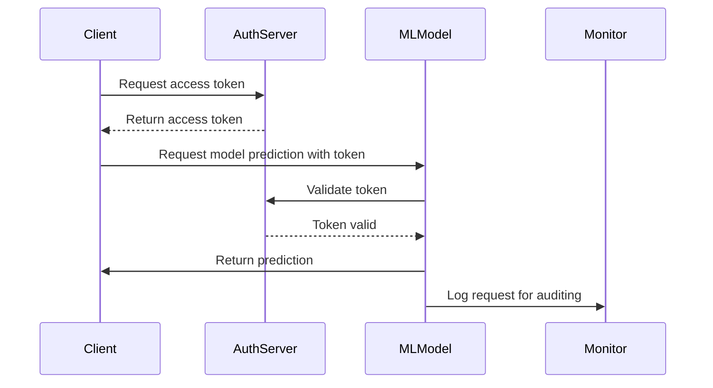

In the realm of cloud-based machine learning (ML) applications, security is of paramount importance. ML systems, due to their complex nature and the valuable data they handle, are potential targets for numerous security threats. This article explores patterns and best practices for securing ML applications in cloud environments, focusing on protecting both the models and the underlying data.

## Design Patterns and Best Practices

### 1. **Data Encryption**

Encrypt data at rest and in transit to protect it from unauthorized access. Use strong encryption protocols such as AES-256 for data at rest and TLS for data in transit. This ensures that even if data is intercepted, it cannot be easily read or modified.

### 2. **Access Control Management**

Implement strict access controls. Use role-based access control (RBAC) or attribute-based access control (ABAC) to ensure that only authorized users and systems can access the ML models and data. Regularly review and update access permissions.

### 3. **Model Monitoring and Logging**

Continuously monitor ML models and maintain comprehensive logs. Logging and monitoring help in identifying unusual access patterns or behaviors that might indicate a security breach. Use tools like AWS CloudWatch or Azure Monitor for effective monitoring.

### 4. **Adversarial Robustness**

Enhance model robustness against adversarial attacks. This can be done by employing techniques such as adversarial training, defensive distillation, and input sanitization to make models resilient to inputs specifically designed to deceive them.

### 5. **Secure Model Serving**

Deploy models using secure endpoints to prevent unauthorized access. Utilize authentication mechanisms such as API keys or OAuth tokens and ensure models run in isolated environments like Docker containers for added security.

### 6. **Data Masking and Differential Privacy**

When handling sensitive data, apply data masking and differential privacy methods to protect personally identifiable information (PII) and maintain data privacy. These techniques can help in deriving insights without exposing individual data points.

### Example Code

```python
from cryptography.fernet import Fernet

def encrypt_data(data):
    key = Fernet.generate_key()
    cipher_suite = Fernet(key)
    encrypted_data = cipher_suite.encrypt(data.encode())
    return encrypted_data, key

data = "Sensitive information"
encrypted_data, key = encrypt_data(data)

print("Encrypted:", encrypted_data)
```

## Diagrams

### UML Sequence Diagram: Secure ML Model Deployment



## Related Patterns

- **Zero Trust Architecture**: Adopting a "never trust, always verify" approach can greatly enhance security by enforcing strict access controls and validating every access request.
- **Data Anonymization**: Techniques to anonymize data before it is used. Useful for maintaining privacy while leveraging data for training and analysis.
- **Immutable Infrastructure**: Running your applications, including ML models, on immutable infrastructure can prevent persistent threats by enforcing regular updates and sans state retention across deployments.

## Additional Resources

- [NIST ML Security Framework](https://www.nist.gov/publications) - A comprehensive guide on ML security best practices.
- [OWASP Top Ten for ML Applications](https://owasp.org) - A resource detailing the top security risks in machine learning applications.
- [Microsoft's Security Best Practices for ML](https://docs.microsoft.com/en-us/security) - Guidance from Microsoft on securing ML workloads.

## Summary

Securing machine learning applications in the cloud involves a multifaceted approach that combines data protection, secure access controls, model robustness, and continuous monitoring. By adhering to the security design patterns and best practices outlined in this article, organizations can mitigate potential threats and safeguard their valuable ML assets against both common and sophisticated security challenges.
