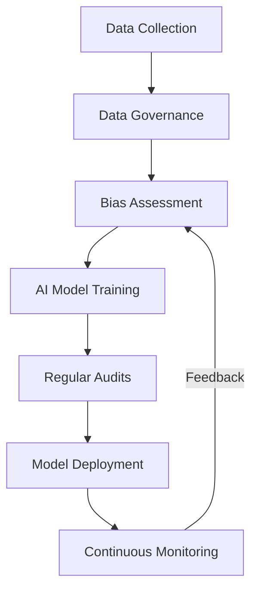

## Introduction

In the rapidly evolving field of Artificial Intelligence (AI) and Machine Learning (ML), compliance refers to ensuring that AI applications adhere to legal, ethical, and regulatory standards. This is especially crucial as AI systems are increasingly being integrated into products and services that impact society, economy, and personal privacy.

## Importance of Compliance in AI/ML

Compliance in AI/ML is crucial for several reasons:

- **Legal Compliance**: Various laws and regulations such as GDPR in Europe, CCPA in California, and other data protection regulations worldwide require organizations to handle personal data responsibly.
- **Ethical Considerations**: Ensures that AI applications do not perpetuate biases or discrimination.
- **Reputation Management**: Maintaining compliance helps protect the reputation of an organization by preventing misuse of AI technologies.
- **Risk Management**: Mitigating the risk of data breaches, misuse of data, and other potential liabilities.

## Potential Risks of Non-Compliance

- **Regulatory Fines**: Non-compliance with regulations such as GDPR can result in significant fines.
- **Loss of Trust**: Stakeholders lose trust if an organization's AI/ML practices are perceived as unethical or intrusive.
- **Security Breaches**: Poor compliance could increase the risk of data breaches, leading to financial and reputational damage.

## Strategies for Ensuring Compliance

1. **Data Governance Framework**: Establish a robust data governance framework to ensure data is collected, processed, and stored responsibly.
 
2. **Regular Audits**: Perform regular audits of AI systems to ensure they meet compliance requirements.
   
3. **Bias Mitigation**: Implement techniques in AI models to identify and mitigate bias, ensuring fair and ethical outcomes.
   
4. **Transparency and Explainability**: Maintain transparency in AI processes and develop explainable AI models to simplify legal and ethical assessments.

5. **Security Measures**: Use advanced encryption and security protocols to protect data integrity and confidentiality.
   
6. **Cross-Disciplinary Teams**: Involve legal, ethical, and technical experts in designing and implementing AI solutions to ensure comprehensive compliance.

## Example Code

```scala
// Example of loading data with compliance checks in a Scala ML application
import org.apache.spark.sql.SparkSession
import org.apache.spark.sql.functions._

object ComplianceAI {
  def main(args: Array[String]): Unit = {
    val spark = SparkSession.builder.appName("ComplianceAI").getOrCreate()
    
    // Load Data with Compliance Verifications
    val dataPath = "path/to/dataset"
    
    try {
      val dataset = spark.read
        .option("header", "true")
        .csv(dataPath)

      // Compliance Check Example: Anonymizing PII
      
      val anonymizedDataset = dataset.withColumn("anonymizedColumn", sha2(col("sensitiveColumn"), 256))
      
      // Further processing
      anonymizedDataset.show()
      
    } catch {
      case e: Exception => println("Error in data processing with compliance: " + e.getMessage)
    }
  }
}

```

## Diagram

Below is a simplified diagram illustrating the stages of AI compliance:



## Related Patterns

- **Data Encryption at Rest and in Transit**: Ensures data is protected both when stored and when being transferred between services.
- **Zero Trust Security**: Enhances security by verifying each request as though it originates from an open network.

## Additional Resources

- [The EU’s European Strategy for Data](https://ec.europa.eu/digital-strategy)
- [NIST AI Risk Management Framework](https://www.nist.gov)
- [AI Ethics Guidelines from the European Commission](https://ec.europa.eu/digital-strategy)

## Summary

Compliance in AI/ML ensures that AI applications operate within legal and ethical boundaries, fostering trust and minimizing risk. By implementing robust compliance strategies, organizations can sustainably harness the potential of AI while safeguarding stakeholders' interests and adhering to relevant regulations.
