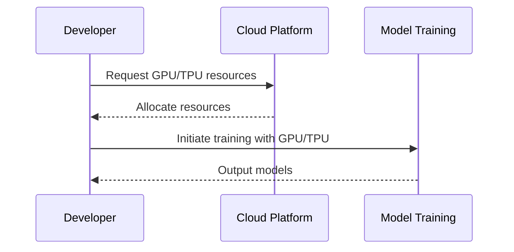

Effective utilization of GPUs (Graphics Processing Units) and TPUs (Tensor Processing Units) is crucial for accelerating machine learning workloads, particularly in the training of large-scale models. This design pattern explores how leveraging specialized hardware in cloud environments can enhance the performance and efficiency of AI computations.

## Detailed Explanation

### Introduction to GPUs and TPUs

GPUs and TPUs are specialized hardware accelerators designed to perform the complex calculations associated with machine learning more efficiently than traditional CPUs:

- **GPUs**: Originally designed to handle graphics rendering, GPUs are highly parallelized, making them effective at training deep learning models. They excel in tasks that require high throughput calculations, such as matrix multiplications.
  
- **TPUs**: Developed by Google, TPUs are application-specific integrated circuits (ASICs) tailored for accelerating TensorFlow applications. TPUs are optimized for large-scale operations across thousands of nodes in massive data centers.

### Advantages of Using GPUs and TPUs

- **Speed**: By paralleling computation tasks, these hardware accelerators can reduce model training times significantly, sometimes from days to hours.
  
- **Scalability**: Cloud providers offer scalable access to GPU and TPU resources, which can be allocated dynamically based on demand.

- **Cost-Effectiveness**: Although initially expensive, the reduced time to train models can lead to cost savings in the long run, especially with pay-as-you-go cloud pricing.

### Typical Use Cases

- **Deep Learning**: Training models such as convolutional neural networks (CNNs) or recurrent neural networks (RNNs) used in image and language processing.
  
- **High-Performance Computing**: Performing extensive simulations and computations where traditional CPU resources would be inefficient.

## Architectural Approaches

### Cloud Integration

Most major cloud providers offer integrated access to GPU/TPU resources:

- **AWS**: Offers Elastic GPU instances and NVIDIA V100 Tensor Core GPUs.
- **Google Cloud Platform**: Provides access to both NVIDIA GPUs and TPUs.
- **Azure**: Provides a range of GPU offerings from NVIDIA A100 to T4 models.
  
Users can leverage these offerings to build scalable and efficient AI systems without the overhead of managing physical hardware.

### Parallel Training Frameworks

- Use established libraries and frameworks like TensorFlow and PyTorch that support GPU/TPU hardware acceleration natively.
- Consider distributed training paradigms, where model training is spread across multiple GPU/TPU instances to reduce convergence time.

## Best Practices

- **Optimize Data Pipeline**: Ensure data input pipelines can keep pace with the computational capabilities of GPU/TPUs to avoid bottlenecks.
  
- **Adjust Batch Sizes**: Leverage larger batch sizes to maximize utilization of parallel processing capabilities.

- **Regularly Profiling and Monitoring**: Utilize tools to monitor hardware utilization and performance metrics to identify potential inefficiencies.

## Example Code

Here's a sample of configuring TensorFlow to utilize TPU on Google Cloud:

```python
import tensorflow as tf

resolver = tf.distribute.cluster_resolver.TPUClusterResolver(tpu='your-tpu-name')
tf.config.experimental_connect_to_cluster(resolver)
tf.tpu.experimental.initialize_tpu_system(resolver)

strategy = tf.distribute.TPUStrategy(resolver)

with strategy.scope():
    model = tf.keras.Sequential([...])
    model.compile(
        optimizer=tf.keras.optimizers.Adam(),
        loss=tf.keras.losses.SparseCategoricalCrossentropy(from_logits=True),
        metrics=[tf.keras.metrics.SparseCategoricalAccuracy()],
    )
```

## Diagrams



## Related Patterns

- **Auto-Scaling Compute Resources**: Dynamically scale compute instances based on training workload demands.
- **Serverless Machine Learning**: Deploy machine learning models without needing to manage underlying hardware.

## Additional Resources

- [NVIDIA Developer Guide for GPUs](https://developer.nvidia.com/gpu-accelerated-applications)
- [Google Cloud TPU Documentation](https://cloud.google.com/tpu/docs)
- [AWS EC2 GPU Instances](https://aws.amazon.com/ec2/instance-types/gpu/)

## Summary

Utilizing GPUs and TPUs is an effective strategy for accelerating AI model training in cloud environments. By leveraging parallel processing capabilities and cloud scalability, organizations can significantly reduce training times, aiding faster model iterations and deployments. This pattern not only improves performance but also leverages cloud cost models for efficient use of computational resources.
