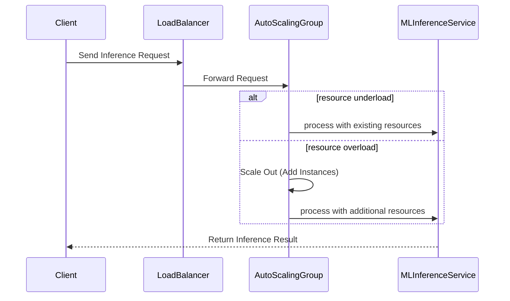

## Introduction

As machine learning (ML) becomes integral to business operations, the ability to efficiently scale ML workloads is crucial. This pattern highlights strategies for optimally managing resources in the cloud during both the training and inference phases of ML models. Leveraging cloud computing's elasticity, organizations can dynamically adjust resources to meet the fluctuating demands in an efficient and cost-effective manner.

## Design Pattern: Scaling ML Workloads

Scaling ML Workloads in cloud environments involves systematically adjusting computational resources based on the current needs of ML tasks. The goal is to utilize cloud services to handle variability in workload effectively, thus ensuring steady performance and cost efficiency.

### Key Concepts

1. **Dynamic Resource Allocation**: Utilize cloud provider features to automatically adjust resources (e.g., compute power, memory, storage) based on workload requirements.
2. **Horizontal Scaling**: Add more instances to improve capacity. Ideal for increasing the number of processes running in parallel.
3. **Vertical Scaling**: Increase the capacity of existing instances to handle larger datasets or more complex models.
4. **Auto-scaling**: Enable features that automatically increase or decrease resources in response to traffic patterns or computational demands.
5. **Spot and Reserved Instances**: Optimize costs by using varied pricing models according to workload predictability.

## Architectural Approach

1. **Training Phase**:
   - **Elastic Compute Clusters**: Deploy ML training on distributed clusters that can expand or contract based on the model complexity and the dataset size.
   - **Batch Processing**: Use services like AWS Batch or Google Cloud Dataflow to manage compute jobs efficiently, exploiting batch slots for large task executions.
   - **Distributed Training**: Implement frameworks such as TensorFlow or PyTorch's distributed strategies to divide the workload across several nodes.
  
2. **Inference Phase**:
   - **Serverless Architecture**: Deploy models using serverless offerings (e.g., AWS Lambda, Azure Functions) to auto-scale functions in response to user demands.
   - **Containerization**: Use containers (via Kubernetes or AWS ECS) for scaling inference services, ensuring consistent and efficient deployments.

## Example Code

Below is a simple example illustrating auto-scaling using AWS Lambda for inference:

```java

// AWS Lambda example to handle HTTP requests for model inference.

exports.handler = async (event) => {
    const modelResponse = await performMLInference(event.body);
    return {
        statusCode: 200,
        body: JSON.stringify(modelResponse),
    };
};

// Function to perform inference using a pre-trained model.
async function performMLInference(input) {
    // Load the model and perform inference
    const results = /* Model inference logic */;
    return results;
}

```

### Diagrams

#### Sequence Diagram

A Mermaid UML sequence diagram illustrating the scaling workflow for an ML Inference Service:



## Related Patterns

- **Stateless Microservices**: Deploy inference services in a stateless manner to enable easy scaling.
- **Container Orchestration**: Use Kubernetes for managing the deployment, scaling, and operation of containerized applications.

## Best Practices

- Monitor and adapt auto-scaling policies to prevent unnecessary costs.
- Regularly update the models and retrain them to ensure accuracy and performance.
- Use logging and monitoring tools to gain insights into resource utilization and model efficiency.

## Additional Resources

- [AWS Machine Learning Services](https://aws.amazon.com/machine-learning/)
- [Google AI and Machine Learning Products](https://cloud.google.com/products/ai)
- [Azure Machine Learning](https://azure.microsoft.com/en-us/services/machine-learning/)

## Summary

Scaling ML workloads in the cloud effectively optimizes both performance and cost. By leveraging cloud-based tools and strategies such as auto-scaling, containerization, and serverless architectures, organizations can ensure their machine learning applications remain responsive and efficient, no matter the demand. This pattern empowers ML practitioners to dynamically manage and allocate resources, enabling robust and scalable machine learning solutions.
