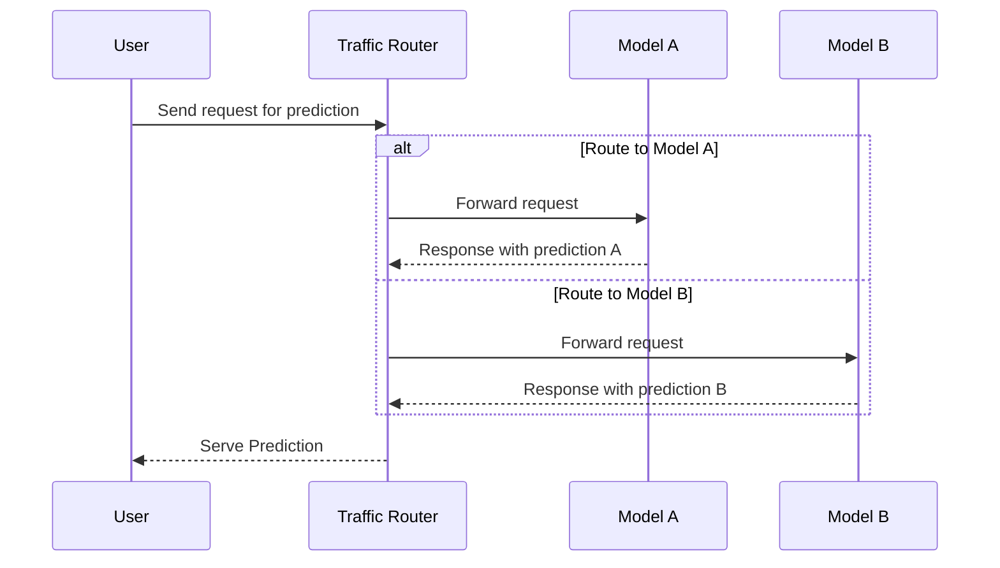

## Introduction

A/B Testing, also known as split testing, involves comparing two versions (A and B) to determine which one performs better under predefined metrics. In the context of machine learning models deployed in cloud environments, A/B Testing is crucial for empirically measuring and validating model performance. This allows data scientists and engineers to iterate rapidly on model improvements in live settings without disrupting the user experience.

## Design Pattern Overview

### Problem

Deploying machine learning models into production is fraught with uncertainties. Models that perform well on training data may not generalize to live environments due to differences in data distribution, evolving trends, or unseen edge cases. A/B Testing provides a controlled way to evaluate multiple models simultaneously, ensuring that selected models improve key performance indicators (KPIs) before full-scale deployment.

### Solution

Implement A/B Testing by running multiple versions of a model in parallel in a live production environment. Distribute user requests between these models based on a predefined ratio. Continuously collect performance metrics to analyze how each version behaves with real users. This empirical evidence guides future model development, reduced biases, and enables data-driven decision-making.

## Architecture and Implementation

### Architectural Approach

1. **Model Deployment:** Deploy multiple model versions contemporaneously in a cloud-native environment (e.g., using Kubernetes or serverless functions).
   
2. **Traffic Splitting:** Use a traffic router or balancer to split incoming requests between models based on percentages (e.g., Model A gets 50%, Model B gets 50%).

3. **Metrics Collection:** Instrument the models to expose metrics (such as accuracy, latency, and usage patterns) or integrate with logging/monitoring tools like CloudWatch, Prometheus, or Stackdriver.

4. **Analysis and Decision:** Evaluate metrics to determine statistically significant performance differences. Use this data to make informed decisions about which model to promote, tune, or phase out.

### Example Code

Using a hypothetical setup with Python and Flask for routing between models:

```python
from flask import Flask, request
import random
import model_a
import model_b

app = Flask(__name__)

@app.route('/predict', methods=['POST'])
def predict():
    data = request.json
    # Random assignment for A/B testing
    if random.random() < 0.5:
        result = model_a.predict(data)
        log_prediction('A', result)
    else:
        result = model_b.predict(data)
        log_prediction('B', result)
    return result

def log_prediction(model_version, result):
    # Log outcomes and metrics for analysis
    print(f"Model {model_version} prediction: {result}")

if __name__ == '__main__':
    app.run(debug=True)
```

### Diagrams



## Related Patterns

- **Canary Deployment:** A related pattern where small subsets of traffic are routed to new model versions to limit risk.
- **Blue-Green Deployment:** Deploying a new version while keeping the old one live, allowing for immediate rollback if necessary.

## Additional Resources

- Martin Fowler's "Feature Toggles" for handling runtime model switching.
- Research paper on "Efficient A/B Testing for Machine Learning" discussing statistical aspects.
- Cloud provider documentation on deployment strategies for ML models (e.g., AWS Sagemaker, Google AI Platform).

## Summary

A/B Testing of Models in the cloud empowers enterprises to make quantitatively backed decisions on model upgrades and deployments. This pattern reduces risks associated with deploying new ML models by providing empirical data on how models perform in a live environment. Beyond mere accuracy, A/B Testing evaluates user satisfactions and operational constraints, marrying data engineering diligence with business goals. By adopting this pattern, organizations can iteratively and safely enhance machine learning capabilities, driving innovation while minimizing negative user impact.
