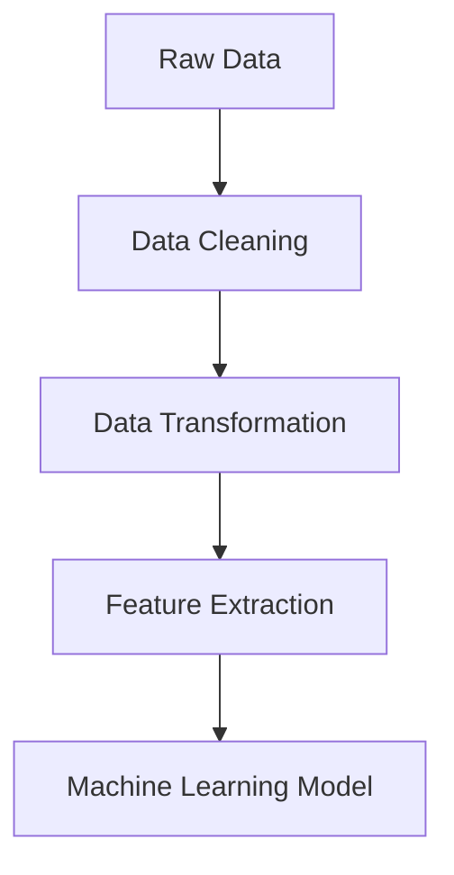

Data preprocessing is a crucial step in any machine learning project. It involves transforming raw data into a format that is clean and ready for model training. This process generally encompasses data cleaning, normalization, transformation, feature extraction, and selection. Effective preprocessing can significantly enhance the performance, accuracy, and reliability of machine learning models.

## Key Components of Data Preprocessing

### Data Cleaning

Data cleaning tackles tasks such as handling missing values, removing duplicates, correcting errors, and filtering out outliers. Techniques include imputing missing data using statistical methods, removing data records with excessive missing values, and standardizing inconsistent data formats.

### Data Transformation

This step involves converting data into suitable forms, like scaling numerical values, encoding categorical variables, and normalizing data distributions. Common techniques include min-max scaling, z-score normalization, and one-hot encoding.

### Feature Extraction and Selection

Feature extraction creates new input features from existing data, often using techniques like Principal Component Analysis (PCA) to reduce dimensionality. Feature selection involves identifying the most relevant features for the modeling process to boost model performance and reduce training time.

## Architectural Approaches

Data preprocessing can be orchestrated using various architectural patterns, including:

- **Batch Processing**: Ideal for scenarios with large volumes of data that don't require real-time processing. Tools like Apache Beam or Apache Spark are commonly used.
- **Stream Processing**: Suitable for real-time preprocessing, this approach handles data as it arrives. Stream processing platforms like Apache Kafka and Apache Flink facilitate this.
- **Hybrid Processing**: Combines batch and stream processing to handle both historical and real-time data, providing comprehensive preprocessing capabilities.

## Best Practices

- **Automate Preprocessing Steps**: Use tools and frameworks that automate preprocessing tasks to ensure consistency and efficiency.
- **Use Version Control for Data Pipelines**: Keep track of different versions of data pipelines for reproducibility and easy rollback.
- **Monitor Data Quality**: Implement data quality checks to ensure that cleaned data maintains integrity through the preprocessing stages.
- **Scalability and Flexibility**: Design preprocessing pipelines to handle increasing data volumes and changing requirements.

## Example Code

Here's a simplified example using Python and the Pandas library to demonstrate data cleaning and transformation:

```python
import pandas as pd
from sklearn.preprocessing import MinMaxScaler, OneHotEncoder

data = pd.read_csv('dataset.csv')

data.dropna(inplace=True)  # Drop missing values
data.drop_duplicates(inplace=True)  # Remove duplicates

scaler = MinMaxScaler()
data['scaled_feature'] = scaler.fit_transform(data[['feature']])

encoder = OneHotEncoder()
encoded_features = encoder.fit_transform(data[['category']]).toarray()

processed_data = pd.concat([data, pd.DataFrame(encoded_features)], axis=1)
```

## Diagrams

### Example of a Data Preprocessing Pipeline



## Related Patterns

- **Data Lake**: Establish a centralized repository to store all your data, enabling comprehensive preprocessing activities.
- **ETL Pipelines**: Extract, Transform, Load processes that prepare data for various analytical operations.
- **Data Quality Management**: Techniques to ensure that the data used in preprocessing is accurate and reliable.

## Additional Resources

- [Scikit-learn Documentation: Preprocessing](https://scikit-learn.org/stable/modules/preprocessing.html)
- [Apache Spark MLlib: Pipelines](https://spark.apache.org/docs/latest/ml-pipeline.html)
- [AWS Data Pipeline](https://aws.amazon.com/datapipeline/)

## Summary

Data preprocessing pipelines are indispensable for preparing data for machine learning models. By cleaning, transforming, and selecting features, they ensure that your ML models have the highest likelihood of success. With the appropriate architectural patterns and best practices, you can build robust pipelines tailored to both batch and stream processing needs, ensuring data quality and scalability in your machine learning workflows.
