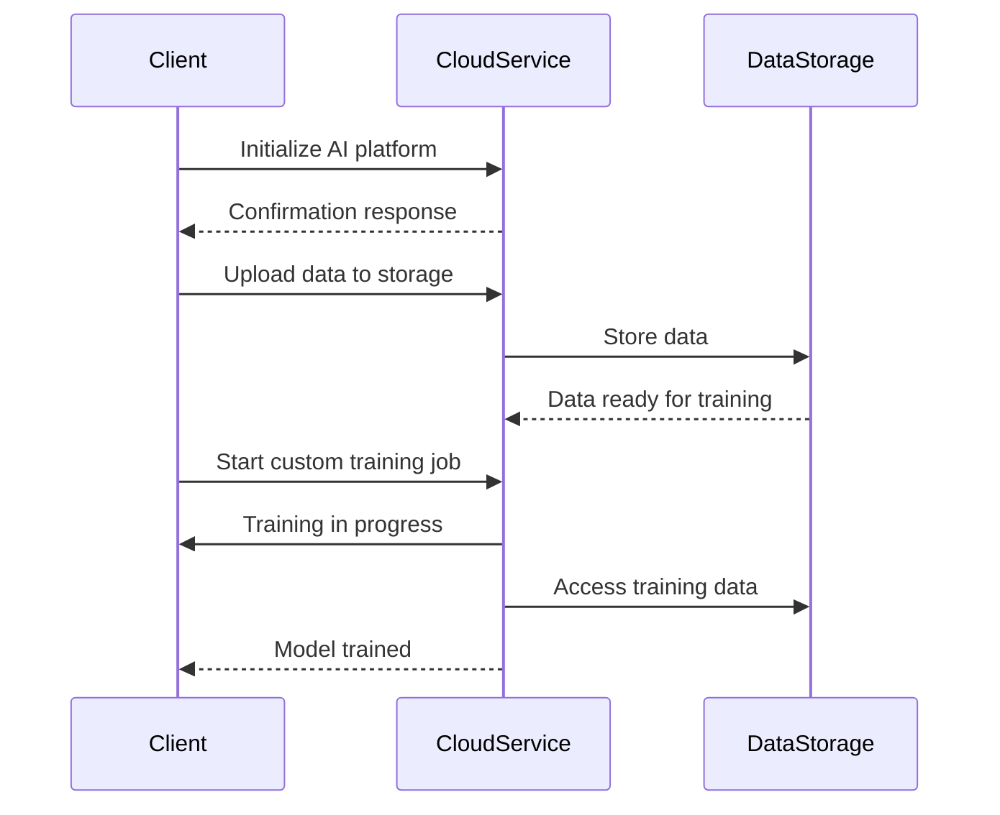

## Introduction

Custom Model Training is a pattern in cloud computing that focuses on developing and training machine learning models to cater to specific, often complex, business requirements. Unlike predefined models, custom models allow organizations to leverage their proprietary data and unique problem constraints to create more accurate and relevant AI solutions. Cloud platforms such as AWS, GCP, Azure, and others offer a multitude of services to facilitate custom model training while ensuring scalability and flexibility.

## Design Pattern Details

- **Problem Statement**: Organizations often face unique challenges that require tailored predictive models. Predefined models may not effectively cater to domain-specific requirements, leading to the necessity for custom solutions.
  
- **Solution**: Utilize cloud-based artificial intelligence and machine learning services to design, develop, and train models that are specifically tailored to your unique requirements and datasets. This approach ensures more accurate predictions and insights.

- **Applicability**: Use the custom model training pattern when:
  - Off-the-shelf models do not meet your business needs.
  - You have proprietary data and specialized requirements.
  - Scalability and flexibility are a concern, necessitating the use of cloud solutions.

## Architectural Approaches

1. **Data Preparation**: Start with data collection, cleaning, and transformation. Use cloud services such as AWS S3, Google Cloud Storage, or Azure Blob Storage to manage data efficiently.

2. **Model Development**: Employ platforms like Google AI Platform, AWS SageMaker, or Azure ML Studio. These environments provide integrated tools for model development, experimentation, and deployment.

3. **Training**: Leverage cloud elasticity to train models with large datasets. Services such as Amazon EC2, Google Compute Engine, or Azure VMs help in parallelizing training jobs, making efficient use of distributed resources.

4. **Evaluation and Tuning**: Perform model evaluation using cloud-based tools to ensure performance metrics meet your specific requirements. Fine-tune models through hyperparameter optimization frameworks available on these platforms.

5. **Deployment**: Deploy models into production using scalable serving platforms like AWS Lambda, Google Cloud Run, or Azure Functions.

6. **Monitoring and Iteration**: Continuously monitor model performance using integrated dashboards and observability tools such as Amazon CloudWatch, Google Stackdriver, or Azure Monitor. Iterate as needed to improve accuracy and performance.

## Example Code

Here is an example of setting up a custom model training pipeline using Python in Google Cloud AI Platform:

```python
from google.cloud import aiplatform

aiplatform.init(project='your-google-cloud-project', location='us-central1')

job = aiplatform.CustomJob(
    display_name='custom-model-training',
    worker_pool_specs=[{
        'machine_spec': {'machine_type': 'n1-standard-4'},
        'replica_count': 1,
        'python_package_spec': {
            'executor_image_uri': 'gcr.io/cloud-aiplatform/training/tf-gpu.2-3:latest',
            'package_uris': ['gs://your-bucket/trainer.tar.gz'],
            'python_module': 'trainer.task',
            'args': ['--epochs', '10', '--batch_size', '32'],
        }
    }]
)

model = job.run(sync=True)
```

## Diagrams

### Custom Model Training Sequence Diagram



## Related Patterns

- **AutoML**: Automated Machine Learning allows non-experts to develop models without manual programming or extensive model tuning.
- **Data Lake**: For storing large volumes of raw data in its native format, enabling advanced analytics and model training.
- **Serverless Architecture**: For deploying machine learning models without managing underlying infrastructure.

## Additional Resources

- [Google Cloud AI Platform](https://cloud.google.com/ai-platform)
- [AWS SageMaker](https://aws.amazon.com/sagemaker/)
- [Azure Machine Learning](https://azure.microsoft.com/en-us/services/machine-learning/)
- [TensorFlow Documentation](https://www.tensorflow.org/)

## Summary

Custom Model Training is a vital pattern for organizations that need targeted machine learning solutions. By leveraging cloud-based AI services, businesses can efficiently handle large datasets, customize algorithms to better fit unique challenges, and deploy scalable and robust models. The approach helps achieve business-specific insights that can drive strategic decisions, enhance efficiency, and provide a competitive edge.
