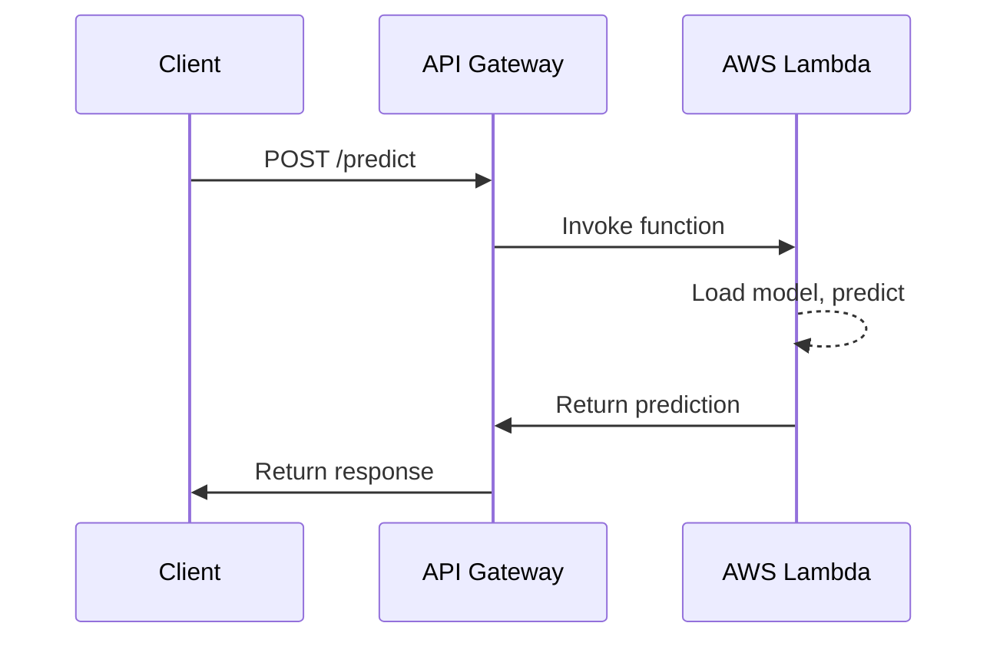

## Overview

In the current landscape of cloud computing, serverless architecture has emerged as a revolutionary way of running applications and services without the cumbersome overhead of managing infrastructure. Serverless Machine Learning (ML) Deployment takes advantage of this architecture, allowing data scientists and ML engineers to deploy predictive models quickly and effortlessly without concerning themselves with server management, provisioning, or scaling concerns.

## Problem Statement

Deploying machine learning models traditionally requires setting up and maintaining a server infrastructure, managing load balancing, and ensuring scalability to cope with demand fluctuations. This process can be resource-intensive, costly, and susceptible to scaling bottlenecks.

## Solution

Serverless ML Deployment utilizes Function-as-a-Service (FaaS) offerings provided by cloud platforms such as AWS Lambda, Azure Functions, or Google Cloud Functions to execute ML functions. These services automatically scale in reaction to demand, only incurring costs based on actual usage rather than pre-allocated resources. The following technologies are frequently used:

- **AWS Lambda & SageMaker:** Leverage AWS Lambda for function execution, integrate with Amazon SageMaker for model training and hosting.
- **Azure Functions & Machine Learning Studio:** Deploy models with Azure Functions, optimize and manage lifecycle using Azure Machine Learning Studio.
- **Google Cloud Functions & AI Platform:** Employ Google Cloud Functions for serverless execution, utilize AI Platform for comprehensive ML capabilities.

## Architectural Approach

1. **Model Training and Development:** The model is developed and trained using commonly available frameworks like TensorFlow, PyTorch, or Scikit-learn in a cloud-native environment.
   
2. **Packaging and Deployment:** The trained model is packaged into a concise deployment artifact, such as a Docker container or zip file, including necessary dependencies.

3. **Function Invocation:** The model is invoked via HTTP requests or event triggers within the serverless framework. Serverless functions handle input requests, process the data against the model, and return predictions.

4. **Scalability and Monitoring:** Serverless ML deployment capitalizes on automatic scalability, ensuring resource allocations based on request volume. Integrations with logging and monitoring tools (e.g., CloudWatch, Azure Monitor, Stackdriver) provide insights into function performance and errors.

## Example Code

```python
import json
import numpy as np
import tensorflow as tf

def lambda_handler(event, context):
    # Load model
    model = tf.keras.models.load_model('/path/to/model')
    
    # Parse input data
    input_data = np.array(event['data'])
    
    # Perform prediction
    prediction = model.predict(input_data)
    
    # Prepare response
    return {
        'statusCode': 200,
        'body': json.dumps({'prediction': prediction.tolist()})
    }
```

## Diagram



## Related Patterns

- **Microservices Architecture:** Serverless functions align with microservices, ensuring ML logic is modular and independently scalable.
- **Event-Driven Architectures:** Utilize event triggers such as data uploads or scheduled operations to trigger ML functions.
- **Continuous Deployment/Integration:** Integrate models with CI/CD pipelines for robust and iterative deployment cycles.

## Best Practices

- **Stateless Functions:** Design functions to be stateless with idempotent behavior to enable intuitive scaling.
- **Efficient Input/Output Handling:** Minimize start-up latency and optimize data serialization for quick processing.
- **Cost Monitoring:** Implement resource usage monitoring to manage unpredictable cost spikes.

## Additional Resources

- [AWS Whitepapers on Serverless Architectures](https://aws.amazon.com/whitepapers/serverless-architectures-on-aws/)
- [Google Cloud Serverless Documentation](https://cloud.google.com/serverless)
- [Azure Serverless Information](https://docs.microsoft.com/azure/azure-functions/)

## Summary

Serverless ML Deployment provides an efficient, scalable, and cost-effective way to deploy machine learning models leveraging cloud provider services. By abstracting infrastructure management and focusing on the execution logic, the deployment process becomes streamlined, allowing data scientists to innovate rapidly while reducing operational overhead. This pattern is well-suited for dynamic applications requiring elasticity and cost management, adhering to modern cloud-native practices.
