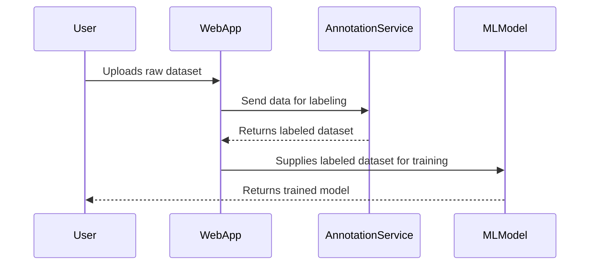

## Introduction

In the world of artificial intelligence and machine learning, high-quality labeled data is indispensable. Data Labeling Services are cloud solutions designed to cater to this very need. These services facilitate the outsourcing of data annotation tasks, making it feasible for organizations to amass large and precisely labeled datasets requisite for effective model training. This article dives deep into the significance, implementation, and best practices associated with Data Labeling Services in the context of cloud computing.

## Design Pattern Description

Data Labeling Services provide a structured approach to manage the lifecycle of data annotation. By leveraging cloud infrastructures, these services offer scalable, efficient, and often automated solutions to transform raw datasets into labeled datasets through human and machine collaboration.

### Key Components

- **Data Collection**: Gathering unprocessed data that needs annotation, such as images, text, audio, or video.
- **Pre-processing**: Cleaning and organizing data to make it suitable for labeling.
- **Annotation Tools**: Using specialized software or platforms that support various labeling types, including image segmentation, entity extraction, sentiment labeling, etc.
- **Quality Assurance**: Implementing checks and balances to ensure annotation accuracy and consistency.
- **Data Storage**: Securely storing labeled datasets for easy access and integration into ML pipelines.

## Architectural Approaches

### Cloud-Native Solutions

Utilizing cloud-native services (such as AWS SageMaker Ground Truth, Google Cloud Data Labeling, or Azure Machine Learning) offers several advantages:
- **Scalability**: Leverage cloud elasticity for growing or shrinking resources based on demand.
- **Integration**: Seamless integration with other cloud-based ML tools and services.
- **Automation**: Utilizing AI to assist or automate labeling tasks where applicable.

### Security and Compliance

Given the sensitivity of data, especially in domains like healthcare or finance, Data Labeling Services must adhere to strict security and compliance protocols, ensuring data privacy and integrity.

## Best Practices

- **Define Clear Labeling Guidelines**: Ensure that labeling instructions are clear and comprehensive to improve annotation quality.
- **Iterative Feedback**: Establish a process for continuous feedback and iteration between data labelers and project leads.
- **Quality Metrics**: Utilize precision, recall, and other metrics to evaluate and maintain annotation quality.
- **Hybrid Approaches**: Combine manual and automated labeling processes to enhance efficiency and accuracy.

## Example Code

Here’s a snippet demonstrating the integration of a cloud data labeling service using a hypothetical SDK:

```java
import com.cloud.labeling.DataLabelerClient;
import com.cloud.labeling.models.AnnotationTask;

public class DataLabelingExample {
    public static void main(String[] args) {
        DataLabelerClient client = new DataLabelerClient();

        // Create a new annotation task
        AnnotationTask task = client.createTask("Image annotation for wildlife dataset");

        // Start the data labeling process
        boolean success = client.startLabeling(task);

        if (success) {
            System.out.println("Data labeling task started successfully.");
        } else {
            System.out.println("Failed to start the data labeling task.");
        }
    }
}
```

## Diagram

Here is a simplified UML Sequence Diagram illustrating the interactions in a cloud-based data labeling service:



## Related Patterns

- **Batch Processing**: Often used with Data Labeling Services to process large datasets concurrently.
- **Data Integration**: Combining labeled data from various sources for comprehensive datasets.
- **Machine Learning Model Management**: Ensures labeled data is effectively utilized in model development and lifecycle management.

## Additional Resources

- [AWS SageMaker Ground Truth](https://aws.amazon.com/sagemaker/groundtruth/)
- [Google Cloud Data Labeling](https://cloud.google.com/data-labeling)
- [Azure Machine Learning](https://azure.microsoft.com/en-us/services/machine-learning/)

## Summary

Data Labeling Services play a quintessential role in the AI/ML landscape by providing efficient, scalable, and quality-driven means to annotate datasets. By delegating this task to specialized cloud services, organizations can focus on model development and deployment, achieving faster time-to-market and superior AI solutions.
