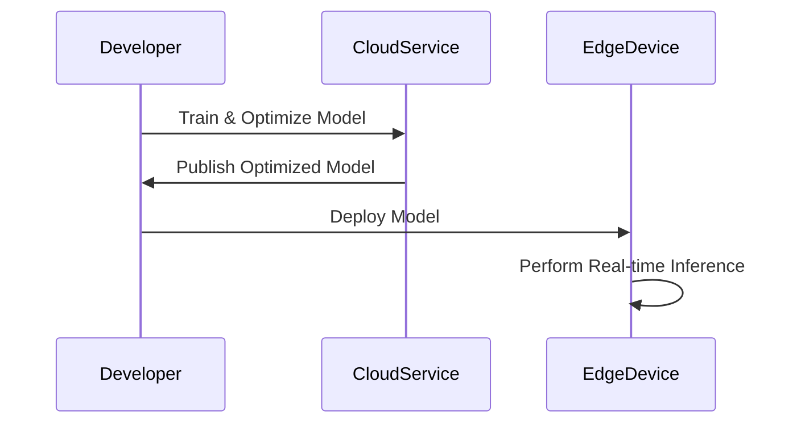
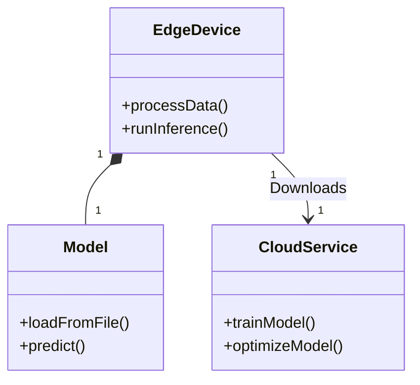

## Overview

Edge AI Deployment refers to the practice of deploying machine learning models directly on edge devices to perform real-time inference. This paradigm shift from centralized cloud-based AI to localized edge devices aims to reduce latency, improve privacy, and enhance the efficiency of IoT systems. Edge devices ranging from smartphones to IoT sensors benefit from onboard inferencing, enabling applications in autonomous vehicles, industrial automation, healthcare, and more.

## Key Concepts

### Low Latency
Deploying models on edge devices ensures immediate processing and decision-making, crucial for applications where time-sensitive actions are necessary, such as robotics or autonomous driving.

### Offline Functionality
Edge AI can operate without continuous internet access, making it resilient and reliable in remote or connectivity-constrained scenarios.

### Data Privacy
By analyzing data locally, sensitive information doesn't need to be transmitted to the cloud, enhancing security and privacy concerns.

### Resource Constraints
Edge devices often have limited computational and power resources compared to cloud infrastructures; thus, models need to be optimized for efficient execution.

## Architectural Approaches

### Model Optimization Techniques
1. **Quantization**: Reduces model size and increases inference speed by converting weights from floating-point to integer representation.
2. **Pruning**: Removes unnecessary neurons or layers to streamline the model without significant loss of accuracy.
3. **Knowledge Distillation**: Uses a large pre-trained model to train a smaller model that is more suitable for edge deployment.

### Deployment Strategies
1. **On-device Inference**: Direct deployment of AI models on device hardware, leveraging native libraries like TensorFlow Lite, ONNX Runtime, or Core ML.
2. **Edge Gateway Inference**: Offloading AI tasks to more capable edge gateways that aggregate data from multiple devices.
3. **Federated Learning**: A method where each device locally trains its model, and parameters are shared collectively without sharing the raw data.

## Example Code

For device-specific deployment, consider using TensorFlow Lite for a common edge device, such as a smartphone:

```python
import tensorflow as tf
import numpy as np

converter = tf.lite.TFLiteConverter.from_keras_model(your_keras_model)
tflite_model = converter.convert()

with open('model.tflite', 'wb') as f:
    f.write(tflite_model)
```

This code snippet converts a Keras model to TensorFlow Lite format, suitable for deployment on mobile and embedded devices.

## Diagrams

### Sequence Diagram: Model Deployment to Edge Device



### Class Diagram: Edge AI Component Architecture



## Related Patterns

- **IoT Data Aggregation Pattern**: Combining data from various IoT devices before edge processing.
- **Model Optimization Pattern**: Techniques to reduce model resource requirements for better edge performance.
- **Federated Learning Pattern**: Enhancing privacy by performing training across dispersed devices.

## Additional Resources

- [TensorFlow Lite Documentation](https://www.tensorflow.org/lite)
- [Edge AI: Trends and Challenges](https://arxiv.org/abs/2101.00202)
- [Federated Learning: Collaborative Machine Learning without Centralized Training Data](https://ai.googleblog.com/2017/04/federated-learning-collaborative.html)

## Summary

Edge AI Deployment is a transformative approach that extends AI inference capabilities to the endpoints of a network. By deploying models to edge devices, organizations can achieve significant improvements in latency, privacy, and operational efficiency, paving the way for advanced applications in various industries. Successful implementation of this pattern relies on model optimization techniques and strategic deployment methods to overcome edge device limitations.
