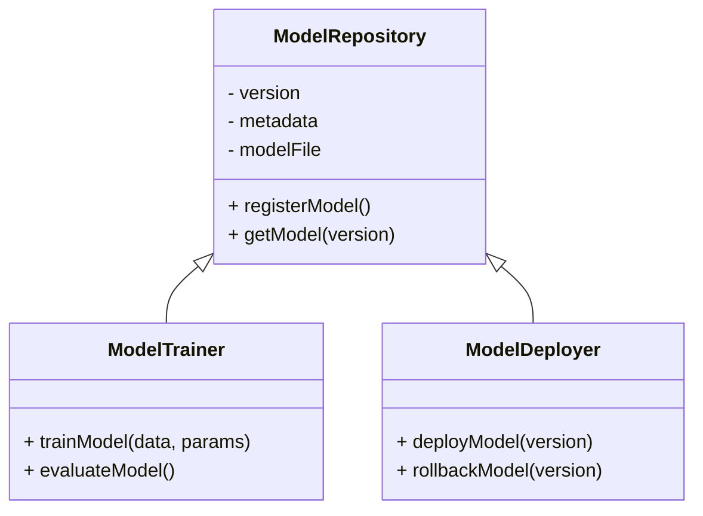

## Introduction

As machine learning models are developed, tested, and deployed, they undergo numerous changes based on new data, improved algorithms, and enhancements in features. Without a systematic way of managing these changes, organizations risk losing track of model efficacy and relevance over time. The **Model Versioning and Tracking** pattern is a framework designed to keep your model iterations well-organized, reproducible, and efficiently managed within cloud platforms.

## Design Pattern: Model Versioning and Tracking

Model versioning and tracking can be likened to source code versioning, where each iteration of a model is saved as a distinct version, complete with metadata and performance metrics. This approach provides a comprehensive audit trail and facilitates effective collaboration between teams.

### Key Considerations

- **Tracking and Metadata**: Collect essential metadata for each version, such as data configurations, feature sets, training parameters, and performance metrics.
  
- **Repository Structure**: Use a structured repository to store models, much like you would for source code. This can be achieved using dedicated tools like MLflow, DVC, or cloud-native solutions.

- **Data and Environment Consistency**: Ensure that models are linked to the specific datasets and environments used during training to support reproducibility.

- **Access and Permissions**: Implement robust access controls to manage who can access and modify model versions.

- **Interoperability**: Utilize open standards and frameworks that allow for seamless integration with various ML tools and cloud platforms.

### Architectural Approaches

1. **Version Control Systems for Models**:
   - Implement systems similar to Git but designed for large datasets and models, such as DVC or MLflow.
  
2. **Cloud Managed Services**:
   - Leverage cloud-native solutions from providers like AWS (SageMaker), Azure (ML Studio), or GCP (AI Platform) for built-in model tracking and versioning capabilities.
  
3. **Containerization**:
   - Use Docker and Kubernetes to encapsulate model environments, ensuring consistent deployment across different stages.

### Best Practices

- **Version Everything**: From datasets to training scripts and models, everything should be version-controlled to ensure clear traceability.
- **Model Registry**: Maintain a centralized registry that stores models with their metadata, making search and retrieval efficient.
- **Automate Tracking**: Automate the capturing of model metrics and lineage during the model training and deployment pipeline.
- **Continuous Integration and Continuous Deployment (CI/CD)**: Implement CI/CD practices tailored for machine learning to manage the lifecycle effectively.

### Example Code Snippet

The following is a Python snippet using MLflow to log and track model versions:

```python
import mlflow
import mlflow.sklearn

with mlflow.start_run():

    # Train your model
    model = train_model(data, params)
    
    # Log parameters and metrics
    mlflow.log_params(params)
    mlflow.log_metrics({"accuracy": 0.95})
    
    # Log sklearn model
    mlflow.sklearn.log_model(model, "model")
```

### UML Diagram



## Related Patterns

- **Continuous Integration for ML**: Supports the automation of model training and validation.
- **Data Lineage Tracking**: Ensures all transformations and their impacts on model outcomes are transparent.
- **Automated Model Retraining**: Facilitates ongoing learning and adaptation for models based on new data.

## Additional Resources

- [MLflow Documentation](https://www.mlflow.org/docs/latest/index.html)
- [AWS SageMaker Model Registry](https://docs.aws.amazon.com/sagemaker/latest/dg/model-registry.html)
- [Azure Machine Learning](https://azure.microsoft.com/en-us/services/machine-learning/)
- [Google AI Platform Pipelines](https://cloud.google.com/ai-platform/pipelines/docs)

## Summary

Model versioning and tracking serve as the backbone for structured machine learning development in cloud environments, ensuring that teams can effectively manage, reproduce, and collaborate on model advancements. By implementing this pattern, organizations can enhance their AI and machine learning operations with an organized and proactive approach to model lifecycle management.
