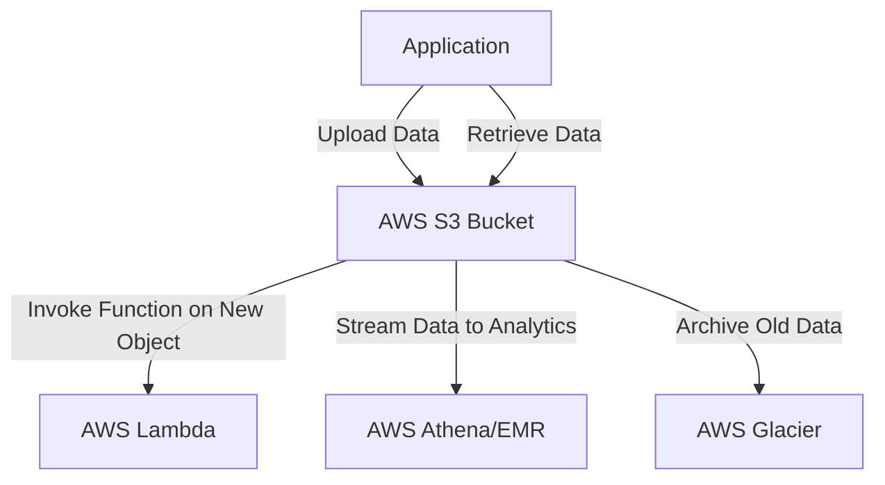

## Introduction

In the modern cloud computing landscape, the need for robust, scalable, and cost-effective data storage solutions has become paramount. Object Storage Utilization is a design pattern that emphasizes the use of scalable object storage services, such as Amazon S3, to store and manage unstructured data. This pattern is pivotal for cloud-native applications that require seamless access to vast amounts of data without the constraints of traditional file systems or databases.

## Design Pattern Description

Object Storage Utilization involves storing data as discrete units called objects. Each object contains data, metadata, and a globally unique identifier, allowing straightforward retrieval and manipulation. Unlike block or file storage, object storage provides a flat namespace, enabling easy scaling into petabytes and beyond without the complexity of a hierarchical file structure.

### Key Characteristics

- **Scalability**: Object storage is designed for high scalability, accommodating exponential data growth without compromising performance.
- **Durability**: With multiple copies across different locations, object storage offers high durability, ensuring data integrity and availability.
- **Cost-Effectiveness**: Pay-as-you-go pricing models and tiered storage options help optimize costs based on application needs.
- **Accessibility**: Object storage services provide RESTful APIs, integrating seamlessly with applications and services across various cloud platforms.

## Architectural Approaches

### 1. Data Lifecycle Management

Using policies to manage data throughout its lifecycle, from creation to archiving or deletion, can optimize storage costs and ensure compliance with retention policies.

### 2. Integration with Cloud Services

Object Storage can be integrated with a plethora of cloud services such as AWS Lambda for serverless computing, AWS Athena for querying data directly in S3, and AWS Glacier for long-term archival.

### 3. Security and Compliance

Implementing strong access controls, encryption, and audit logging ensures that data stored in object storage meets security and compliance standards specific to the industry.

## Best Practices

- **Use Versioning**: Enable versioning to protect against accidental overwrites or deletions of critical data.
- **Employ Encryption**: Use server-side or client-side encryption to safeguard data at rest.
- **Leverage Lifecycle Rules**: Automate the transition of data between different storage classes or services based on age, access frequency, or other criteria.
- **Implement IAM best practices**: Use AWS IAM policies to enforce the principle of least privilege when accessing object storage resources.

## Example Code

Here's an example of how to upload a file to Amazon S3 using the AWS SDK for Python (Boto3):

```python
import boto3
from botocore.exceptions import NoCredentialsError

def upload_to_s3(file_name, bucket, object_name=None):
    s3_client = boto3.client('s3')
    try:
        response = s3_client.upload_file(file_name, bucket, object_name or file_name)
        print(f"File '{file_name}' uploaded successfully to {bucket}/{object_name or file_name}")
        return response
    except FileNotFoundError:
        print("The file was not found")
    except NoCredentialsError:
        print("Credentials not available")

upload_to_s3('example.txt', 'my-example-bucket')
```

## Diagrams

### Basic Architecture of Object Storage with S3



## Related Patterns and Descriptions

- **Content Delivery Network (CDN) Integration**: Enhance performance by caching frequently accessed objects closer to end-users.
- **Data Lake Pattern**: Store vast amounts of raw data in its native format for centralized analytics and data processing.
- **Backup and Restore**: Utilize object storage for reliable backup and restore operations across distributed systems.

## Additional Resources

- [AWS S3 Documentation](https://docs.aws.amazon.com/s3/index.html)
- [Google Cloud Storage Documentation](https://cloud.google.com/storage/docs)
- [Azure Blob Storage Documentation](https://docs.microsoft.com/en-us/azure/storage/blobs/)

## Summary

Object Storage Utilization is a foundational pattern for modern applications dealing with unstructured data. By leveraging scalable object storage services like Amazon S3, organizations can ensure their data is durable, cost-efficient, and easily accessible. It provides a highly reliable option for managing big data in the cloud, offering seamless integration with a host of other services to facilitate advanced data processing and analytics.
