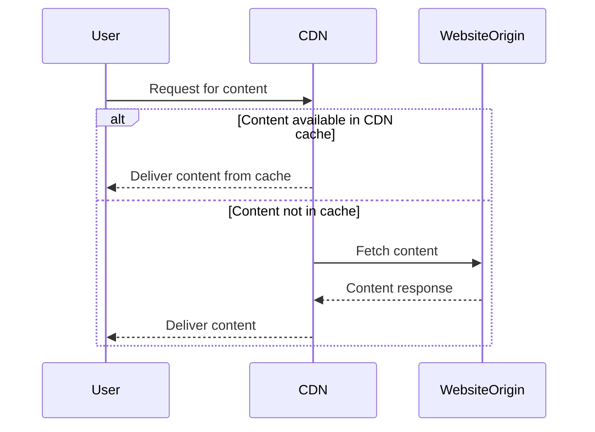

## Introduction

Content Delivery Networks (CDNs) play a crucial role in modern web architecture by ensuring that content is delivered to users efficiently, with minimized latency and improved reliability. CDNs achieve this by distributing server nodes globally and leveraging them to cache content closer to end-users.

## Detailed Explanation

### Definition

A Content Delivery Network (CDN) is a distributed group of servers that work together to provide fast delivery of Internet content. This content can include web pages, images, videos, and other web resources.

### How CDNs Work

1. **Caching and Distribution**: CDNs store cached versions of content in multiple geographical locations (called Points of Presence, or PoPs). These are strategically located around the globe to ensure content requests are served from the closest server.

2. **Request Routing**: When a user requests content, the CDN's intelligent routing system determines the most efficient server to deliver that content based on location, server health, and load levels.

3. **Load Balancing**: CDNs distribute traffic evenly across servers to optimize resource use, maximize throughput, minimize response time, and avoid overload on single servers.

4. **Content Optimization**: Besides caching, CDNs also employ various techniques to reduce file sizes and enhance delivery speed, such as compression and minification.

### Benefits

- **Reduced Latency**: By serving content from a location closer to the user, CDNs significantly reduce the time it takes for data to travel.
- **Improved Load Times**: Faster content delivery enhances the user experience.
- **Scalability**: CDNs handle spikes in demand effectively without impacting performance.
- **Enhanced Security**: Many CDNs provide security features such as DDoS protection and secure content delivery through TLS/SSL encryption.

## Example Code

```JavaScript
// Example of using a CDN with a JavaScript library
// Let's include a library hosted on a CDN for faster global accessibility
const script = document.createElement('script');
script.src = "https://cdn.jsdelivr.net/npm/library-name@version/library.min.js";
document.head.appendChild(script);
```

This code snippet demonstrates how to include a JavaScript library from a CDN, improving load times by fetching from the nearest server instead of a central location.

## Diagrams

### CDN Request Flow Diagram



## Related Patterns

- **Edge Computing**: Like CDNs, edge computing brings processing closer to the data source, improving response times.
- **Load Balancing**: Both CDNs and load balancers distribute traffic to enhance performance and reliability.

## Additional Resources

- [AWS CloudFront Documentation](https://aws.amazon.com/cloudfront/)
- [Google Cloud CDN Overview](https://cloud.google.com/cdn)
- [Azure CDN](https://azure.microsoft.com/en-us/services/cdn/)

## Summary

Content Delivery Networks are pivotal in delivering digital assets quickly and securely by caching content close to the users. By reducing latency and enhancing performance, CDNs improve user experiences and provide robust support for high traffic and distributed applications. As internet usage continues to grow globally, leveraging CDNs becomes essential for businesses to maintain competitive and efficient online services.
