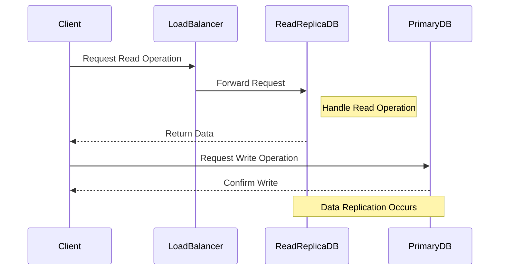

## Overview

Database Read Replicas are a design pattern that involves creating one or more copies of a primary database specifically to handle read queries. By offloading read operations to replicas, the primary database is relieved of a significant load, allowing it to process write operations more efficiently. This pattern is particularly useful in cloud environments where database performance, scalability, and fault tolerance are crucial.

## Architectural Approach

In a typical setup, the primary database serves as the source of truth and handles all write operations. Each read replica is a separate database instance that asynchronously replicates data changes from the primary database. This asynchronous nature helps minimize latency and ensures that read operations do not impact the primary database's throughput.

### Key Components:
- **Primary Database**: Central database instance processing all write operations.
- **Read Replicas**: Copies of the primary database that synchronize data but are dedicated to processing read queries.
- **Replication Mechanism**: The technology or protocol ensuring data from the primary database is replicated to the read replicas.

## Best Practices

1. **Consistent Replication**: Ensure the replication mechanism is reliable and can handle eventual consistency delays.
2. **Auto-scaling**: Implement auto-scaling for read replicas based on the traffic volume and operational needs.
3. **Load Balancing**: Use load balancers to distribute read traffic effectively across replicas.
4. **Monitoring and Alerts**: Set up monitoring for replication lag and alert systems to detect when replicas are out of sync.
5. **Security**: Secure replicas similarly to the primary database to prevent unauthorized access or data breaches.

## Example Code

Here's an example of setting up a read replica in AWS using the SDK for Java:

```java
import com.amazonaws.services.rds.AmazonRDS;
import com.amazonaws.services.rds.AmazonRDSClientBuilder;
import com.amazonaws.services.rds.model.CreateDBInstanceReadReplicaRequest;

public class CreateReadReplica {
    public static void main(String[] args) {
        final AmazonRDS rds = AmazonRDSClientBuilder.defaultClient();

        CreateDBInstanceReadReplicaRequest request = new CreateDBInstanceReadReplicaRequest()
                .withDBInstanceIdentifier("read-replica-instance")
                .withSourceDBInstanceIdentifier("primary-database")
                .withDBInstanceClass("db.m5.large")
                .withAvailabilityZone("us-west-2a");

        rds.createDBInstanceReadReplica(request);
        System.out.println("Read Replica created successfully.");
    }
}
```

## Diagrams

### UML Diagram



## Related Patterns

- **Database Sharding**: Distributing data across multiple database instances to handle large data volumes and improve performance.
- **Multi-Region Deployment**: Deploying database replicas across different regions for disaster recovery and latency reduction.
- **Caching**: Using in-memory data stores to cache frequent read queries for faster access.

## Additional Resources

- [AWS RDS Read Replicas Documentation](https://docs.aws.amazon.com/AmazonRDS/latest/UserGuide/USER_ReadRepl.html)
- [Google Cloud Read Replicas](https://cloud.google.com/sql/docs/mysql/replication)
- [Azure SQL Database Read Scale-Out](https://docs.microsoft.com/en-us/azure/azure-sql/database/read-scale-out)

## Summary

Implementing Database Read Replicas is a fundamental pattern in cloud computing to enhance database performance, scalability, and reliability. By distributing read operations across several replicas, you can significantly reduce the load on the primary database, allowing for more efficient operation. This pattern is valuable for high-traffic applications where read-heavy operations can lead to bottlenecks.
