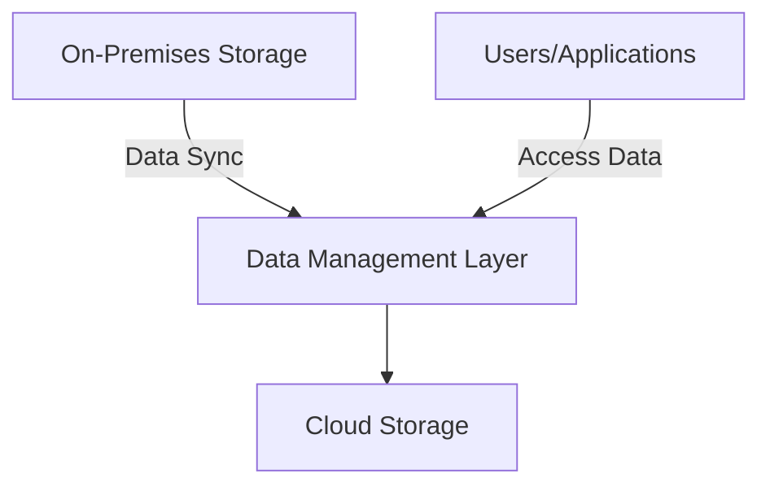

## Introduction

In the modern digital landscape, the need for robust, scalable, and flexible storage solutions has intensified. The **Hybrid Storage Solutions** pattern addresses this need by seamlessly integrating on-premises and cloud storage. This pattern enables organizations to leverage the strengths of both environments, achieving optimal performance, resiliency, and cost-effectiveness.

## Architectural Overview

Hybrid Storage Solutions create a unified storage environment where data can be stored and accessed from both on-premises and cloud locations. This pattern allows businesses to design custom storage strategies that optimize for cost, performance, and data governance requirements.

### Key Components

- **On-Premises Storage**: Utilized for low-latency access to critical data. Common technologies include SAN (Storage Area Network), NAS (Network Attached Storage), and other high-performance storage systems.
  
- **Cloud Storage**: Provides scalable, elastic storage capacity. Options include object storage (e.g., AWS S3, Google Cloud Storage), block storage, and file storage services.
  
- **Data Management Layer**: Software or middleware that handles data synchronization, replication, and access control between on-premises and cloud storage.

- **Connectivity**: Secure and efficient network connections (e.g., VPNs, Direct Connect) enable seamless integration between the on-premises infrastructure and cloud services.

## Best Practices

1. **Data Tiering and Lifecycle Management**: Implement policies to automatically move data between on-premises and cloud storage based on access patterns and lifecycle stages to optimize costs and performance.

2. **Security and Compliance**: Ensure data security through encryption and adhere to compliance requirements by maintaining control over data residency and access controls.

3. **Latency and Bandwidth Optimization**: Use caching and data compression techniques to manage latency and bandwidth costs effectively.

4. **Disaster Recovery and Backup**: Utilize cloud storage for affordable, scalable backup and disaster recovery solutions, ensuring data availability and durability.

5. **Performance Monitoring**: Continuously monitor the performance of storage resources to optimize for cost and efficiency, using integrated cloud services and third-party tools.

## Example Code

```java
// Example of a service to manage hybrid storage
public class HybridStorageManager {
    private final CloudStorageService cloudStorage;
    private final OnPremStorageService onPremStorage;

    public HybridStorageManager(CloudStorageService cloudStorage, OnPremStorageService onPremStorage) {
        this.cloudStorage = cloudStorage;
        this.onPremStorage = onPremStorage;
    }

    public void storeData(String dataKey, byte[] data, StoragePolicy policy) {
        switch (policy) {
            case CLOUD:
                cloudStorage.save(dataKey, data);
                break;
            case ON_PREM:
                onPremStorage.save(dataKey, data);
                break;
            case HYBRID:
                onPremStorage.save(dataKey, data);
                cloudStorage.save(dataKey, data);
                break;
        }
    }
    
    public byte[] retrieveData(String dataKey, StoragePolicy policy) {
        // Retrieving logic based on storage policy
    }
    
    // Other functionalities
}
```

## Diagrams

### Hybrid Storage Architecture



## Related Patterns

- **Data Lake**: Centralized repository that allows you to store structured and unstructured data at any scale.
- **Archival Storage**: Storing data in lower-cost cloud services for long-term retention.
- **Content Delivery Network (CDN)**: Use for caching and distributing high-demand data closer to end-users.

## Additional Resources

- [AWS Storage Services](https://aws.amazon.com/products/storage/)
- [Google Cloud Storage Options](https://cloud.google.com/products/storage/)
- [Azure Storage Overview](https://azure.microsoft.com/en-us/services/storage/)

## Summary

The Hybrid Storage Solutions pattern offers a strategic approach to managing modern storage requirements by combining the benefits of on-premises infrastructure with the scalability and flexibility of cloud storage. By carefully designing and implementing this pattern, organizations can achieve significant cost savings, improve performance, and meet complex compliance and data residency challenges. As the cloud ecosystem continues to evolve, Hybrid Storage Solutions remain a vital component of forward-thinking data management strategies.
