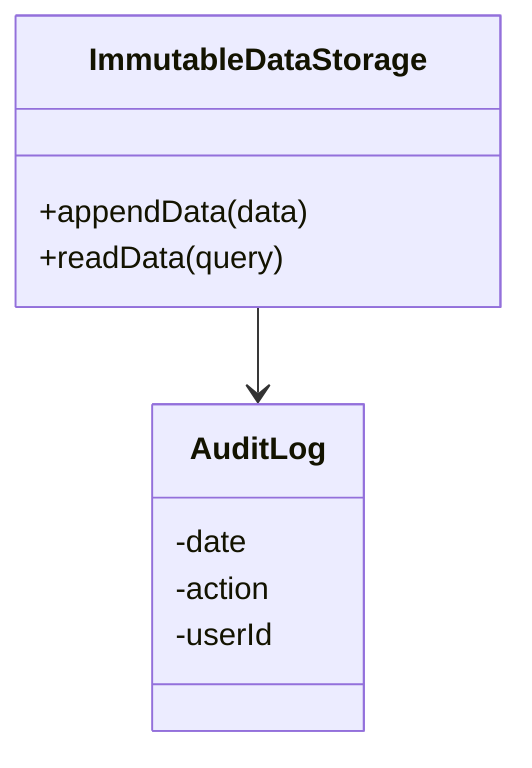
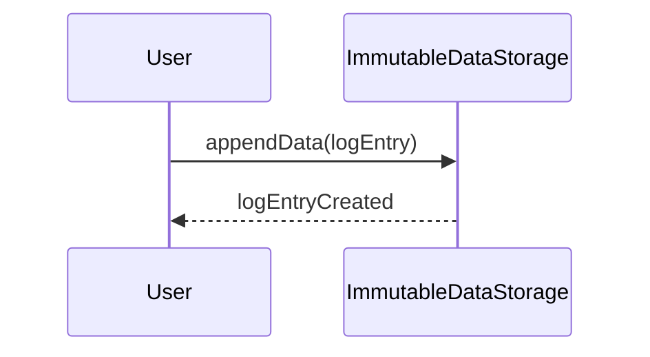

In today's cloud-centric world, organizations often require storage solutions that ensure data cannot be altered once it is written. This need is met by the **Immutable Data Storage** pattern, which is particularly useful for storing audit logs, compliance records, and other forms of critical, unchangeable data.

## Design Pattern Explanation

Immutable Data Storage refers to a data management pattern where once data is written, it cannot be modified or deleted. This pattern is essential in situations where data integrity, historical correctness, and compliance are critical. By preventing changes to stored data, this pattern enhances data consistency and security.

### Use Cases

- **Audit Logs**: Capturing changes over time and ensuring logs remain untampered for auditing purposes.
- **Financial Records**: Maintaining historical financial data that must remain unchanged for compliance and analysis.
- **Blockchain Integrations**: Storing transactions that need to be permanently recorded without the possibility of tampering.
- **Legal Documents**: Preserving legal documents in their original state for regulatory compliance.

## Architectural Approaches

1. **Append-Only Databases**: Utilize databases that allow only append operations for transaction records. This prevents any deletion or update of past records.
2. **Blockchain**: Integrate blockchain technology to store transaction records in a distributed, immutable ledger.
3. **Write-Once-Read-Many (WORM) Storage**: Use WORM storage solutions available on cloud platforms, which allow data to be written once but read many times without modification.
4. **Versioned Object Storage**: Implement object storage with versioning to maintain records of changes, although inherently mutable, it provides historical snapshots.

## Best Practices

- **Access Control**: Implement strict access controls to manage who can write data to prevent unauthorized additions.
- **Data Encryption**: Encrypt data at rest and in transit to protect against unauthorized access and ensure data integrity.
- **Regular Audits**: Conduct regular audits of stored data to ensure compliance with regulations and enterprise policies.
- **Backup and Replication**: Maintain regular backups and data replication strategies to safeguard against data loss or corruption.

## Example Code

Here's an example of implementing an append-only log using a NoSQL database like MongoDB:

```javascript
const MongoClient = require('mongodb').MongoClient;

async function appendLogEntry(client, logEntry) {
    const result = await client.db("auditDB").collection("auditLogs").insertOne(logEntry);
    console.log(`New log entry created with the following id: ${result.insertedId}`);
}

(async function() {
    const client = new MongoClient("mongodb://localhost:27017", { useNewUrlParser: true, useUnifiedTopology: true });
    try {
        await client.connect();
        await appendLogEntry(client, { timestamp: new Date(), action: "User Login", userId: "12345" });
    } finally {
        await client.close();
    }
})();
```

## Diagrams

### UML Class Diagram



### Sequence Diagram



## Related Patterns

- **Event Sourcing**: Builds the current state of an entity from a sequence of state-changing events.
- **Command Query Responsibility Segregation (CQRS)**: Separates read and write operations, potentially using immutable stores for the write side.
- **Data Versioning**: Maintains different versions of data, allowing rollback to previous states.

## Additional Resources

- [AWS S3 Object Lock](https://aws.amazon.com/s3/features/object-lock/)
- [Azure Immutable Blob Storage](https://learn.microsoft.com/en-us/azure/storage/blobs/immutable-storage)
- [Google Cloud - Immutable Storage Solutions](https://cloud.google.com/storage/docs/immutable-buckets)

## Summary

The **Immutable Data Storage** pattern is a crucial strategy for ensuring data remains unchanged after initial storage, safeguarding its integrity and reliability. Its implementation across various fields facilitates adherence to strict data compliance and audit standards, providing industries with secure, verifiable, and trustworthy data records.
