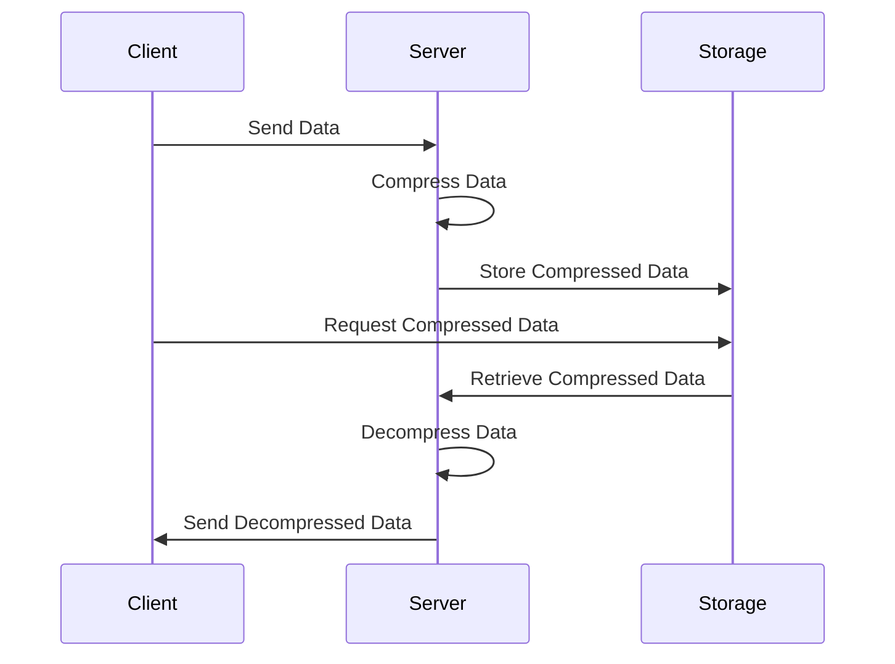

## Introduction

In the realm of cloud computing, efficient data management is critical for both cost-efficiency and performance. Data Compression is a pivotal design pattern employed to reduce the size of data stored in cloud environments. This pattern not only minimizes storage costs but also accelerates data processing and retrieval times by decreasing the volume of data that needs to be moved or processed.

## Objectives

- **Cost Reduction**: Less storage space is required, leading to lower storage costs.
- **Performance Improvement**: Compressed data can be transferred and processed faster, improving application performance.
- **Resource Optimization**: Compressed data uses fewer computational resources during processing and transmission.

## Architectural Approach

Data Compression can be implemented in various layers of a cloud architecture, including:

- **In-transit Compression**: Data is compressed while being transmitted over networks, reducing bandwidth usage.
- **At-rest Compression**: Data is stored in a compressed format within databases or file systems.
- **In-memory Compression**: Data is compressed in memory, reducing the memory footprint and allowing more data to be held in RAM.

## Paradigms and Best Practices

1. **Choose the Appropriate Compression Algorithm**: Different algorithms (e.g., gzip, zlib, snappy, LZ4) offer trade-offs between speed and compression ratio. Select based on use case requirements.
   
2. **Assess and Monitor Impact**: Continuously evaluate the trade-offs between compression overhead and performance gains. Use metrics to guide decisions.

3. **Compress at the Right Layer**: Decide whether to compress at the application level, database level, or during data transmission, depending upon where maximum benefit can be achieved.

4. **Decompress Efficiently**: Ensure efficient decompression to avoid performance bottlenecks.

## Example Code

Here's an example of implementing data compression using Python and the `gzip` library:

```python
import gzip
import shutil

with open('file.txt', 'rb') as f_in:
    with gzip.open('file.txt.gz', 'wb') as f_out:
        shutil.copyfileobj(f_in, f_out)

with gzip.open('file.txt.gz', 'rb') as f_in:
    with open('file_decompressed.txt', 'wb') as f_out:
        shutil.copyfileobj(f_in, f_out)
```

## Diagrams

### UML Sequence Diagram for Data Compression



## Related Patterns

- **Data Deduplication**: Focuses on eliminating duplicate copies of repeating data.
- **Caching**: Temporarily storing frequently accessed data for quick retrieval.

## Additional Resources

- [Google's Snappy Compression Format](https://google.github.io/snappy)
- [Apache Parquet: A columnar storage file format optimized for use with big data processing frameworks](https://parquet.apache.org/)
- [AWS S3 Storage Classes](https://aws.amazon.com/s3/storage-classes/)

## Summary

Data Compression is an essential pattern in cloud systems, aiming to balance storage costs and performance through the strategic compression of data. By compressing data, organizations can save significant costs and optimize performance, provided they carefully choose the right strategies and algorithms. Understanding and implementing this pattern is crucial for teams looking to optimize their cloud infrastructure.
