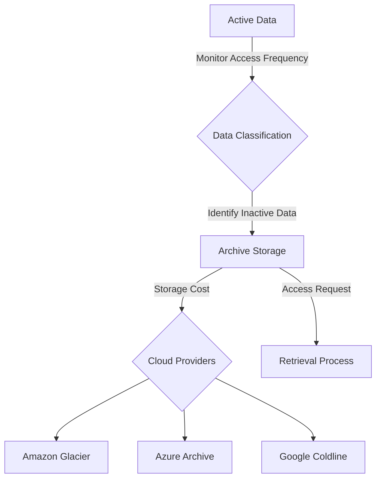

## Introduction

In the digital era, managing enormous volumes of data efficiently is critical for businesses. Data Archiving Solutions offer a methodical approach to identifying and transferring infrequently accessed data to less expensive storage, optimizing both costs and storage efficiency. This pattern is vital for companies that need to maintain historical data compliance or mine data at a later stage without incurring high storage fees.

## Key Concepts

Data archiving involves relocating data that is not actively in use to separate storage for long-term retention. By utilizing lower-cost storage options, organizations can significantly reduce expenses, maintain system performance, and improve operational productivity. This is crucial in cloud computing environments where storage costs can escalate with increasing data volumes.

## Architectural Approach

A typical data archiving solution involves several components:

1. **Data Classification**: Determine which data is infrequently accessed and eligible for archiving.
2. **Archiving Strategy**: Define policies and the lifecycle of the archived data, including storage options and duration.
3. **Storage Solutions**: Utilize cloud-based archival storage solutions such as Amazon S3 Glacier, Azure Archive Storage, or Google Coldline.
4. **Retrieval Mechanism**: Implement efficient retrieval processes for the archived data when needed.

### Diagram

Below is a simplified architectural diagram showing a Data Archiving Solution.



## Best Practices

- **Automate Data Classification**: Use machine learning to automate the identification of data access patterns.
- **Define Retention Policies**: Establish clear policies for how long data should be retained and under what conditions it should be deleted.
- **Regular Audits**: Periodically review and audit archived data to manage ever-growing storage efficiently.
- **Secure Data**: Ensure that archived data is encrypted and comply with data protection regulations.

## Example Code

Here's a simple Java example demonstrating how you might interface with a cloud storage service to archive data:

```java
import com.amazonaws.services.s3.AmazonS3;
import com.amazonaws.services.s3.AmazonS3ClientBuilder;

public class ArchiveData {
    
    private final AmazonS3 s3Client = AmazonS3ClientBuilder.defaultClient();

    public void archiveData(String bucketName, String keyName) {
        // Upload data to S3 Glacier
        s3Client.putObject(bucketName, keyName, "Your data here");
    }

    public static void main(String[] args) {
        ArchiveData archive = new ArchiveData();
        archive.archiveData("example-archive-bucket", "example-key");
        System.out.println("Data archived successfully.");
    }
}
```

## Related Patterns

- **Data Lifecycle Management**: Extends data archiving with phased data movement through various storage classes over time.
- **Data Compression**: Before data is archived, it can be compressed to further reduce storage costs.
- **Backup and Recovery**: While related, the focus for backups is on recovery rather than cost optimization.

## Additional Resources

- [Archiving Data on AWS](https://aws.amazon.com/glacier/)
- [Azure Storage - Archive Tier](https://azure.microsoft.com/en-us/services/storage/archive/)
- [Google Cloud Storage: Coldline Storage Class](https://cloud.google.com/storage/docs/storage-classes#coldline)

## Summary

Data Archiving Solutions provide a strategic advantage by relocating seldom-used data to lower cost storage solutions without compromising data retrieval when necessary. By implementing this pattern, organizations can maintain agility, improve cost management, and ensure that valuable historical data is accessible for compliance and analysis. This pattern is crucial for sustainable long-term data management in cloud environments.
