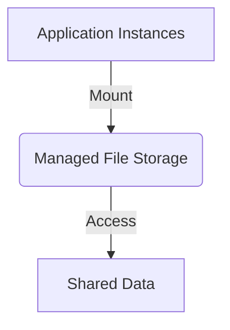
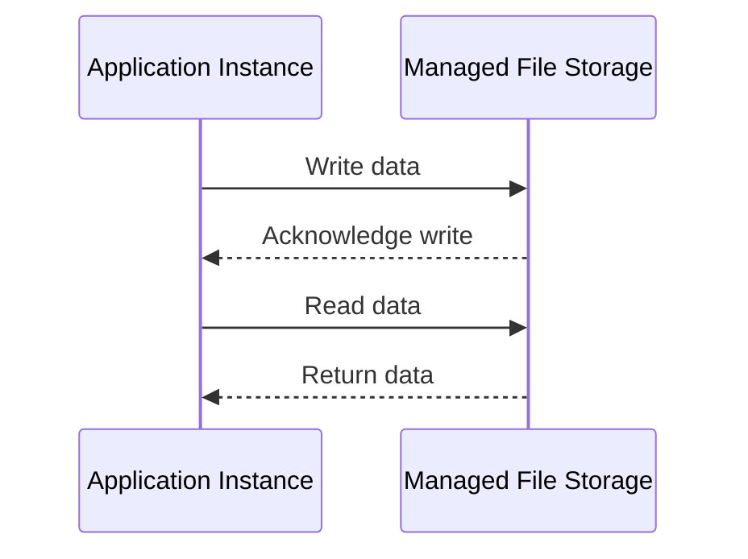

## Introduction

File Storage Services in the cloud provide scalable, managed solutions for applications that require shared file systems across multiple instances or services. Leveraging managed file storage means that developers and operations teams do not need to manage the complexities of creating and maintaining file systems, allowing them to focus more on application development and less on infrastructure.

## Design Patterns & Architectural Approaches

### Managed File Storage

**Description**: Use managed file storage services (like Amazon EFS, Azure Files, and Google Cloud Filestore) to create a shared file system that is automatically backed up, scaled, and highly available.

**Key Components**:
1. **File System**: The shared storage area for application data.
2. **Mount Targets**: Endpoints that allow instances or services to access the file system.
3. **Access Controls**: Permissions to manage read/write access to the file system.

### Application Use-Cases

- **Content Management Systems**: Where multiple front-end nodes require concurrent access to image, video, or document libraries.
- **Data Analysis Workloads**: Where distributed processing frameworks need access to shared datasets.
- **Development Environments**: Providing shared storage for source code and build artifacts.

## Best Practices

- **Security**: Implement strong access controls and encryption. Utilize VPC or network restrictions to limit access to file storage.
- **Performance Optimization**: Evaluate and configure performance characteristics (like IOPS and throughput) of the file storage to match application demands.
- **Data Management**: Implement lifecycle policies to archive or delete aged data in order to optimize storage costs.

## Example Code

Suppose we are leveraging AWS EFS from a Java application to store shared files:

```java
import java.nio.file.*;

public class EFSExample {
    public static void main(String[] args) {
        try {
            // Mount the EFS file system
            Path efsPath = Paths.get("/mnt/efs");
            // Create a file in the EFS
            Path filePath = efsPath.resolve("example.txt");
            Files.write(filePath, "Hello, File Storage!".getBytes());

            // Read from the EFS
            String content = new String(Files.readAllBytes(filePath));
            System.out.println("File content: " + content);
        } catch (Exception e) {
            e.printStackTrace();
        }
    }
}
```

## Diagrams

### Cloud Integration Diagram



### Sequence Diagram



## Related Patterns

- **Block Storage Services**: Use block storage for low-latency, high-throughput workloads requiring a direct attachment to databases or applications.
- **Object Storage Services**: Utilize object storage for unstructured data and static content that requires high availability and durability.

## Additional Resources

- [AWS EFS Documentation](https://docs.aws.amazon.com/efs/)
- [Azure Files Documentation](https://docs.microsoft.com/en-us/azure/storage/files/)
- [Google Cloud Filestore Documentation](https://cloud.google.com/filestore)

## Summary

File Storage Services in cloud environments provide simplified management of shared file systems required for various applications. By implementing such managed solutions, businesses can achieve improved scalability, availability, security, and file-handling performance, which is critical for modern, distributed application architectures.
