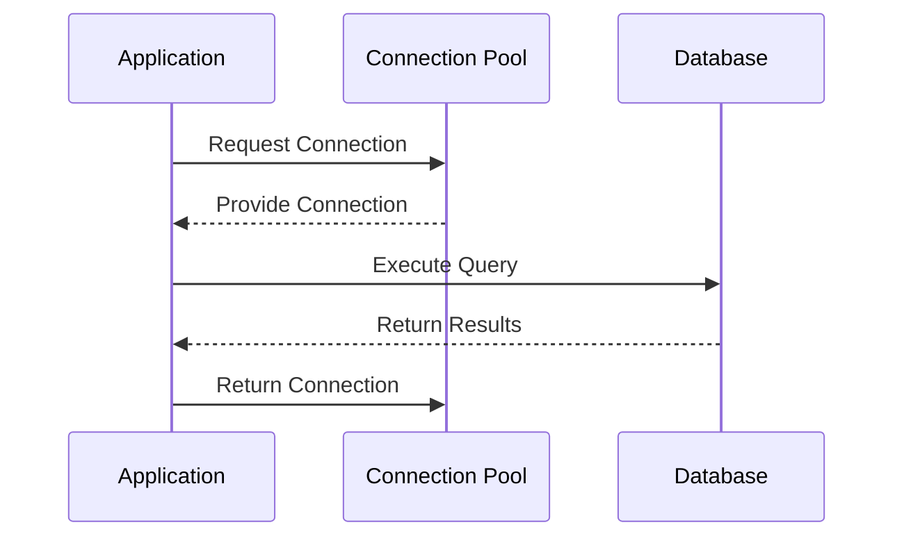

## Introduction

Database Connection Pooling is a fundamental design pattern in cloud computing and enterprise architecture that aims to manage and optimize the usage of database connections in a controlled and efficient manner. When applications repeatedly access databases, establishing a new connection each time can be resource-intensive and lead to bottlenecks. Connection pooling mitigates this by reusing a set of established connections, thus enhancing performance and resource management.

## Detailed Explanation

Connection Pooling works by maintaining a pool of active database connections that applications can borrow and return as needed. This pool is managed by a connection pool manager that handles the allocation, deallocation, and reuse of connections.

### Architectural Approaches

1. **Pre-allocated Pools**: Before there is any database demand, a predetermined number of connections are created and made available in the pool.
   
2. **Dynamic Allocation**: The pool can dynamically adjust, adding connections as the demand grows and releasing them when the demand decreases. This approach is useful in scaling environments.

3. **Resource Management**: By setting maximum and minimum connections in the pool, systems can prevent resource exhaustion and manage database licensing costs.

### Best Practices

- **Set Appropriate Maximum and Minimum Pool Sizes**: Determine the optimal number of connections based on load and budget constraints to avoid over-provisioning or resource starvation.
  
- **Connection Timeouts**: Implement timeouts to close idle connections and prevent application hang-ups.

- **Monitoring and Logging**: Use tools and logs to monitor connection pool usage and adjust configurations as needed.

- **Testing for Leaks**: Regularly test your application for connection leaks which can slowly drain your pool.

### Example Code

Here is an example code snippet using a connection pool in Java with HikariCP, a popular JDBC connection pool:

```java
import com.zaxxer.hikari.HikariConfig;
import com.zaxxer.hikari.HikariDataSource;

public class DatabasePool {
    private static HikariDataSource dataSource;

    static {
        HikariConfig config = new HikariConfig();
        config.setJdbcUrl("jdbc:mysql://localhost:3306/mydb");
        config.setUsername("username");
        config.setPassword("password");
        config.setMaximumPoolSize(10);
        config.setMinimumIdle(5);

        dataSource = new HikariDataSource(config);
    }

    public static java.sql.Connection getConnection() throws SQLException {
        return dataSource.getConnection();
    }
}
```

### Diagrams

Here is UML Sequence diagram illustrating how a connection pool is utilized in an application.



## Related Patterns

- **Circuit Breaker**: Helps manage connection failures gracefully by preventing constant retry attempts.
- **Bulkhead**: Isolates parts of a system to prevent failures from cascading, which is useful alongside connection pooling to maximize resilience.
- **Cache-Aside**: Reduces database load by caching frequently requested data which complements the use of connection pools.

## Additional Resources

- [HikariCP Documentation](https://github.com/brettwooldridge/HikariCP)
- [JDBC Documentation](https://docs.oracle.com/javase/tutorial/jdbc/)

## Summary

Database Connection Pooling is an instrumental pattern for ensuring efficient and performant database interactions in cloud environments. By reusing active connections, it helps applications reduce latency, manage resources efficiently, and improve overall system robustness. When implemented with attention to tuning and monitoring, it becomes a cornerstone of scalable and high-performing database architectures.
