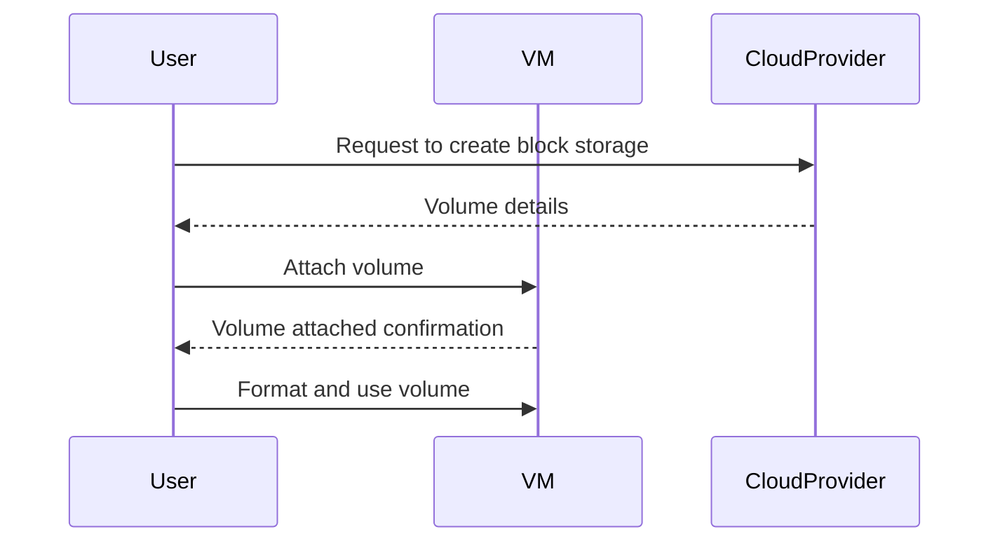

Block storage is a fundamental pattern in cloud computing, allowing virtual machines (VMs) to use additional storage that is presented as raw disk volumes. This approach provides persistence, which means that data remains even after the VM is stopped or restarted.

## Detailed Explanation

### Key Concepts

- **Block Storage**: A type of data storage typically used in cloud environments where data is stored in volumes and can be attached to virtual machines.
- **Virtual Machines (VMs)**: VMs are emulations of computer systems. They provide the functionality of a physical computer.
- **Persistence**: Ensures that the data remains intact across VM restarts or failures.

### How It Works

1. **Volume Creation**: Block storage volumes are created in a cloud environment, such as AWS EBS (Elastic Block Store), Azure Managed Disks, or GCP Persistent Disks. These volumes are defined by size, type (SSD, HDD), and performance requirements.

2. **Volume Attachment**: The created volume is attached to a VM. An operating system on the VM recognizes the volume as a new block device, which can then be formatted and mounted as needed.

3. **Data Management**: Once attached, these volumes can be used for various storage needs—such as root devices for VMs, database storage, or any application requiring high IOPS and low latency.

4. **Scalability**: Block storage allows for dynamic scaling—volumes can be detached and re-attached to other VMs as required without data loss, contributing to flexibility.

### Architectural Considerations

- **Performance**: Choose the type of block storage based on performance requirements. SSDs typically offer lower latency and higher IOPS, while HDD options can be more cost-effective for less critical applications.
- **Security**: Implement encryption options to secure data at rest. Cloud providers often offer encryption services to protect block storage.
- **Cost**: Be mindful of the cost associated with persistent storage volumes, which might include pay-as-you-go pricing models.

### Best Practices

- **Backup and Recovery**: Regularly snapshot volumes to prevent data loss and ensure recovery.
- **Monitoring and Alerts**: Utilize cloud provider tools to monitor storage usage and performance metrics.
- **Lifecycle Management**: Implement scripts or automation to manage the lifecycle of storage volumes—cleaning up unwanted or detached volumes.

## Example Code

Assuming AWS environment, the following is a simple demonstration using Boto3 for Python to create and attach a block storage volume to a VM (EC2 instance):

```python
import boto3

def create_and_attach_ebs(volume_size, instance_id, availability_zone):
    ec2 = boto3.resource('ec2')
    
    # Create EBS Volume
    volume = ec2.create_volume(
        Size=volume_size,
        AvailabilityZone=availability_zone,
        VolumeType='gp2'  # General Purpose SSD
    )
    
    print(f"Volume {volume.id} created.")
    
    # Attaching the Volume
    volume.attach_to_instance(
        InstanceId=instance_id,
        Device='/dev/xvdb'  # For Linux instances
    )
    
    print(f"Volume {volume.id} attached to instance {instance_id}.")

create_and_attach_ebs(volume_size=20, instance_id='i-0abcdef1234567890', availability_zone='us-west-2a')
```

## Diagrams

### Volume Attachment Diagram



## Related Patterns

- **Object Storage**: Suitable for unstructured data storage with features like versioning and metadata.
- **File Storage**: Provides file-level storage for use cases like content repositories and user home directories.
- **Ephemeral Storage**: Offers temporary storage where data does not persist after VM shutdown.

## Additional Resources

- [AWS EBS Documentation](https://aws.amazon.com/ebs/)
- [Azure Managed Disks Overview](https://azure.microsoft.com/en-us/services/managed-disks/)
- [GCP Persistent Disks Overview](https://cloud.google.com/persistent-disk)

## Final Summary

The Block Storage for VMs pattern is an indispensable component of cloud infrastructure. It empowers users with scalable, secure, and high-performance storage solutions that enhance data persistence and ensure business continuity across VM lifecycles. By leveraging these patterns effectively, organizations can optimize their cloud storage configurations to meet enterprise-grade demands.
