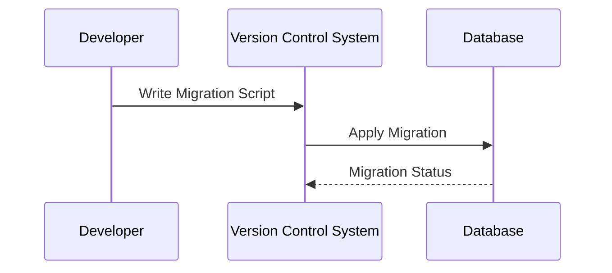

## Introduction

In cloud computing environments, where applications are continually evolving, it's crucial to manage changes to database schemas effectively. Schema versioning and migration are integral processes that ensure data integrity and application compatibility while minimizing downtime during schema updates.

## Design Pattern Description

Schema Versioning and Migration refers to the practice of managing changes to a database's schema in a systematic, controlled manner. This involves tracking different versions of the schema and applying transformations or migrations to accommodate new requirements or enhancements without disrupting existing functionalities.

### Key Concepts:

- **Schema Versioning** involves identifying and managing different versions of the database schema to keep track of changes over time.
- **Migration** is the process of transforming the database from one schema version to another, involving altering tables, adding new fields, or even restructuring relational models.

## Architectural Approaches

Several approaches can be taken to manage schema versioning and migration effectively:

1. **Incremental Migration**: Use a series of small, incremental changes instead of a single significant overhaul, allowing for easier rollback if issues arise.

2. **Forward and Backward Compatibility**: Ensures that database schema changes do not break existing application logic. Forward compatibility allows new applications to work with old data, and backward compatibility ensures old applications can operate with new data formats.

3. **Transactional Migrations**: Utilize database transactions to apply schema changes. This approach enables rolling back changes if any part of the migration fails, maintaining data integrity.

4. **Automated Migration Tools**: Tools like Flyway, Liquibase, and Alembic automate the tracking, versioning, and deployment of schema changes, ensuring that migrations are repeatable and consistent across deployments.

## Best Practices

When implementing schema versioning and migration, consider the following best practices:

- **Version Control**: Store migration scripts in a version control system alongside the application code to ensure that schema changes align with application changes.
  
- **Testing**: Thoroughly test migrations in a staging environment before applying them to production to detect potential issues.

- **Backward Compatibility**: Design migrations to be backward compatible to support smooth transitions and allow old services to run alongside new schema versions temporarily.

- **Data Backup**: Always backup data before performing a migration to prevent data loss in case of migration failures.

## Example Code

Here is a simplified example of how you might use Flyway to manage database migrations:

```yaml
flyway:
  url: jdbc:mysql://localhost:3306/mydb
  user: dbuser
  password: dbpass
  locations: filesystem:./migrations
```

Migration scripts (SQL files) are placed in the `migrations` directory with names like `V1__Initial_schema.sql`, `V2__Add_new_table.sql`, etc.

## Diagrams

Below is a diagram illustrating the process of schema versioning and migration:



## Related Patterns

- **Command Query Responsibility Segregation (CQRS)**: Separating read and write operations can simplify schema changes by isolating query models.
- **Event Sourcing**: Stores data changes as a sequence of events, allowing reconstruction of past states and easy schema evolution.

## Additional Resources

- [Flyway Database Migrations](https://flywaydb.org/)
- [Liquibase Documentation](https://www.liquibase.org/documentation/index.html)
- [Best Practices for Schema Versioning](https://www.example.com/best-practices)

## Summary

Schema Versioning and Migration are essential techniques for managing database schema changes, especially in dynamic cloud-based applications. By adopting structured versioning strategies, leveraging automated tools, and adhering to best practices, organizations can ensure seamless schema evolution while preserving data integrity and application stability.
