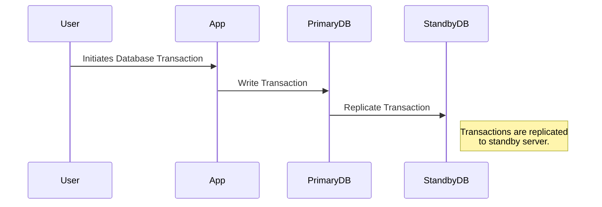

In today's digital landscape, businesses rely heavily on data-driven applications to drive decision-making, create competitive advantages, and enhance customer experiences. The loss or corruption of database resources due to unforeseen disasters can result in significant operational disruptions and financial losses. As such, implementing a robust disaster recovery (DR) plan is crucial for maintaining data availability and integrity.

## Design Pattern Overview

Disaster recovery for databases refers to a set of strategies and practices to protect and restore data and database services in the event of natural disasters, hardware failures, cyber-attacks, or human errors. A successful DR strategy ensures minimal data loss, reduced downtime, and business continuity.

### Objectives of Disaster Recovery for Databases

- **Data Protection**: Safeguard critical data from loss or corruption.
- **Business Continuity**: Ensure that business processes can continue with minimal disruption.
- **Recovery Time Objective (RTO)**: Define the maximum acceptable amount of time to restore database operations.
- **Recovery Point Objective (RPO)**: Determine the maximum acceptable amount of data loss measured in time.

## Architectural Approaches

Several architectural approaches can be employed to implement disaster recovery for databases:

1. **Backup and Restore**: Regular backups provide a fundamental layer of protection. Backups can be stored in the cloud or an offsite location to secure them from localized disasters.

2. **Replication**: Continuous or near-real-time replication of database transactions to a secondary location ensures data is up-to-date and ready for failover. Replication can be asynchronous or synchronous.

3. **Failover Clustering**: Automatic failover clusters maintain a standby instance that can take over rapidly if the primary instance fails. This approach minimizes downtime.

4. **Geographically Distributed Systems**: Deploying databases in multiple regions or availability zones increases resilience and provides location diversity to mitigate regional failures.

## Best Practices

- **Regular Testing**: Periodically test disaster recovery plans to identify and mitigate potential vulnerabilities.
- **Automated Monitoring and Alerts**: Implement monitoring and alert systems to quickly detect anomalies and trigger DR processes.
- **Documentation**: Maintain clear documentation of DR procedures and system configurations.
- **Compliance and Security**: Ensure that DR practices comply with industry regulations and security standards.

## Example Code

Below is an example configuration of a PostgreSQL database utilizing streaming replication for disaster recovery:

```sql
-- On the primary server:
\c postgres
ALTER SYSTEM SET wal_level = replica;
ALTER SYSTEM SET max_wal_senders = 3;
ALTER SYSTEM SET wal_keep_segments = 64;

SELECT pg_create_physical_replication_slot('my_replica_slot');

-- Backup primary database:
pg_basebackup -h primary-server-ip -D /var/lib/postgresql/replica -P -U replicator -Fp -Xs -R

-- Start replica on the standby server:
pg_ctl -D /var/lib/postgresql/replica start
```

## Diagrams



## Related Patterns

- **Data Backup and Versioning**: A pattern focusing on data snapshot creation for rollback and restore purposes.
- **Continuous Replication**: This pattern deals with continually replicating data to ensure real-time availability across different locations.

## Additional Resources

- [AWS Disaster Recovery Resources](https://aws.amazon.com/disaster-recovery/)
- [Google Cloud Disaster Recovery Documentation](https://cloud.google.com/solutions/disaster-recovery-cookbook)
- [Microsoft Azure Site Recovery](https://learn.microsoft.com/en-us/azure/site-recovery/)

## Summary

Disaster recovery for databases is a vital component of a business's overall contingency planning. By understanding and implementing DR patterns, organizations can protect against data loss and ensure business continuity. A well-conceived DR strategy aligns with business requirements, utilizes appropriate architecture, adheres to best practices, and is reviewed and tested regularly to adapt to evolving threats.
