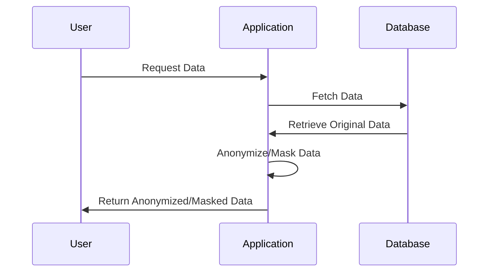

## Introduction

In the modern cloud computing landscape, organizations relentlessly seek methods to securely manage sensitive data without compromising privacy or operational efficiency. **Data Anonymization and Masking** are vital techniques that strengthen data security by obfuscating personally identifiable information (PII) and ensuring privacy compliance when handling data for analytics, sharing, or testing in non-production environments.

## Detailed Explanation

### Design Pattern Overview

**Data Anonymization** refers to techniques that modify data to irreversibly remove direct or indirect identifiers, ensuring data cannot be traced back to an individual. Conversely, **Data Masking** involves transforming data to render it meaningless while retaining its original format for usability in application development, testing, or analytics.

### Architectural Approaches

1. **Static Data Masking**: Involves disguising data at rest, typically making a copy of the production database to be masked before being used in non-production environments.

2. **Dynamic Data Masking**: Modifies data in real-time as it is retrieved from the database for application users, offering an additional layer by ensuring that privacy rules are actively applied at the query level.

3. **Tokenization**: Replacing sensitive data with unique identification symbols or keys while maintaining the usability of the dataset. Typically used in scenarios requiring robust data recovery and minimal performance disruption.

4. **Differential Privacy**: Adding noise to the dataset to protect individual information while still allowing meaningful queries to be answered.

### Paradigms and Best Practices

- **Data Minimization**: Collect only the necessary data to reduce abuse potential.
- **Access Control**: Incorporate strict controls and monitoring on who can access masked or anonymized data.
- **Logging and Monitoring**: Track all access to sensitive data, ensuring any breaches don't go unnoticed.
- **Regular Updates**: Continuously update and test data masking algorithms to counter advances in re-identification attacks.
  
### Example Code

Here is a simple pseudocode example demonstrating static masking using hash functions:

```java
import java.security.MessageDigest;
import java.util.Base64;

public class DataMasking {

    public static String hashData(String data) throws Exception {
        MessageDigest md = MessageDigest.getInstance("SHA-256");
        byte[] hashBytes = md.digest(data.getBytes());
        return Base64.getEncoder().encodeToString(hashBytes);
    }

    public static void main(String[] args) {
        try {
            String sensitiveData = "user1234@mail.com";
            String maskedData = hashData(sensitiveData);
            System.out.println("Masked Data: " + maskedData);
        } catch (Exception e) {
            e.printStackTrace();
        }
    }
}
```

### Diagrams

#### UML Sequence Diagram



## Related Patterns

- **Encryption and Key Management**: Often used in conjunction with data masking to secure sensitive data.
- **Access Control Pattern**: Ensures that unauthorized users cannot access sensitive information.
- **Data Redaction**: Remove sensitive data from documents and datasets before sharing.

## Additional Resources

- [NIST Privacy Framework](https://www.nist.gov/privacy-framework)
- [GDPR Compliance Guidelines](https://gdpr-info.eu/)
- [AWS Data Masking Solutions](https://docs.aws.amazon.com/solutions/latest/data-masking-on-aws/solution-overview.html)

## Summary

Data Anonymization and Masking are essential cloud patterns for protecting sensitive information while maintaining operational efficiency and compliance in data-driven applications. By leveraging these techniques, organizations can safely manage data across environments and ensure enhanced privacy safeguards against unauthorized exposure.
