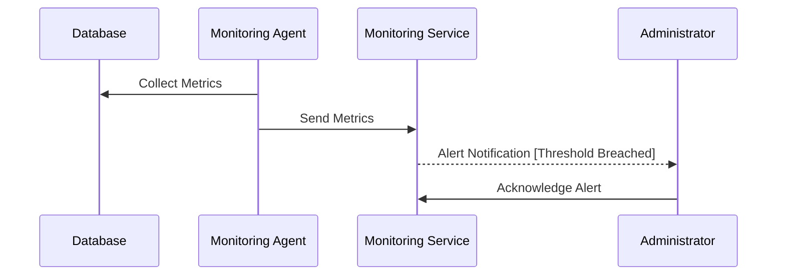

## Introduction

Database Monitoring and Alerting is a crucial design pattern in cloud computing that involves tracking the performance, availability, and overall health of database systems. This pattern plays a central role in ensuring databases operate optimally, enables early detection of anomalies, facilitates rapid response to incidents, and guides performance tuning efforts. Database monitoring encompasses a variety of metrics, while alerting provides timely notifications to relevant stakeholders when predefined conditions are met.

## Detailed Explanation

### Key Concepts

1. **Metrics Collection**: Automatically gather data about CPU usage, memory consumption, query performance, disk I/O, and other critical performance indicators. Metrics are often collected using agents running on the database host or by utilizing managed cloud services.

2. **Performance Benchmarks**: Set benchmarks based on expected workload characteristics to aid in assessing whether the database operates within the desired performance thresholds.

3. **Alerting Mechanisms**: Set up alerting rules based on specific metrics and thresholds. When these thresholds are surpassed, alerts are triggered to notify database administrators or operations teams.

4. **Visual Dashboards**: Utilize visualization tools to present real-time data in an easy-to-understand format, aiding quick situational awareness and trend analysis.

5. **Automated Responses**: In some systems, alerting can trigger automated mitigation mechanisms, such as scaling resources or executing predefined scripts to remediate detected issues.

### Architectural Approaches

- **Agent-based Monitoring**: Deploy monitoring agents on database hosts to collect detailed metrics and send them to a central monitoring system.
- **Remote Monitoring**: Use cloud provider tools or third-party services that connect directly to databases via secure channels to gather metrics.
- **Log Analysis**: Continuously analyze and parse database logs for identifying issues like slow queries, lock contention, or error rates.

### Best Practices

- **Baseline Performance**: Establish baseline performance metrics during periods of normal workload to define sensible alert thresholds.
- **Selective Metrics**: Monitor vital metrics that align with your business requirements to avoid excessive data noise.
- **Regular Audits**: Conduct periodic reviews of alert configurations and thresholds to ensure relevance and effectiveness.
- **Incident Response Plans**: Develop and rehearse incident response scenarios based on alerts to improve response times and outcomes.

## Example Code

```java
// Pseudo-code for setting up a simple alert using a cloud monitoring service API.
MonitoringService monitorService = new MonitoringService();
AlertCondition highCPUUsage = new AlertCondition.Builder()
    .setMetric("database_cpu_usage")
    .setThreshold(85)
    .setPeriod("5m")
    .build();

Alert alert = new Alert.Builder()
    .setName("High CPU Usage Alert")
    .setCondition(highCPUUsage)
    .setNotificationChannel("email", "db-admins@example.com")
    .build();

monitorService.createAlert(alert);
```

## Diagrams



## Related Patterns

- **Log Aggregation**: Consolidates logs from various sources for comprehensive analysis.
- **Performance Optimization**: Involves tuning database configurations and queries to enhance responsiveness.
- **Scalability Patterns**: Adjusts resources based on load, often in response to monitored metrics.

## Additional Resources

- [Google Cloud Monitoring](https://cloud.google.com/monitoring)
- [AWS CloudWatch](https://aws.amazon.com/cloudwatch/)
- [Azure Monitor](https://azure.microsoft.com/en-us/services/monitor/)
- [Prometheus](https://prometheus.io/)

## Summary

Database Monitoring and Alerting is an essential pattern for maintaining efficient and reliable database operations in cloud environments. Through careful selection of monitoring metrics, intelligent alerting, and a proactive approach to performance management, organizations can ensure their databases remain healthy, performant, and aligned with business objectives. Investing in robust monitoring and alerting systems enhances resilience and informs strategic decision-making in database management.
