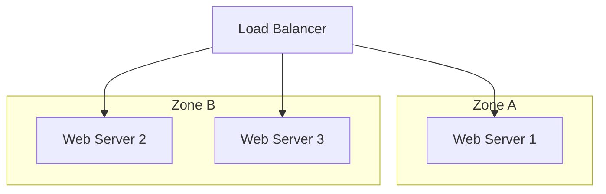

## Introduction

In the world of cloud computing, ensuring that applications and services remain operational, even in the face of failures, is paramount. High Availability (HA) Architectures are designed to address this need by eliminating single points of failure and ensuring that systems can recover quickly from disruptions. This approach is essential for systems where uptime is critical, such as e-commerce platforms, online banking, and health care systems.

## Design Pattern Explanation

### Goals and Benefits

High Availability Architectures aim to:

- **Maximize Uptime**: Reduce downtime by designing systems that continue to operate despite failures.
- **Ensure Resilience**: Quickly recover from failures with minimal impact on service availability.
- **Enhance Fault Tolerance**: Implement strategies that tolerate or bypass faults, preventing system-wide failures.

### Architectural Components

1. **Redundancy**: Duplicate critical components across multiple nodes and regions to ensure availability in case of a failure.
2. **Load Balancing**: Distribute traffic evenly across servers to prevent overload and promote optimal resource use.
3. **Failover Strategies**: Automatically switch to standby systems when a primary system fails.
4. **Data Replication**: Synchronize data across various locations to enable consistent data access even if one site goes down.
5. **Monitoring and Alerts**: Implement monitoring tools to detect failures and send alerts for prompt corrective actions.

### Example Code

Using AWS as an example, here's a simple setup for load balancing and auto-scaling a web application:

```yaml
Resources:
  MyLoadBalancer:
    Type: "AWS::ElasticLoadBalancingV2::LoadBalancer"
    Properties:
      Scheme: internet-facing
      Subnets:
        - Subnet-1-ID
        - Subnet-2-ID

  MyAutoScalingGroup:
    Type: "AWS::AutoScaling::AutoScalingGroup"
    Properties:
      VPCZoneIdentifier:
        - Subnet-1-ID
        - Subnet-2-ID
      LaunchConfigurationName: MyLaunchConfig
      MinSize: 2
      MaxSize: 5

  MyLaunchConfig:
    Type: "AWS::AutoScaling::LaunchConfiguration"
    Properties:
      ImageId: "ami-0123456789abcdef0"
      InstanceType: "t2.micro"
      SecurityGroups:
        - Ref: InstanceSecurityGroup
```

### Diagrams

#### High-Level Architectural View



## Best Practices

- **Implement Heartbeat Checks**: Regular health checks can quickly detect when a component fails, allowing for immediate failover.
- **Utilize Multi-Zone Deployments**: Deploy systems across multiple availability zones or regions to avoid complete outages.
- **Data Backup and Recovery Plans**: Ensure regular data backups and create comprehensive recovery plans to restore operations swiftly.
- **Automate Response to Failures**: Use automation to handle failover and resource reallocation for quicker recovery. 

## Related Patterns

- **Disaster Recovery Pattern**: Focus on long-term recovery strategies post-major outages or disasters.
- **Elasticity Pattern**: Combine HA with elasticity to automatically adjust resources based on demand spikes or drops.
- **Circuit Breaker Pattern**: Stop cascading failures by breaking faults and rerouting traffic.

## Additional Resources

- [AWS High Availability and Fault Tolerance](https://aws.amazon.com/architecture/high-availability/)
- [Google Cloud High Availability](https://cloud.google.com/solutions/high-availability)
- [Azure High Availability Options](https://learn.microsoft.com/en-us/azure/architecture/checklist/availability)

## Summary

High Availability Architectures form the backbone of robust and reliable storage and database systems in the cloud. By adopting strategies like redundancy, failover mechanisms, and effective monitoring, enterprises can ensure their applications meet strict uptime requirements and avoid costly downtime, ultimately delivering a seamless experience to end-users.
