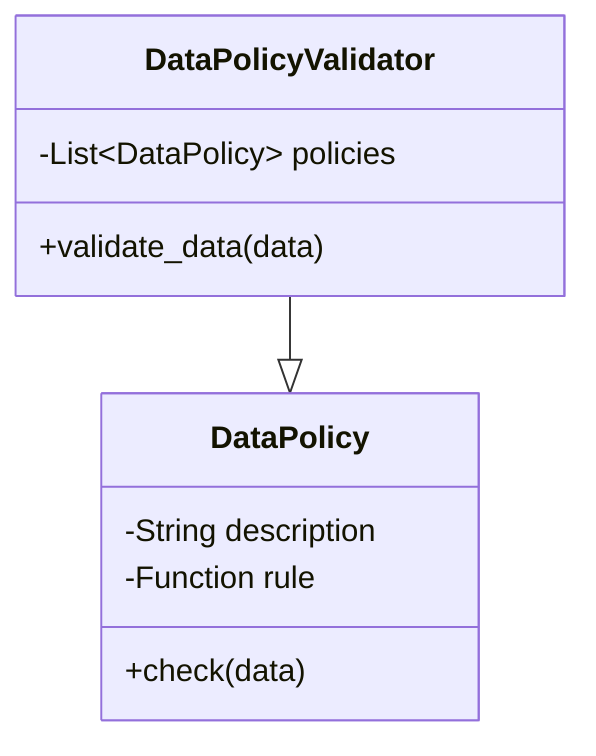

## Introduction

In the era of digital transformation, organizations collect, store, and process massive volumes of data. This explosion in data volume has necessitated robust data governance policies to ensure compliance with regulations, maintain data privacy, and manage data ownership effectively. Data governance is critical in cloud environments due to their inherent complexity and distributed nature.

## Importance of Data Governance Policies

Data governance involves managing data's availability, usability, integrity, and security to meet regulatory and internal standards. Here are some key aspects of data governance policies:

- **Compliance**: Ensures adherence to legal and regulatory requirements such as GDPR, CCPA, HIPAA, etc.
- **Data Privacy**: Protects sensitive information from unauthorized access and ensures users' privacy.
- **Data Ownership**: Clearly defines who owns the data, who can access it, and who is responsible for its protection.
- **Quality Assurance**: Maintains data accuracy, consistency, and reliability across systems.

## Architectural Approaches

### 1. Centralized Governance Model

In this model, a centralized team or committee is responsible for defining and enforcing data governance policies. This approach ensures consistency across the organization but may be less agile.

- **Pros**: Uniform policies, streamlined compliance.
- **Cons**: Potential bottlenecks, reduced flexibility.

### 2. Federated Governance Model

Here, governance responsibilities are distributed among business units, enabling them to tailor policies to their needs while adhering to a common framework.

- **Pros**: Flexibility, contextual adaptation.
- **Cons**: Risk of inconsistency, coordination challenges.

## Best Practices

1. **Define Clear Goals**: Establish what you wish to achieve with your data governance policies, such as compliance, risk management, and operational efficiency.

2. **Stakeholder Engagement**: Involve all relevant stakeholders, including IT, legal, and business units, in policy development and implementation.

3. **Policy Documentation**: Clearly document policies, procedures, and roles to minimize ambiguity.

4. **Continuous Monitoring**: Implement monitoring and auditing mechanisms to ensure policies are followed and to identify areas for improvement.

5. **Training and Awareness**: Regularly train employees on data governance policies and raise awareness about compliance regulations and privacy issues.

## Example Code

Below is a simple example of how you might implement a policy check in a cloud-based data processing system using Python.

```python
class DataPolicyValidator:
    def __init__(self, policies):
        self.policies = policies

    def validate_data(self, data):
        for policy in self.policies:
            if not policy.check(data):
                raise ValueError(f"Data violates policy: {policy.description}")

class DataPolicy:
    def __init__(self, description, rule):
        self.description = description
        self.rule = rule

    def check(self, data):
        return self.rule(data)

gdpr_policy = DataPolicy("GDPR Compliance", lambda data: "user_consent" in data)
validator = DataPolicyValidator([gdpr_policy])

data_record = {"user_name": "John Doe", "user_consent": True}
validator.validate_data(data_record)  # This should pass without issues
```

## Diagrams

Below is a simple **UML Class Diagram** illustrating a conceptual approach to implementing a data policy validator:



## Related Patterns

- **Data Masking**: A pattern that involves hiding sensitive data to protect it from unauthorized access.
- **Access Control**: Implementing mechanisms to restrict data access based on user roles and privileges.
- **Encryption**: Using cryptographic techniques to secure data both in transit and at rest.

## Additional Resources

- *Book*: "Data Governance: How to Design, Deploy, and Sustain an Effective Data Governance Program" by John Ladley.
- *Online Course*: Udemy's "Data Governance and Data Management Masterclass".
  
## Summary

Implementing effective data governance policies is essential for modern organizations to navigate the complex landscape of data compliance, privacy, and ownership. By understanding the key principles of data governance, utilizing appropriate architectural models, and adhering to best practices, organizations can secure their data assets and maintain trust with users and stakeholders.
