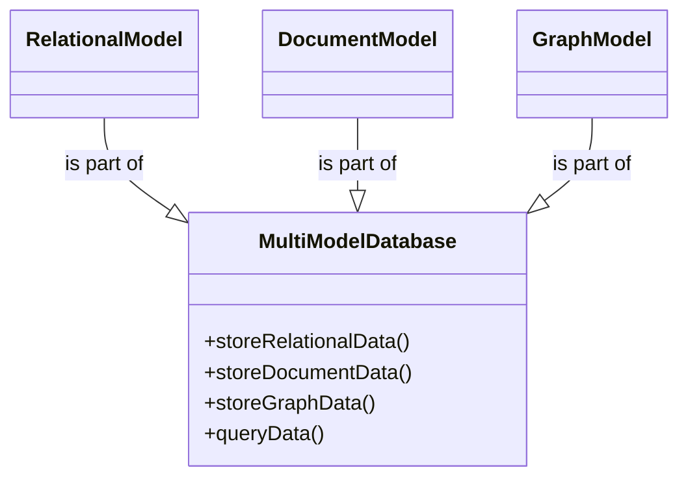

## Introduction

As data platforms grow increasingly complex, organizations are often faced with the challenging task of managing different types of data, which are inherently suited to different database models. Enter multi-model databases—a paradigm that simplifies data management by supporting multiple data models within a single, integrated database system. This capability allows businesses to seamlessly handle a diverse array of data types, ranging from relational tables to documents, graphs, and key-value pairs under one umbrella, thus reducing operational inconsistencies and increasing efficiency.

## Architectural Approaches

Multi-model databases come equipped with functionalities that traditionally required maintaining separate database systems, each catering to a specific data model. By consolidating data models into one system, multi-model databases help eliminate data silos, facilitate more agile application development, and enhance complex data querying and analysis. The architectural approaches commonly associated with multi-model databases include:

- **Unified Query Language**: A consistent query interface that can interact with multiple data models.
- **Integrated Storage Engine**: A sophisticated engine capable of storing, processing, and indexing accessible data across various models.
- **Distributed Architecture**: Offers horizontal scalability and fault tolerance, crucial for cloud-native applications.

## Best Practices

1. **Assess Data Needs**: Determine the specific data models and query patterns your application will leverage.
2. **Balance Flexibility and Complexity**: While multi-model databases offer flexibility, they can introduce complexity; tailor usage to application demands.
3. **Efficient Indexing**: Leverage optimized indexing to speed up queries across different data models.
4. **Horizontal Scalability**: Ensure the chosen database offers horizontal scaling to handle increasing data loads.
5. **Monitor and Optimize Performance**: Regularly monitor database performance and optimize queries across all supported models.

## Example Code

To illustrate a practical example, let's explore a simple application utilizing a multi-model database:

```java
import com.arangodb.ArangoDB;
import com.arangodb.entity.DocumentEntity;

public class MultiModelExample {
    public static void main(String[] args) {
        ArangoDB arangoDB = new ArangoDB.Builder().build();

        // Creating a collection for document store
        arangoDB.db("myDatabase").createCollection("myCollection");

        // Insert a JSON document
        DocumentEntity myDocument = arangoDB.db("myDatabase").collection("myCollection")
                                            .insertDocument("{\"name\":\"John Doe\",\"age\":29}");

        // Simple AQL to query documents
        String query = "FOR user IN myCollection FILTER user.age > 25 RETURN user";
        arangoDB.db("myDatabase").query(query, null, null, BaseDocument.class).forEachRemaining(System.out::println);
    }
}
```

## Diagrams

Below is diagram illustrating the interaction of different data models within a multi-model database:



## Related Patterns

- **Polyglot Persistence**: Using specialized data storage technologies for different data storage needs. Multi-model databases offer a unified platform while polyglot persistence leverages specialized data stores.
- **CQRS (Command Query Responsibility Segregation)**: While CQRS separates read and write operations, multi-model databases can efficiently manage different data representations for these tasks.

## Additional Resources

- [ArangoDB Documentation](https://www.arangodb.com/docs/stable/)
- [Amazon Aurora with Multi-Model Data Support](https://aws.amazon.com/rds/aurora/multi-model/)
- [IBM Db2 as a Multi-Model Database](https://www.ibm.com/cloud/db2)

## Summary

Multi-model databases represent a significant advancement in the domain of data storage and management, offering an adaptable and comprehensive solution to the complex needs of modern data architectures. By supporting multiple data models, these databases improve data accessibility, consistency, and operational efficiency, making them a valuable asset for organizations aiming to consolidate different data types under a unified, cloud-enabled platform. Understanding and implementing multi-model databases can greatly enhance an organization's ability to manage and derive insights from diverse datasets while minimizing overhead and complexity.
