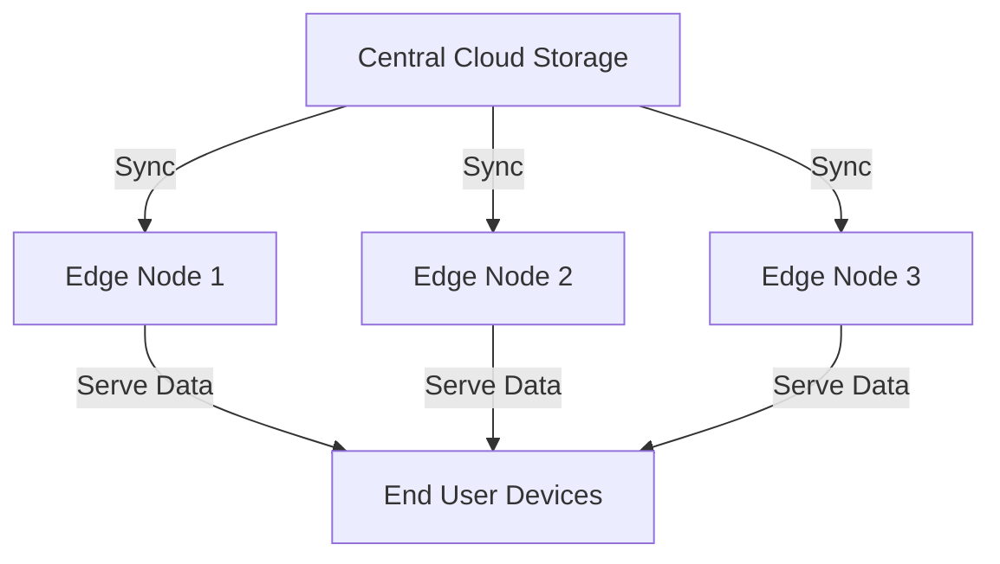

## Introduction to Edge Data Storage

In the landscape of modern cloud computing, the need for faster data access and improved user experiences has led to the rise of edge computing paradigms. **Edge Data Storage** is a design pattern that addresses these challenges by placing data storage facilities closer to the end-users. This decentralized approach reduces latency, enhances data processing speed, optimizes network bandwidth, and provides localized processing capability.

## Detailed Explanation of Edge Data Storage

### Key Attributes and Concepts

1. **Decentralization**: Data is stored at multiple edge locations rather than a centralized cloud data center.
2. **Proximity**: By bringing storage closer to users, access times are significantly reduced, improving application performance.
3. **Latency Reduction**: The primary goal is to minimize the delay in data retrieval and processing.
4. **Local Data Processing**: Allows data to be processed at the edge before transferring to central cloud systems, useful in IoT and low-latency applications.
5. **Scalability**: Facilitates handling vast amounts of data and user requests across diverse geographic regions.

### Architectural Approach

Edge Data Storage architectures involve deploying storage nodes at edge locations such as regional data centers, cellular towers, or other localized servers. These nodes collaborate with the central cloud storage, ensuring data consistency and redundancy.

Here's a simplified architecture to illustrate how edge data storage is implemented:



Each edge node can act independently to handle local data requests while periodically synchronizing with the central cloud to ensure data consistency.

### Best Practices

- **Data Consistency**: Implement strong data consistency models using conflict-free replicated data types (CRDTs) or eventual consistency strategies.
- **Security**: Encrypt data both at rest and in transit to secure sensitive information.
- **Cache Management**: Use intelligent cache management strategies to balance load and ensure up-to-date data delivery.
- **Cost Management**: Monitor and optimize operational costs by efficiently managing edge nodes and network utilization.

## Example Code

Here is a high-level example using Java to illustrate a simple edge data storage client that reads locally stored data:

```java
import java.io.File;
import java.nio.file.Files;
import java.nio.file.Paths;
import java.util.Optional;

public class EdgeDataStorageClient {
    private static final String EDGE_STORAGE_PATH = "/edge/storage/data/";

    public Optional<String> fetchData(String key) {
        try {
            File file = new File(EDGE_STORAGE_PATH + key);
            if (file.exists()) {
                return Optional.of(new String(Files.readAllBytes(Paths.get(file.getPath()))));
            }
        } catch (Exception e) {
            System.out.println("An error occurred while fetching data: " + e.getMessage());
        }
        return Optional.empty();
    }
}
```

## Related Patterns and Descriptions

- **Content Delivery Network (CDN)**: Uses a distributed network of servers to deliver content to users efficiently, similar to edge data storage concepts.
- **Data Sharding**: Distributes large datasets across multiple database instances for scalability.
- **Fog Computing**: Extends cloud capabilities to the network edge, enabling data storage and processing closer to data sources.

## Additional Resources

- **Edge Computing: Principles and Practices**: A comprehensive guide exploring the principles of edge computing.
- **AWS Outposts and Azure Edge Zones**: Services providing edge computing solutions.
- **Apache Kafka on the Edge**: Whitepaper on deploying stream processing applications closer to data sources.

## Summary

The Edge Data Storage pattern represents a transformative approach to storage management in cloud ecosystems, focusing on proximity to users and quick data availability. By effectively employing edge data storage, enterprises can ensure low latency, higher data processing speeds, and a responsive user experience, essential in today's fast-paced digital environments.
